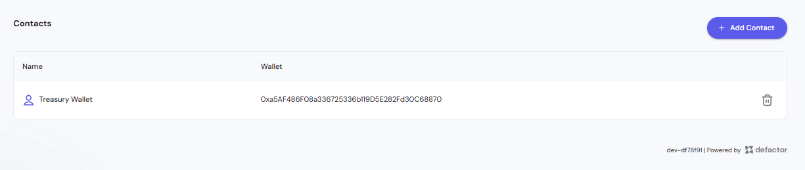
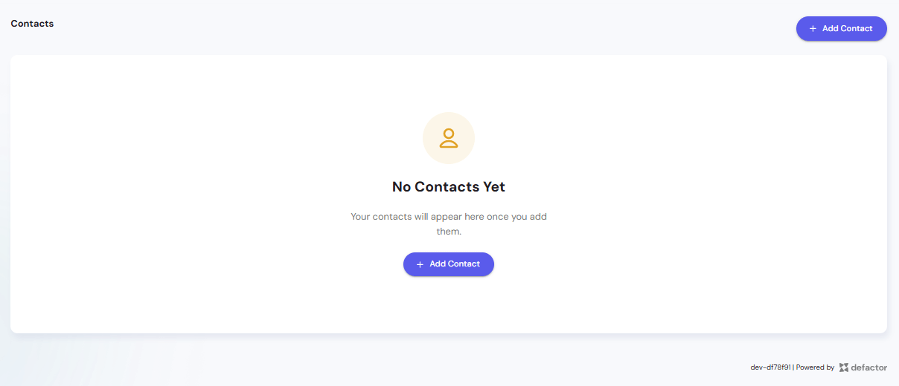
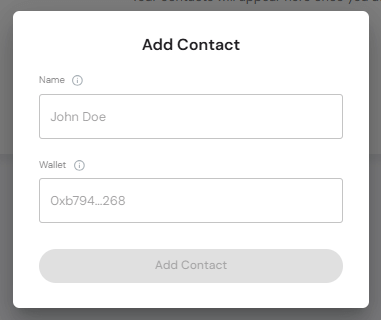
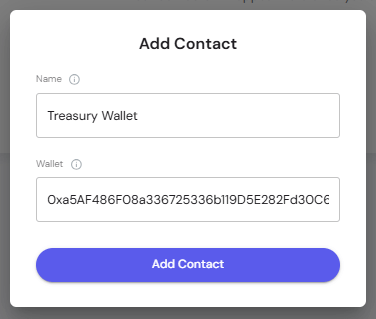

The **Contacts Module** in the Assets frontend provides a convenient way to manage frequently used wallet addresses.  
Instead of manually pasting long wallet strings for every transaction, users can save labeled contacts for quick and reliable access.

This improves efficiency, prevents errors, and provides clear context for wallet interactions across the platform.

## Dashboard Overview  

The **Contacts Dashboard** displays all saved contacts, including their labels and wallet addresses.  
Users can add or remove contacts as needed.  

- **Name** – Human-readable label (e.g., Treasury Wallet, Partner Wallet)  
- **Wallet** – The saved blockchain address  
- **Actions** – Delete icon for removing contacts  

## Empty State  

When no contacts are added, the dashboard shows an **Empty State** with the option to add your first contact.  
Clicking **+ Add Contact** opens the add contact modal.  

## Adding a Contact  

To add a new contact:  

1. Click **+ Add Contact**  
2. Enter:  
   - **Name** – e.g., *Treasury Wallet*  
   - **Wallet** – The blockchain address (EVM-compatible)  
3. Click **Add Contact** to save  

### Example Contact  

For example, you might add a **Treasury Wallet** as the first contact:  
- **Name** – Treasury Wallet  
- **Wallet** – `0xa5AF486F08a336725336b119D5E282Fd30C6887O`  

Once saved, this contact appears in the dashboard for quick access.

## Best Practices  

- **Use Clear Labels** – Choose descriptive names (e.g., Foundation Wallet, Staking Rewards) so contacts are easily recognizable.  
- **Verify Addresses** – Always double-check wallet addresses before saving to prevent sending tokens to the wrong account.  
- **Keep It Clean** – Remove outdated or unused contacts to maintain an organized list.  
- **Add Key Wallets First** – Treasury, liquidity, and partner wallets are strong candidates for initial contacts.  

> The Contacts module ensures frequent interactions are fast, accurate, and traceable by using clear labels instead of raw wallet addresses.
