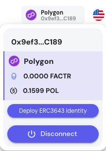

## Frontend UI overview
To get full access to the site please sign in with supported wallet.

### Templates
Assets are tokenized according to templates. Templates outline which data is needed to tokenize an asset. Assets already contains templates for a wide variety of Assets, or you can create a custom template yourself. A template should contain all the relevant dynamic data (data which gets updated throughout the lifetime of the asset) and static data (characteristics, id, etc.) of the asset.

Signed User can choose to create his own template from scratch by clicking new template card and adding desired input fields. On the other hand user can also copy or duplicate a template and edit it.

### Asset creation
To start creating an asset, choose a template that fits your needs and press "Use Template." The process of asset creation consists of four core steps:
1. Fill in the required fields from the template.
2. Set tokenization settings (such as general token information, relevant links, token icon, supply, etc.).
3. Verify the asset.
4. Mint: review the information and mint the token on-chain.

### Uploading Files
Assets use private ipfs for storing uploaded files and icons. This offers several key advantages over centralized storage.
- IPFS is a peer-to-peer distributed system. This means that files are hosted across multiple nodes, reducing the reliance on any single entity to keep the file available.
- Centralized systems rely on a single provider. If that provider has an outage or decides to censor data, files become inaccessible.
- IPFS uses deduplication and chunking to store data. The same data doesn’t have to be uploaded multiple times by different users, saving bandwidth and storage.
- Since IPFS data is content-addressed, users have more control over how data is shared and accessed. Files are retrieved through cryptographic hash functions, making them difficult to tamper with or trace.

### Asset verification
For certain asset types you may want to add an additional layer of trust. This can be done by having an external third party verifying the asset and data attached to it. Once an asset has been verified, other users can see this on the page of the asset. Assets supports this in the pre-configured templates. Reviewing parties will receive an email with asset information and will be able to accept or reject the asset by clicking the 'Continue' button and logging into the assets page to complete the action.

### Asset transfer
Minted assets can be transferred to another wallet by heading to the transfer page and selecting the contact to whom the asset will be sent. If you are trying to send an ERC3643 asset, ensure the receiving address has a deployed identity and is registered to the token identity.

#### Deploy idenity
Identity Management: ERC-3643 tokens are linked to on-chain identities managed by an open-source system known as ONCHAINID. Each participant’s identity stored on the blockchain, allowing for seamless and secure identity management.

#### Register identity on token
Once a user has a deployed identity, they can be registered by the asset creator to be eligible to receive, send, and burn tokens.

## ERC-20 vs ERC-3643
When it comes to asset tokenization, ERC-20 and ERC-3643 tokens offer different advantages based on their design and features. ERC-20 tokens provide a straightforward and flexible option for creating fungible tokens, making them suitable for tokenizing assets where regulatory oversight is minimal and interoperability with various platforms is prioritized. However, ERC-3643 tokens are specifically tailored for asset tokenization that requires stringent regulatory compliance, incorporating advanced features such as KYC/AML verification, whitelisting, and the ability to mint or burn tokens according to regulatory needs. While ERC-20 is ideal for broader applications, ERC-3643 offers a more robust framework for tokenizing assets that demand higher levels of control, security, and compliance.

### ERC-20

* **Widespread Adoption:** ERC-20 tokens are the most commonly used token standard on the Ethereum blockchain. Their simplicity and flexibility have led to their adoption by a wide range of projects, making them the default standard for fungible tokens in the cryptocurrency ecosystem.
* **Interoperability:** ERC-20 tokens are designed to be easily integrated with various wallets, exchanges, and decentralized applications (dApps) across the Ethereum network. This compatibility ensures that ERC-20 tokens can be transferred and used seamlessly across different platforms, enhancing their usability and liquidity.
* **Efficient and Reliable:** ERC-20 tokens benefit from Ethereum's (and all EVM-compatible blockchain's) robust infrastructure, including its well-established network of nodes and miners. This ensures efficient transactions and high reliability, with strong security measures embedded in the underlying blockchain protocol.

ERC-20 tokens have become a cornerstone of the Ethereum ecosystem, offering a simple yet powerful tool for creating fungible assets. While they may not include advanced compliance features, their flexibility and compatibility make them an excellent choice for a wide range of decentralized finance (DeFi) applications, token sales, and other blockchain-based activities.

### ERC-3643
* **Regulatory Compliance:** ERC-3643 tokens are specifically designed to meet regulatory requirements. This includes features for KYC/AML (Know Your Customer/Anti-Money Laundering) compliance, ensuring that only authorized and verified participants can hold and trade these tokens.
* **Whitelisting and Identity Management:** The ERC-3643 standard supports whitelisting, allowing issuers to control who can own and transfer tokens. This is crucial for maintaining compliance and ensuring that only eligible participants engage with the tokens.
* **Advanced Features:** ERC-3643 provides additional functionality such as the ability to mint and burn tokens based on regulatory requirements, enhancing the flexibility and control over the token lifecycle.
Enhanced Security: The standard includes mechanisms to enforce compliance and prevent unauthorized access, ensuring a secure environment for asset tokenization.

ERC-3643 tokens offer a sophisticated solution for asset tokenization, providing the necessary tools to meet regulatory standards and manage complex compliance requirements effectively. This makes ERC-3643 an ideal choice for tokenizing financial instruments and other assets that require stringent oversight and control.
