The **My Templates** section provides users and administrators with the ability to create and manage reusable templates for asset tokenization.  
Templates define the structure of assets by specifying required fields, static details, and dynamic inputs that must be provided when creating new assets.  

This ensures consistency across similar assets while giving flexibility for customization where needed.

---

## Dashboard Overview  

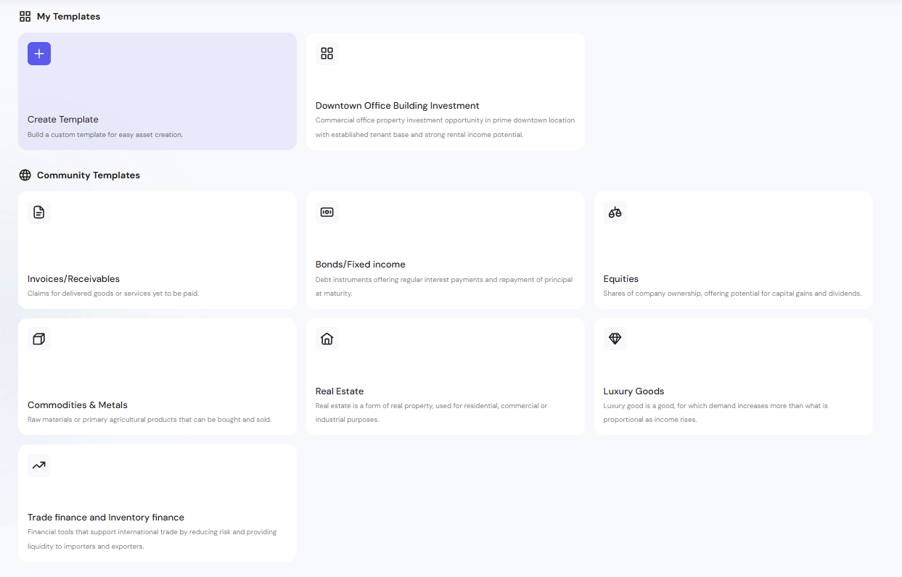

The **My Templates Dashboard** displays a list of all templates available to the user.  
From here you can:  
- **Create a new template** from scratch  
- **Use** an existing template as-is  
- **Copy & Customize** an existing template  
- **Edit** your own templates  
- **Delete** templates you no longer need  

## Creating Templates  

There are three methods for creating a new template:

### Method 1: Create Template from Scratch  

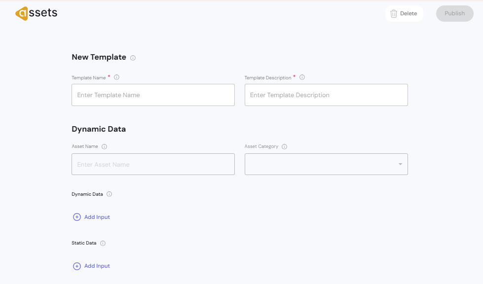

Start with a blank configuration when you want maximum flexibility.  

**Workflow:**  
1. Click **+** in the My Templates section.  

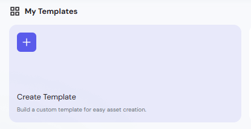

2. Enter **Template Name** and **Template Description**.  
3. Define **Dynamic Data** and **Static Data** fields.  

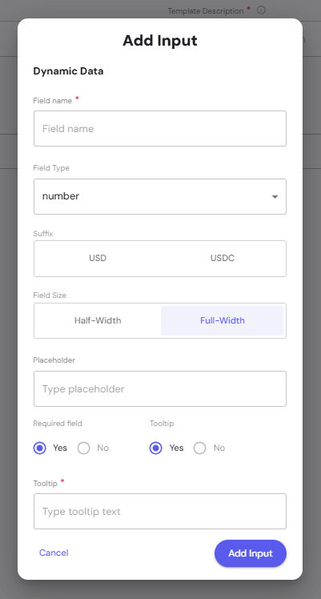

4. **Save the template to make it available for asset creation.**  

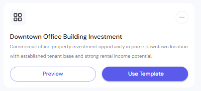

### Method 2: Use an Existing Template  

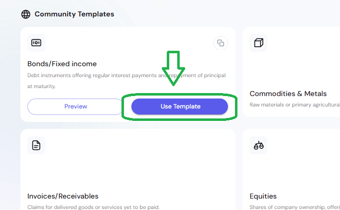

Select a pre-built template that already fits your use case.  

**Workflow:**  
1. Browse available templates.  
2. Click **Use Template** to proceed directly to asset creation.  
3. Fill in the dynamic data required for the specific asset.  

### Method 3: Copy & Customize  

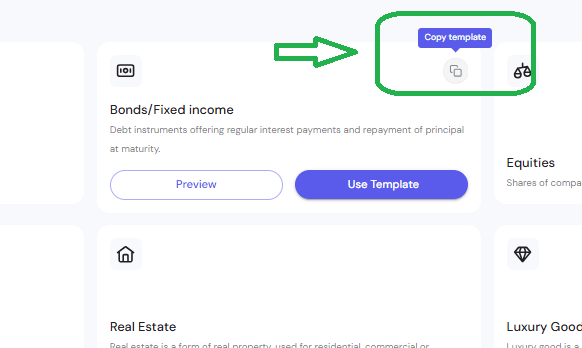

Make a copy of an existing template and adjust it to fit your needs.  

**Workflow:**  
1. Find a template similar to what you need.  
2. Click **Copy Template**.  
3. Open the **actions menu (⋯)** on the copied template. 

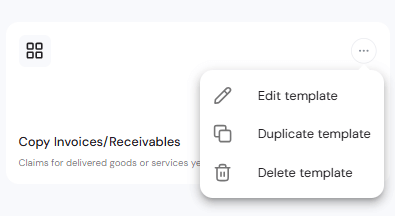

4. Select **Edit** and adjust fields as required.  

## Understanding Data Types  

Each template can contain two types of fields:  

- **Static Data**: Fixed at the template level, unchangeable later. 
 – Fields that are filled **once** when the template is created and remain fixed across all assets using that template.  
  - These values cannot be modified. 

- **Dynamic Data**: Flexible, editable per asset, and even updatable after minting.
  - After an asset is minted, **Dynamic Data can still be updated** (for example, adjusting rental income, occupancy rates, or other changing metrics).  
  - The platform provides an **Update Dynamic Data** action to edit these values post-mint while keeping the asset’s token contract intact.  

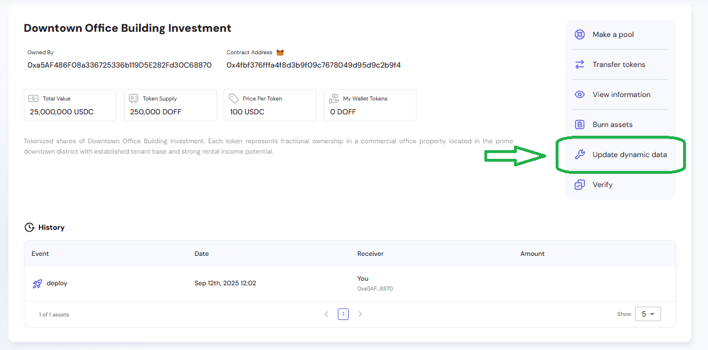
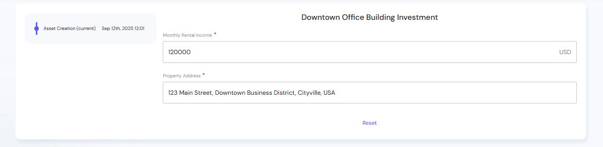 

## Configuring Data Fields  

When creating or editing a template, click **Add Input** under either **Dynamic Data** or **Static Data**.  

### Field Configuration Options  
- **Field Name** – Display label for the field.
- **Field Type** – Select from supported data types.

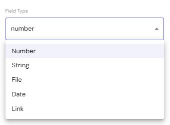

- **Suffix** – Optional suffix (USD, USDC).  
- **Field Size** – Choose *Half-Width* or *Full-Width* layout.  
- **Placeholder** – Example text shown until the field is filled.  
- **Required Field** – Make the field mandatory or optional.  
- **Tooltip** – Add a short help text shown on hover.  

## Template Lifecycle  

- **Create** – Build from scratch, copy, or use an existing template.  
- **Edit** – Update template fields as needed.  
- **Use** – Select a template to start creating an asset.  
- **Delete** – Remove unused or outdated templates.  

## Best Practices  

- **Keep templates focused** – Avoid adding unnecessary fields.  
- **Use clear names** – Make field labels easy to understand.  
- **Balance static vs dynamic data** – Keep static fields for consistency, dynamic fields for uniqueness.  
- **Leverage copies** – Start from a similar template to save time.  

> The **My Templates** section streamlines asset creation by providing a structured starting point, ensuring every asset follows a consistent design while leaving room for flexibility.
