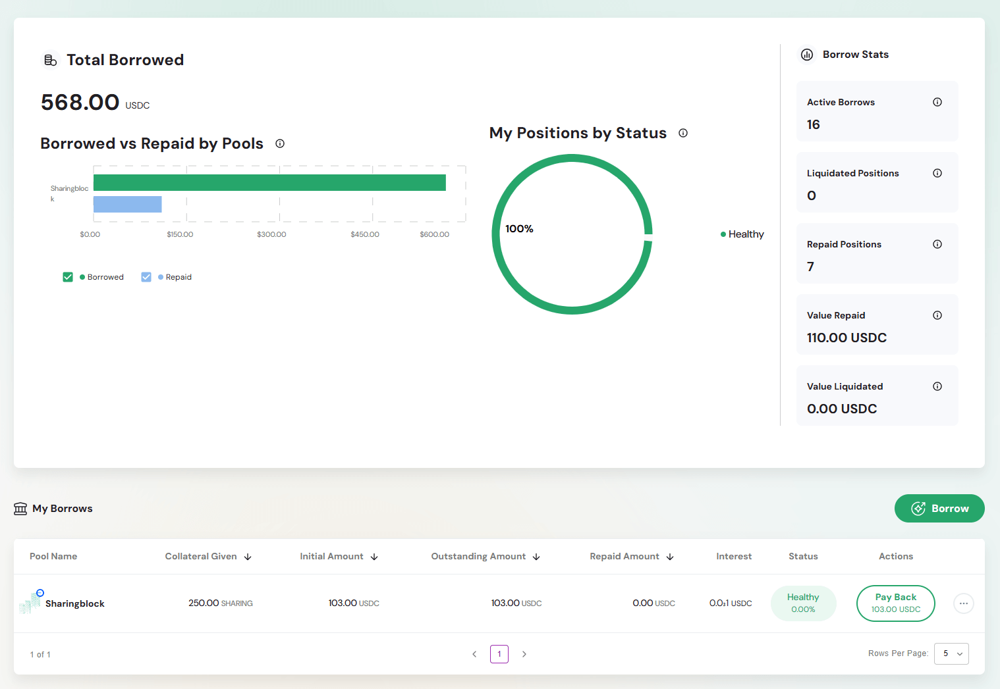
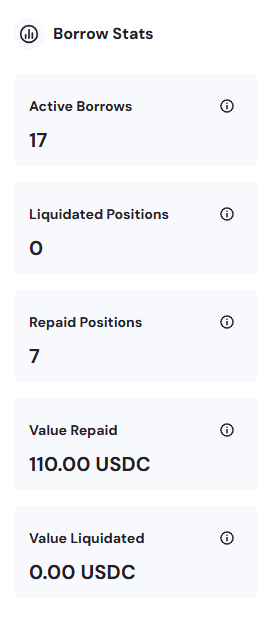
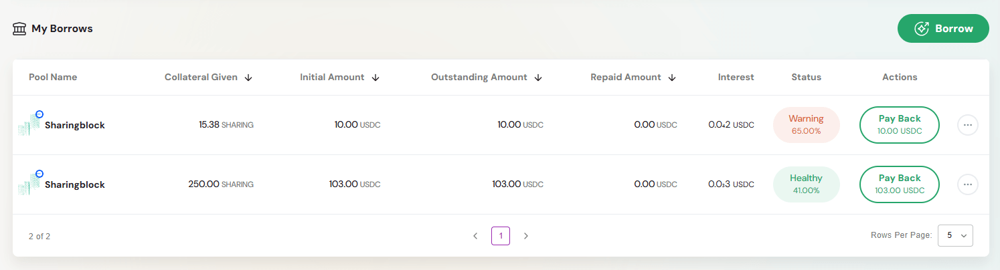
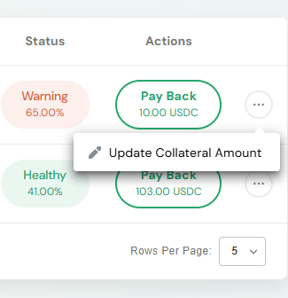
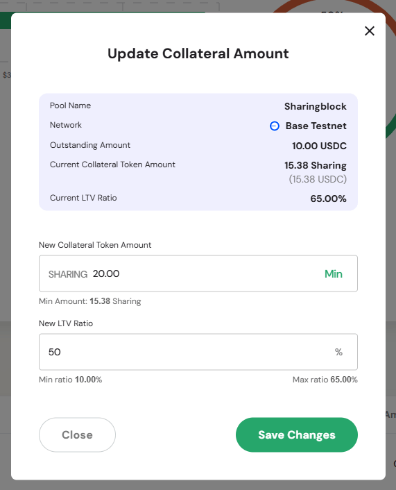
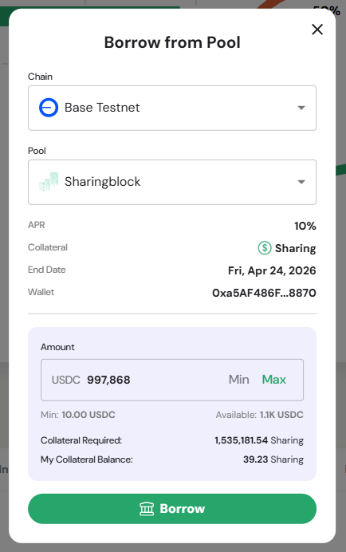

The Borrowed page provides a comprehensive view of all your borrowing positions across pools on the Defactor platform. It serves as your debt management hub for tracking borrowed assets, collateral positions, and managing loan repayments.

---

## Overview Metrics

### Total Borrowed

**Primary Metric Display**
- Large numerical display showing total borrowed amount
- Denominated in USDC
- Represents aggregate debt across all pool positions

### Borrowed vs Repaid by Pools

**Horizontal Bar Chart**
- Visual comparison of borrowed amounts versus repaid amounts
- Pool-by-pool breakdown showing repayment progress
- Two-color visualization:
  - **Borrowed** (green bar) - Principal amount borrowed from each pool
  - **Repaid** (blue bar) - Amount already repaid to each pool

**Chart Scale**
- X-axis showing dollar amounts from $0.00 to maximum values
- Easy comparison across different pools and repayment status

---

## Position Health Overview

### My Positions by Status

**Circular Progress Chart**  
- Visual representation of overall position health.  

**Possible States**  
- **100% Healthy (green)** – All positions are in good standing.  
- **Mixed Status (green/orange split)** – Combination of healthy and warning positions.  
- **100% Warning/Unhealthy (orange/red)** – All positions are at risk or near liquidation.  

**Status Indicators**  
- **Healthy (green)** – Positions with adequate collateralization.  
- **Warning (orange/red)** – Positions approaching liquidation thresholds.  

---

## Borrow Stats Panel

### Key Performance Metrics

**Active Borrows**
- Current count of active borrowing positions
- Quick reference for portfolio complexity

**Liquidated Positions**
- Total number of liquidated positions
- Risk management indicator (showing 0 for healthy management)

**Repaid Positions**
- Total number of fully repaid loan positions
- Historical repayment track record

**Value Repaid**
- Total USDC amount repaid across all positions
- Cumulative repayment history

**Value Liquidated**
- Total USDC value lost to liquidations
- Risk assessment metric (showing 0.00 for good management)

---

## My Borrows Management

### Action Buttons

**Borrow**
- Quick access to create new borrowing position
- Direct path to obtaining liquidity from pools

### Borrow Positions Table

**Column Structure**
- **Pool Name** - Pool identifier with logo/branding
- **Collateral Given** ↓ - Amount of collateral provided (sortable)
- **Initial Amount** ↓ - Original borrow amount (sortable)
- **Outstanding Amount** ↓ - Current debt balance (sortable)
- **Repaid Amount** ↓ - Amount already repaid (sortable)
- **Interest** - Accrued interest charges
- **Status** - Current position health with percentage
- **Actions** - Available position management options

**Position Status Examples**

**Warning Position**
- **Status**: "Warning x%" with orange indicator
- **Collateral**: Lower collateral ratio approaching danger zone
- **Action**: "Pay Back" button for immediate repayment

**Healthy Position**
- **Status**: "Healthy y%" with green indicator
- **Collateral**: Adequate collateral backing the loan
- **Actions**: "Pay Back" button and "Update Collateral Amount" option

### Advanced Position Management

**Update Collateral Amount**
- Allows adjustment of collateral to improve position health

---

## Borrow from Pool Modal

### Pool Selection

**Chain Selection**
- Dropdown for blockchain network selection
- Currently showing available chains (e.g., Base Testnet)

**Pool Selection**
- Dropdown for available pools on selected chain
- Pool-specific borrowing parameters

### Pool Information Display

**Key Metrics**
- **APR**: Annual percentage rate for borrowing costs
- **Collateral**: Required collateral type (e.g., Sharing tokens)
- **End Date**: Pool closure/maturity date
- **Wallet**: Connected wallet address (truncated)

### Borrow Amount Configuration

**Amount Input**
- Numerical input field for borrow amount
- Min/Max buttons for quick selection
- Minimum borrowing limit and available liquidity display

**Collateral Requirements**
- **Collateral Required**: Calculated collateral needed for requested amount
- **My Collateral Balance**: Available collateral in wallet
- Real-time validation of collateral sufficiency

**Borrow Button**
- Confirmation action to execute borrowing
- Validates collateral and borrowing limits

---

## Position Management Table

<!--  -->

### Enhanced Table View

**Detailed Position Information**
- Complete borrowing history per position
- Real-time status updates with health percentages
- Sortable columns for efficient position management

**Action Dropdown Menu**
- Three-dot menu (⋯) revealing additional options
- Context-sensitive actions based on position status
- Quick access to position management functions

### Status Health Indicators

**Color-Coded Status System**
- **Green**: Healthy positions
- **Orange/Red**: Warning positions 

**Percentage Indicators**
- Real-time collateralization ratios
- Visual health assessment for quick decision making

---

## Risk Management Features

### Liquidation Prevention

**Warning System**
- Early alerts for positions approaching liquidation
- Color-coded status indicators for immediate recognition
- Percentage thresholds showing proximity to liquidation

**Collateral Management**
- "Update Collateral Amount" functionality
- Ability to add more collateral to improve position health
- Real-time collateral ratio calculations

### Repayment Options

**Flexible Repayment**
- "Pay Back" buttons for immediate debt reduction

---

## Key Features

### Portfolio Overview
- **Comprehensive Debt Management**: All borrowing positions in single view
- **Health Monitoring**: Visual status indicators with percentage ratios
- **Repayment Tracking**: Historical and current repayment progress

### Risk Assessment
- **Liquidation Alerts**: Early warning system for at-risk positions
- **Collateral Monitoring**: Real-time collateralization ratio tracking
- **Interest Tracking**: Accumulating interest charges display

### User Experience
- **Sortable Tables**: Organize positions by any metric
- **Quick Actions**: Fast access to borrow and repayment functions
- **Modal Interfaces**: Streamlined transaction flows
- **Status Visualization**: Immediate health assessment through charts

---

## Workflow Benefits

- **Centralized Debt Management**: All borrowing activities in one dashboard
- **Proactive Risk Management**: Early warning systems prevent liquidations  
- **Flexible Position Control**: Adjust collateral and make payments as needed
- **Historical Tracking**: Complete borrowing and repayment history
- **Multi-Pool Support**: Manage positions across different pools simultaneously