The CP Pools Dashboard provides a comprehensive overview of pool creation and management activities on the Defactor platform. It serves as your main control center for creating new pools, managing existing pools, and monitoring global pool statistics and performance.

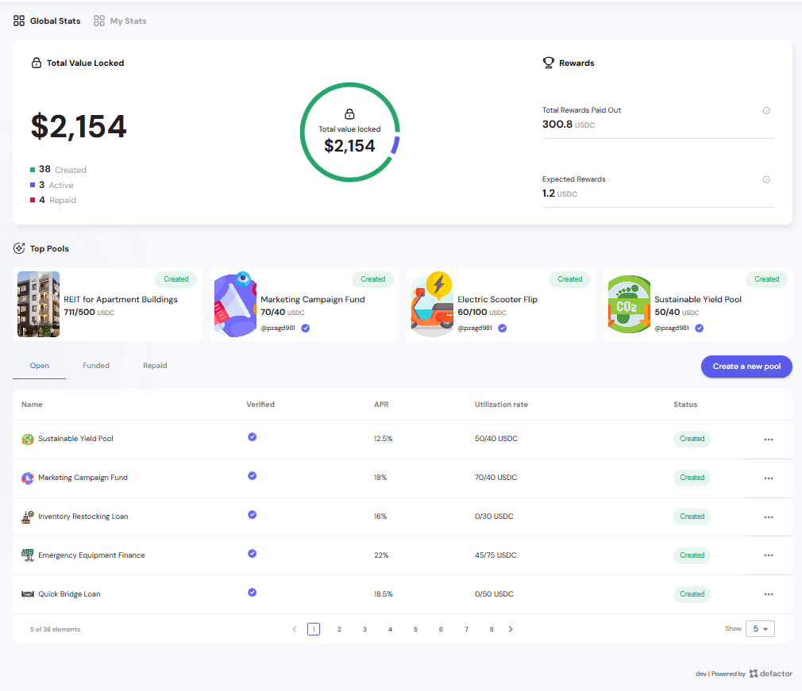

---

## Global Stats Overview

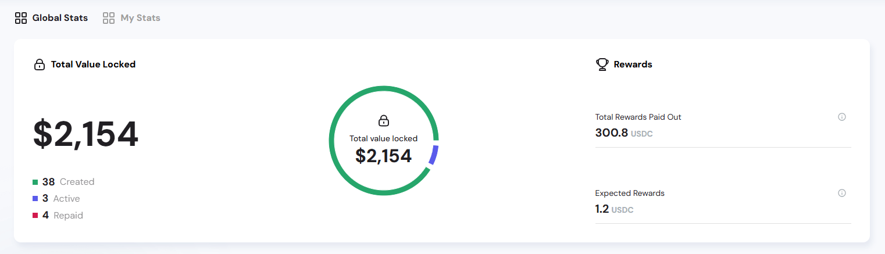

The complete dashboard brings together:  
- **TVL (numerical + chart)**  
- **Pool lifecycle breakdown**  
- **Reward distribution metrics**  

This consolidated view helps stakeholders quickly gauge **platform health, activity, and user incentives** at a glance.

### Total Value Locked (TVL)

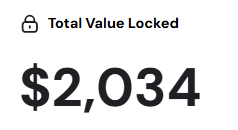

#### Primary Metric Display
- Represents the **aggregate value across all pools** on the platform.  
- Acts as the primary health indicator of platform liquidity.

#### Pool Status Breakdown

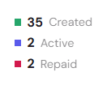

- **Created** → Total number of pools created.  
- **Active** → Pools currently operational.  
- **Repaid** → Completed/closed pools.  

This breakdown provides transparency into the **lifecycle of pools** on the platform.

#### Circular Progress Visualization

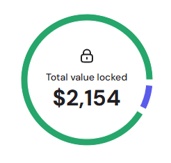

- A **donut chart** reinforces the TVL metric visually.  
- The inner circle shows the total locked value.  
- Colored segments correspond to the **status breakdown** above.  

##### Tooltips for Detailed Insights
Hovering over the chart provides context on pool composition:  

 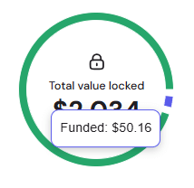  

  *Example*: Funded pools with **$50.16** locked.  

 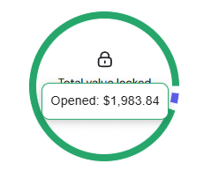  

  *Example*: Opened pools with **$1,983.84** locked.  

### Rewards Section

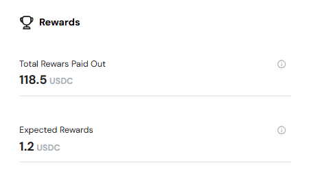

The rewards panel tracks both historical and projected incentives for participants:  

- **Total Rewards Paid Out**  
  - The total amount of rewards that have already been distributed to participants.
  - Cumulative rewards distributed platform-wide.  
  - Reflects the earnings already allocated to users.  

- **Expected Rewards**  
  - The projected rewards expected to be distributed across all participants.
  - Future rewards projected to be distributed.  
  - Indicates forward-looking incentive potential.  

## My Stats Overview

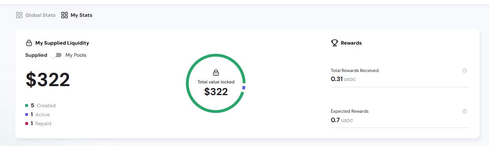

The **My Stats** dashboard provides personalized insights into pools you created or supplied liquidity to.  
You can toggle between two views:  
- **My Supplied Liquidity** → Shows funds and rewards for pools you supplied liquidity to.  
- **My Pools** → Tracks activity and rewards for pools you created.  

### My Supplied Liquidity

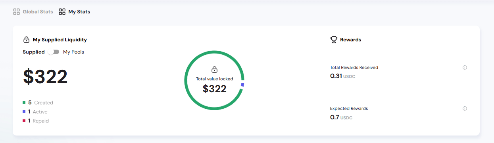

This view highlights **liquidity you provided** to pools created by others.  

#### Primary Metric Display

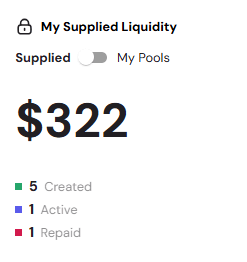

- Tracks the **total value of your supplied liquidity**.  
- Helps assess contribution size and associated rewards.  

#### Circular Progress Visualization

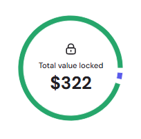

- Donut chart representing supplied liquidity distribution.  
- Central value = total supplied TVL.  

##### Tooltips for Detailed Insights

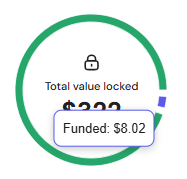  
*Example*: Supplied liquidity funded = **$8.02**  

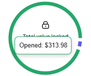  
*Example*: Supplied liquidity opened = **$313.98**  

### Rewards for Supplied Liquidity

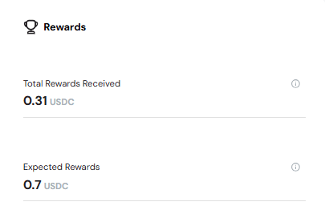

- **Total Rewards Received** → Rewards already distributed to your supplied positions (The total amount of rewards you have already received from your supplied liquidity).
- **Expected Rewards** → Future rewards based on active liquidity (The projected rewards you are expected to receive from your supplied liquidity).  

### My Pools

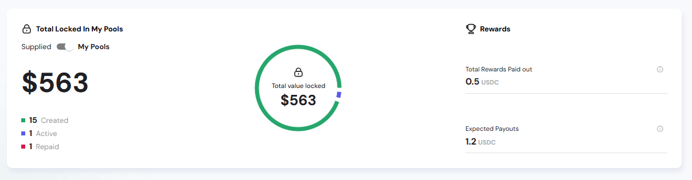

This view highlights **Total Locked In My Pools** and provides insight into the pools you personally created.

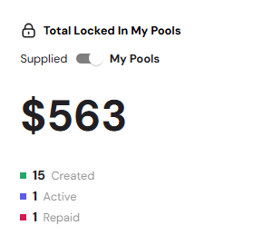

#### Primary Metric Display
- Shows the **total value locked in pools created by you**.  
- Helps you monitor personal exposure and performance.

#### Circular Progress Visualization

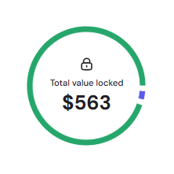

- Donut chart visualizing TVL across your created pools.  
- Segments reflect **Created, Active, Repaid** pools.  

### Rewards for My Pools

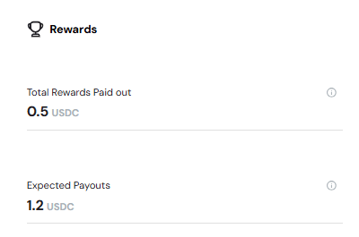

- **Total Rewards Paid Out** → Rewards already distributed from your created pools (The total amount of rewards that participants have already earned from your created pools).  
- **Expected Payouts** → Projected future rewards (The projected rewards that participants are expected to earn from your created pools).  
