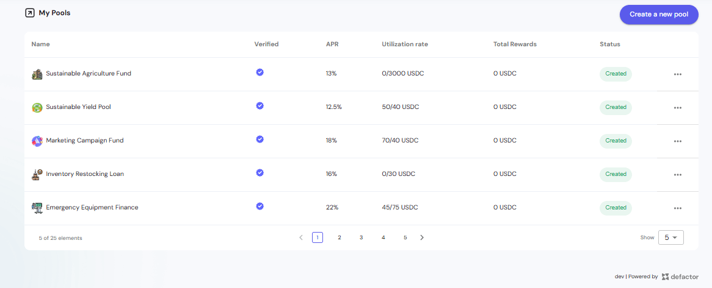
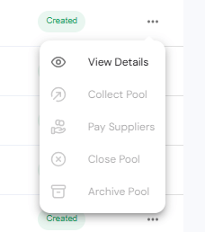
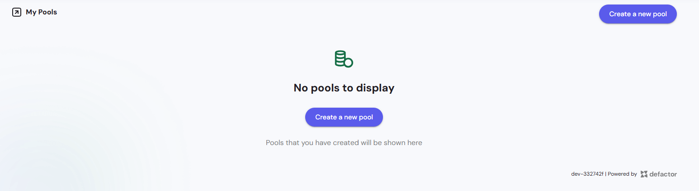

The My Pools page displays all pools that you have created on the CP Pools platform. It serves as your pool management dashboard, showing all investment opportunities you've launched for crowd-pooled funding.

---

## Pool Table Overview

The My Pools page displays your created pools in a comprehensive table format, providing key metrics and actionable controls for each pool you manage.

### Table Columns

**Name**
- Pool identifier with associated icon/logo

**Verified**
- Blue checkmark icon indicates verified pools
- Verification status for pool authenticity

**APR (Annual Percentage Rate)**
- Expected return rate for the pool
- Displayed as percentage 

**Utilization Rate**
- Current pool usage expressed as fraction
- Format: `[used]/[total] USDC`

**Total Rewards**
- Total rewards distributed or available
- Displayed in USDC
- Shows "0 USDC" if no rewards have been distributed yet

**Status**
- Visual badge indicating pool state:
  - **Created** (green) - Pool exists but not yet active
  - **Active** (blue) - Pool is currently operational
  - **Closed** (red/pink) - Pool has ended or been terminated

**Actions**
- **Three-dot menu** (⋮) - Pool management options dropdown

### Actions Dropdown

The three-dot menu provides access to pool management actions:

**Available Actions**
- **View Details** (eye icon) - Opens detailed pool information
- **Collect Pool** (refresh icon) - Gather funds from the pool
- **Pay Suppliers** (user icon) - Distribute payments to investors
- **Close Pool** (x icon) - Terminate the pool
- **Archive Pool** (archive icon) - Move pool to archived status

**Action Availability**
- Menu options may be disabled based on pool status
- Grayed-out options indicate unavailable actions for current pool state

### Table Footer

**Pagination Controls**
- Shows current page and total elements
- Navigation arrows for multi-page results
- Page number selector

**Display Options**
- "Show" dropdown to adjust items per page

### Pool Status States

**Created**
- Pool has been initialized
- Awaiting activation
- Management actions available

**Active**
- Pool is operational and accepting investments
- Real-time utilization tracking
- Full management capabilities enabled

**Closed**
- Pool has reached end of term or been terminated
- No new deposits accepted
- Final settlements in progress

**Liquidated**
- Pool has been fully settled and paid out

**Archived**
- Pool has been moved to archive status

## Empty State Display

### No Pools to Display

**Visual Indicator**
- Database icon with checkmark indicating data readiness
- Clean, minimalist design focusing user attention on next steps

**Primary Message**
- "No pools to display" - Clear status communication
- Explanatory text: "Pools that you have created will be shown here"

**Call to Action**
- **Create a new pool** button prominently displayed
- Direct entry point to pool creation workflow
- Encourages user to launch first investment opportunity

**Navigation Consistency**
- **Create a new pool** button also available in top navigation
- Multiple access points for pool creation functionality

## Pool Creation Interface

### Create Pool Form

The **Create Pool** form allows users to configure a new investment pool by entering basic details, funding limits, deadlines, and expected returns.

**Main Sections**
- **Basic Info:** Pool name and description  
- **Funding:** Soft and hard cap with tooltips  
- **Timeline:** Deadline and liquidation deadline with date pickers  
- **Links:** Website and Twitter handle verification  
- **Returns:** Expected APR, Minimum APR, Expected Term  
- **Visuals:** Upload pool image (PNG, JPG, SVG up to 10MB)

**Collateral**
- Initially empty with an "Add" button to select tokens  
- Required before pool creation can proceed  

**Fees**
- A non-refundable **200 USDC** creation fee  
- Requires **USDC approval** before submission

### Collateral Selection Modal

The **Choose Collateral** modal lists available tokens for selection.

**Columns**
- Checkbox, Name, Symbol, Token ID, Type, Balance  

**Actions**
- Select multiple tokens  
- Click **Add Collateral** to confirm or **Cancel** to exit

### Create Pool – Empty State

Displays an empty form with disabled submission and alerts:
- "No collateral tokens selected yet"  
- Reminder about 200 USDC creation fee

Buttons:
- **Close**  
- **Approve USDC**

### Create Pool – After Collateral Approval

After approving collateral, the **Create Pool** button becomes active.  
All fields are validated, and the pool can be deployed on-chain.

**Workflow Summary**
1. Fill out pool details  
2. Add and approve collateral  
3. Approve USDC fee  
4. Create pool

## Pool States and Lifecycle

### Pre-Creation State
- Empty state with creation encouragement
- Direct path to pool creation workflow

### Creation Process
- Comprehensive form with all required parameters
- Collateral selection and configuration
- Fee payment and approval process

### Post-Creation Display
- Management view of created pools
- Pool performance monitoring
- Access to management and payment actions

### Pool Management
- View detailed pool metrics
- Collect funds from active pools
- Pay suppliers (investors)
- Close or archive pools as needed