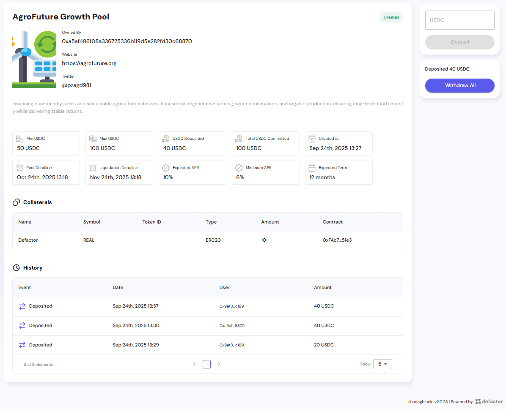
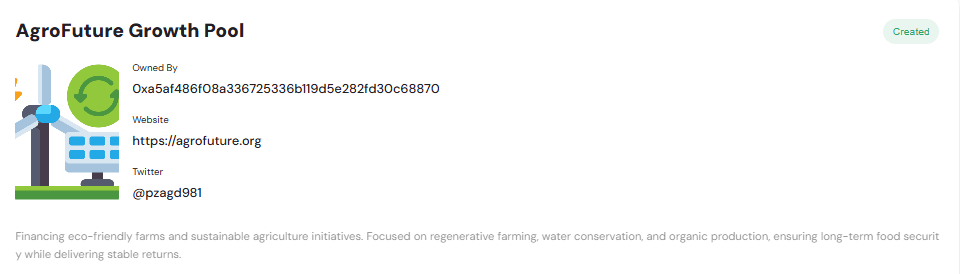
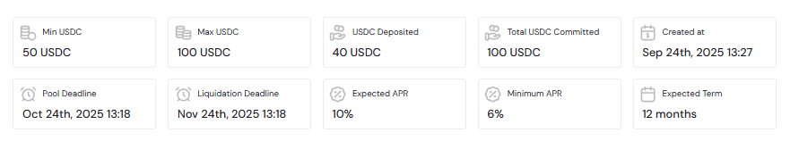
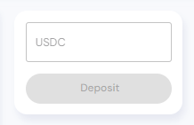
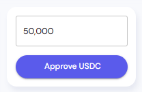
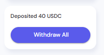
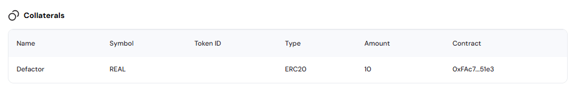
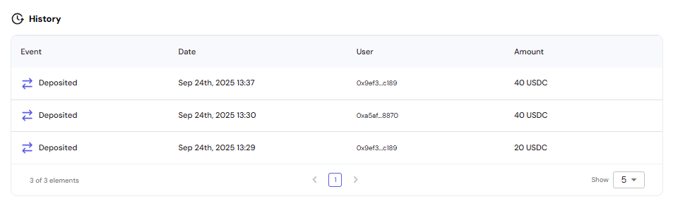

The **Pool Details** page provides comprehensive information about a specific CP pool, including pool parameters, deposit and withdrawal functionality, performance statistics, collaterals, and transaction history. This page is accessed by clicking on any pool row.

---

## Dashboard Overview  

  

The pool details dashboard provides:  
- **Pool Header** – Displays pool name, owner, website, and social links.  
- **Metrics Bar** – Shows pool statistics including deposited amounts, commitments, deadlines, and APRs.  
- **Deposit / Withdraw Panel** – Side panel for depositing USDC or withdrawing committed assets.  
- **Collaterals Table** – Overview of collateral tokens backing the pool.  
- **History Table** – Records of deposits and other interactions with the pool.  

## Pool Header  

  

The **Pool Header** provides the main identity and description of the pool:  
- **Pool Name & Status** – e.g., *AgroFuture Growth Pool* with current state (*Created*).  
- **Owner Address** – Wallet address of the pool owner.  
- **Website & Social Links** – Links to external project sites or social media.  
- **Description** – Narrative text about the pool’s purpose, goals, and focus areas.  

## Metrics Bar  

  

The **Metrics Bar** highlights key pool statistics:  
- **Min / Max USDC** – Minimum and maximum allowed deposit per user.  
- **USDC Deposited** – Current amount deposited.  
- **Total USDC Committed** – The overall commitment cap of the pool.  
- **Created At** – Timestamp of pool creation.  
- **Pool Deadline** – Date/time when pool closes for deposits.  
- **Liquidation Deadline** – Date/time when liquidation occurs if conditions are not met.  
- **Expected APR / Minimum APR** – Returns expected from participation.  
- **Expected Term** – Pool’s duration (e.g., 12 months).  

## Deposit & Withdraw Panel  

### Deposit Form  

  

- **Input Field** – Enter USDC amount to deposit.  
- **Deposit Button** – Confirms and executes the transaction (enabled when valid amount is entered).  

  

### Withdraw All  

  

- **Deposited Amount** – Shows how much has been deposited.  
- **Withdraw All Button** – Allows users to withdraw all deposited funds in one step.  

## Collaterals Table  

  

The **Collaterals Table** shows the assets that back the pool and secure the commitments made by its participants. These collaterals are typically tokens or on-chain assets that guarantee the value of the pool.  

**Columns**  
- **Name & Symbol** – Collateral token name and ticker (e.g., *Defactor REAL*).  
- **Token ID / Type** – Identifier and token standard (e.g., ERC20).  
- **Amount** – Quantity of collateral tokens committed.  
- **Contract** – Smart contract address of the token.  

**How collaterals work**  
- Collaterals are locked into the pool contract by the pool creator or project operator.  
- They act as security for all users who deposit USDC into the pool.  
- If the pool runs successfully, users receive **repayment with interest (APR)** in USDC, and the collateral remains locked.  
- If the pool defaults or fails to meet repayment conditions, the locked collateral can be **liquidated or distributed** to users to cover their losses.  

> Users do not automatically receive these collateral tokens during normal pool operation — they only come into play if repayment conditions are not met and liquidation occurs.  

## History Table  

  

The **History Table** provides a chronological list of pool interactions:  
- **Event** – Action performed (e.g., *Deposited*).  
- **Date** – Timestamp of the event.  
- **User** – Wallet address of the participant.  
- **Amount** – Value deposited or withdrawn.  

> This table provides transparency into all user activity, ensuring traceability and accountability.  
