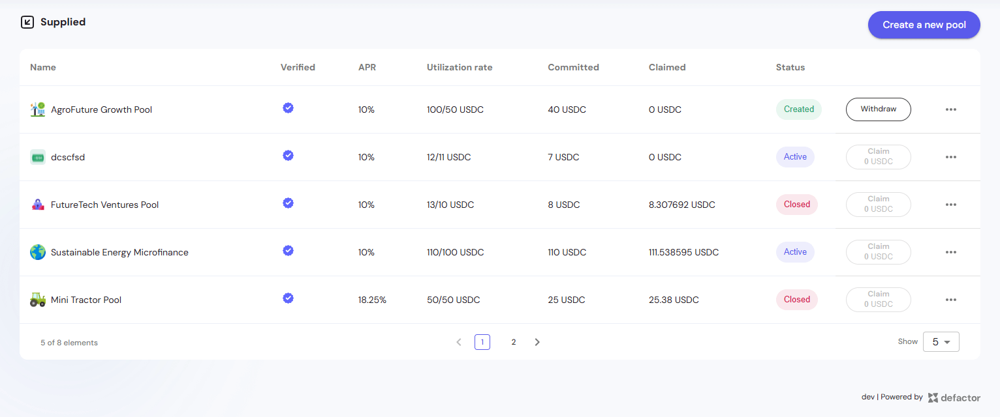
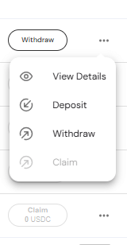
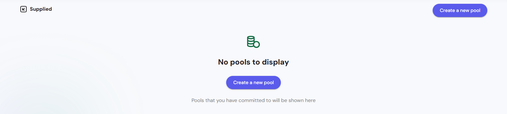
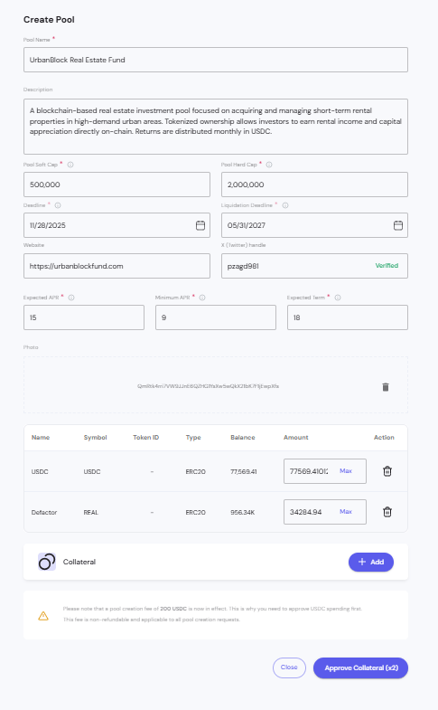
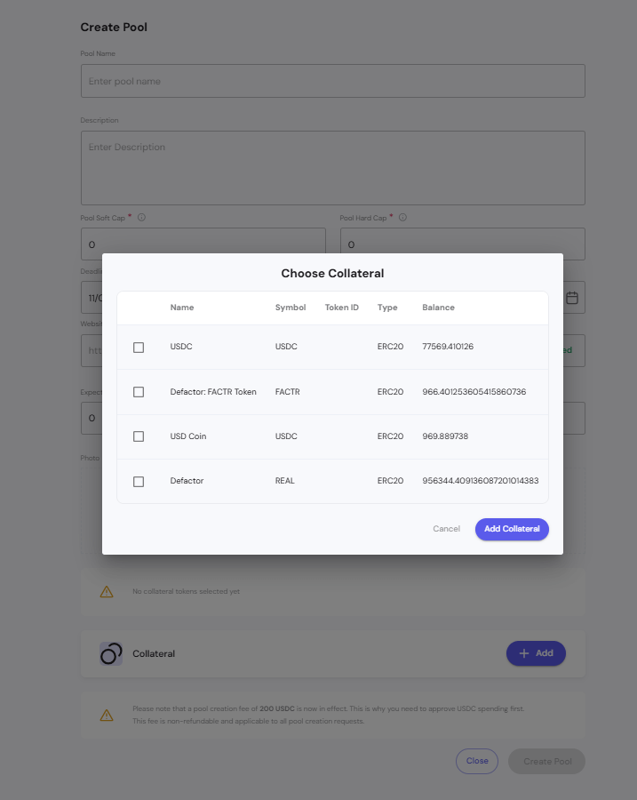
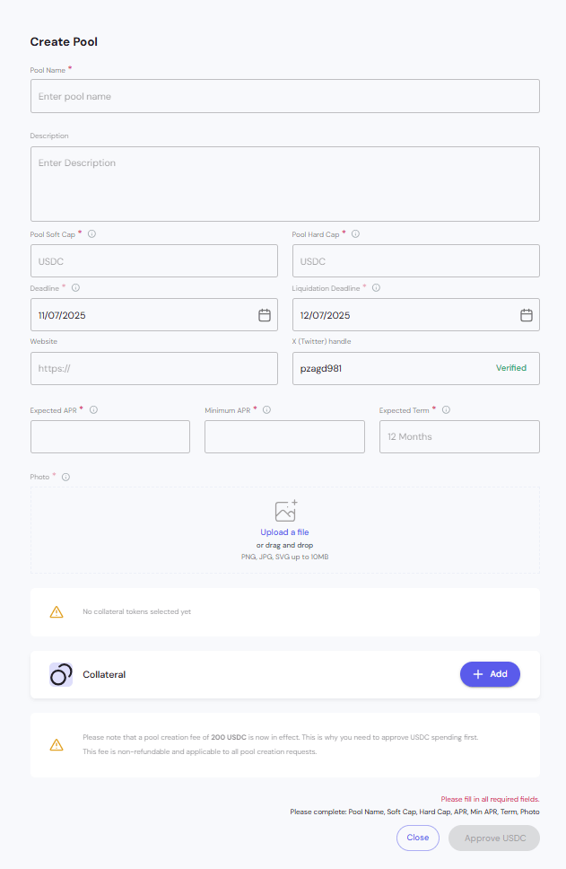
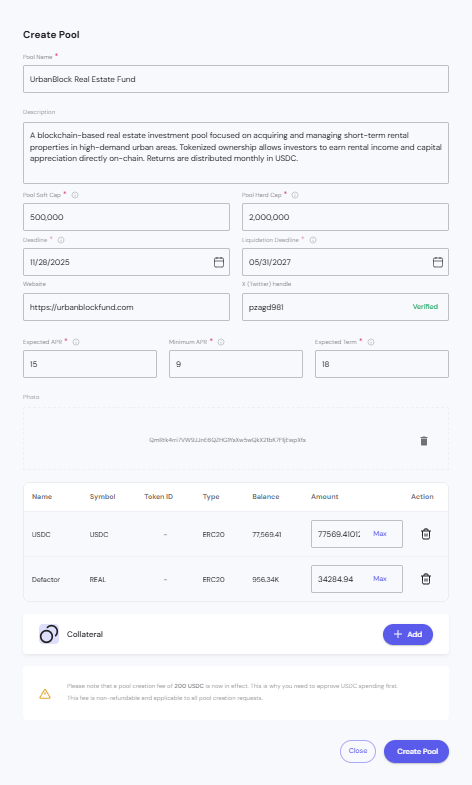

The Supplied page displays all pools that you have committed funds to on the CP Pools platform. It serves as your investment portfolio view, showing your participation in various crowd-pooled investment opportunities.

---

## Pool Table Overview

The Supplied page displays your committed pools in a comprehensive table format, providing key metrics and actionable controls for each investment.

### Table Columns

**Name**
- Pool identifier with associated icon/logo

**Verified**
- Blue checkmark icon indicates verified pools
- Verification status for pool authenticity

**APR (Annual Percentage Rate)**
- Expected return rate for the pool
- Displayed as percentage 

**Utilization Rate**
- Current pool usage expressed as fraction
- Format: `[used]/[total] USDC`

**Committed**
- Amount you have invested in the pool
- Displayed in USDC

**Claimed**
- Amount you have withdrawn from the pool
- Displayed in USDC
- Can show partial amounts
- Shows "0 USDC" if nothing has been claimed yet

**Status**
- Visual badge indicating pool state:
  - **Created** (green) - Pool exists but not yet active
  - **Active** (blue) - Pool is currently operational
  - **Closed** (red/pink) - Pool has ended or been terminated

**Actions**
- **Withdraw** button - Available for pools in "Created" status
- **Claim** button - Available when funds can be withdrawn (shows "Claim 0 USDC" if no claimable amount)
- **Three-dot menu** (⋮) - Additional options dropdown

### Actions Dropdown

The three-dot menu provides quick access to pool-specific actions:

**Available Actions**
- **View Details** (eye icon) - Opens detailed pool information
- **Deposit** (plus icon) - Add more funds to the pool
- **Withdraw** (arrow icon) - Remove committed funds
- **Claim** (checkmark icon) - Withdraw earned returns

**Action Availability**
- Menu options may be disabled based on pool status
- Grayed-out options indicate unavailable actions for current pool state

### Table Footer

**Pagination Controls**
- Shows current page and total elements
- Navigation arrows for multi-page results
- Page number selector

**Display Options**
- "Show" dropdown to adjust items per page

### Pool Status States

**Created**
- Pool has been initialized
- Withdraw action available
- Investments can be recalled before pool activation

**Active**
- Pool is operational and accepting investments
- Claim button available for withdrawing returns
- Real-time utilization tracking

**Closed**
- Pool has reached end of term or been terminated
- Final claim available for remaining funds
- No new deposits accepted

## Empty State Display

### No Pools to Display

**Visual Indicator**
- Database icon with checkmark indicating data readiness
- Clean, minimalist design focusing user attention on next steps

**Primary Message**
- "No pools to display" - Clear status communication
- Explanatory text: "Pools that you have committed to will be shown here"

**Call to Action**
- **Create a new pool** button prominently displayed
- Alternative entry point to pool creation workflow
- Encourages user engagement when no investments exist

**Navigation Consistency**
- **Create a new pool** button also available in top navigation
- Multiple access points for pool creation functionality

## Pool Creation Interface

### Create Pool Form

The **Create Pool** form allows users to configure a new investment pool by entering basic details, funding limits, deadlines, and expected returns.

**Main Sections**
- **Basic Info:** Pool name and description  
- **Funding:** Soft and hard cap with tooltips  
- **Timeline:** Deadline and liquidation deadline with date pickers  
- **Links:** Website and Twitter handle verification  
- **Returns:** Expected APR, Minimum APR, Expected Term  
- **Visuals:** Upload pool image (PNG, JPG, SVG up to 10MB)

**Collateral**
- Initially empty with an “Add” button to select tokens  
- Required before pool creation can proceed  

**Fees**
- A non-refundable **200 USDC** creation fee  
- Requires **USDC approval** before submission

### Collateral Selection Modal

The **Choose Collateral** modal lists available tokens for selection.

**Columns**
- Checkbox, Name, Symbol, Token ID, Type, Balance  

**Actions**
- Select multiple tokens  
- Click **Add Collateral** to confirm or **Cancel** to exit

### Create Pool – Empty State

Displays an empty form with disabled submission and alerts:
- “No collateral tokens selected yet”  
- Reminder about 200 USDC creation fee

Buttons:
- **Close**  
- **Approve USDC**

### Create Pool – After Collateral Approval

After approving collateral, the **Create Pool** button becomes active.  
All fields are validated, and the pool can be deployed on-chain.

**Workflow Summary**
1. Fill out pool details  
2. Add and approve collateral  
3. Approve USDC fee  
4. Create pool

## Pool States and Lifecycle

### Pre-Creation State
- Empty state with creation encouragement
- Direct path to pool creation workflow

### Creation Process
- Comprehensive form with all required parameters
- Collateral selection and configuration
- Fee payment and approval process

### Post-Creation Display
- Portfolio view of committed pools
- Investment tracking and performance monitoring
- Pool status and participation details
