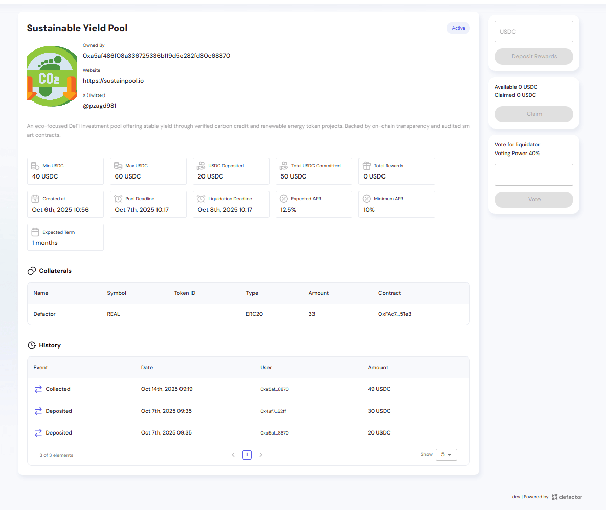
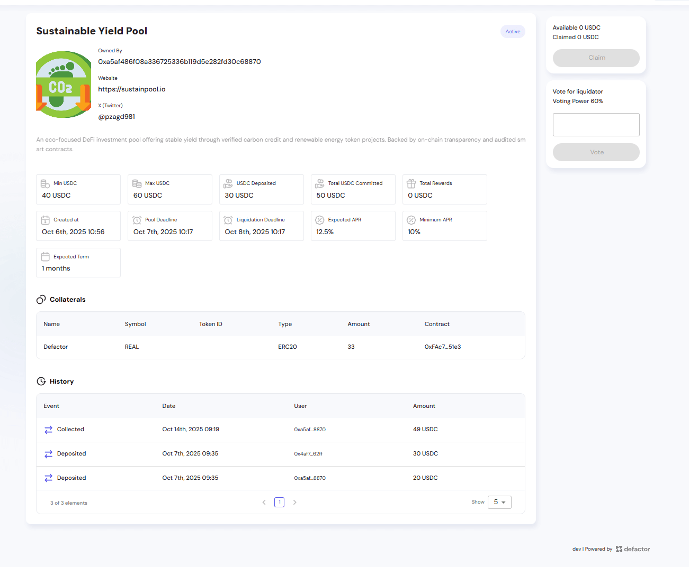
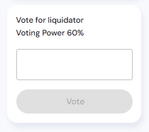
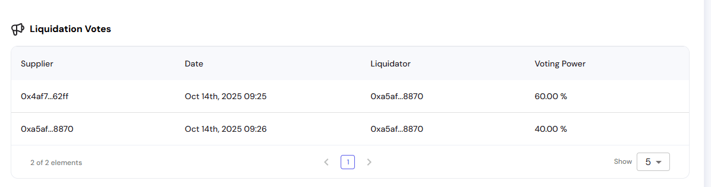
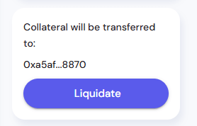

This guide explains what happens when a **CP Pool reaches its funding target** and the owner successfully collects the funds, but later **fails to repay the principal and rewards**.

This represents a **default scenario**, where investors are exposed to the underlying risk of the pool owner not returning capital.

---

## 1. Owner Flow (Default Case)

### 1.1 Collection of Funds

When the pool reaches its funding target (e.g., 50 USDC):

- Owner performs **Collect** transaction
- Funds (minus platform fee) are transferred to the owner's wallet
- Pool status changes from **Created** to **Active**

*Owner view showing the "Deposit Rewards" panel after successfully collecting funds. Pool status is now "Active".*

At this stage, investors await repayment before the liquidation deadline.

### 1.2 Expected Repayment

The owner is required to deposit back:
- **Principal** = total committed funds (e.g., 50 USDC)
- **Rewards** = interest based on APR and term (e.g., 0.76 USDC for 12.5% APR over 1 month)

This deposit must occur **before the liquidation deadline** (Oct 8th, 2025 10:17 in the example).

*Owner can input the amount and click "Deposit Rewards" to repay investors.*

---

## 2. Investor Flow (Default Case)

### 2.1 After Collection

Once the owner collects funds:
- Investors see pool status as **Active**
- Claim panel shows:
  - **Available = 0 USDC**
  - **Claimed = 0 USDC**
- Investors must wait until the owner deposits principal + rewards

*Investor view showing Active pool with 0 USDC available to claim while waiting for owner to repay.*

### 2.2 When Owner Fails to Repay

If the **Liquidation Deadline** passes without the owner depositing rewards:
- Pool status changes to **Liquidated**
- Investors face potential **loss of principal** unless collateral exists
- The liquidation process is triggered automatically

### 2.3 Collateral Liquidation Process

When a pool defaults, investors can vote on who should liquidate the collateral:

#### Voting for Liquidator

Investors vote to designate a liquidator based on their voting power (proportional to their investment):

*Voting interface where investors select a liquidator address. Voting power shown as percentage (60% in this example).*

#### Liquidation Votes Table

The system tracks all liquidation votes:

*Liquidation Votes section showing suppliers who voted, their chosen liquidators, and voting power percentages.*

#### Executing Liquidation

Once voting determines the liquidator, they can execute the liquidation:

**After liquidation:**
- Collateral (e.g., 33 REAL tokens) is transferred to the designated liquidator
- The liquidator is **trusted and expected** to sell the collateral and distribute proceeds proportionally to investors
- This process relies on the liquidator's integrity to fairly distribute recovered funds

---

## 3. Transparency and Audit Trail

The **History section** logs the entire sequence of events:

- ✅ **Deposited** - Initial investor deposits
- ✅ **Collected** - Owner collected funds 
- ❌ **Missing Deposit** - No "Deposited" event for rewards before deadline
- 🚨 **Liquidated** status triggered after deadline
