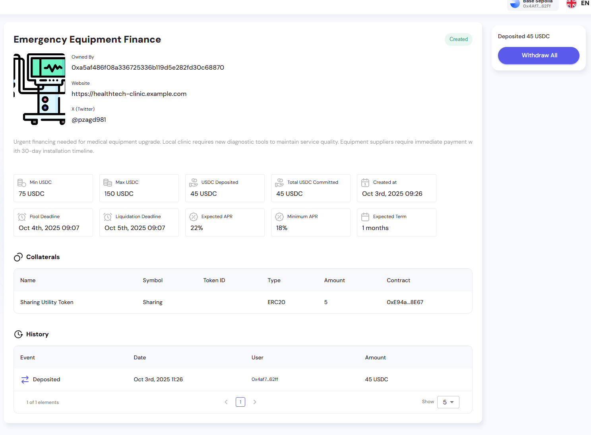
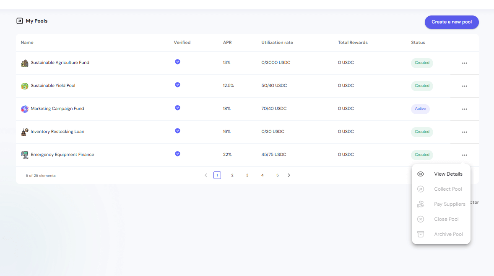
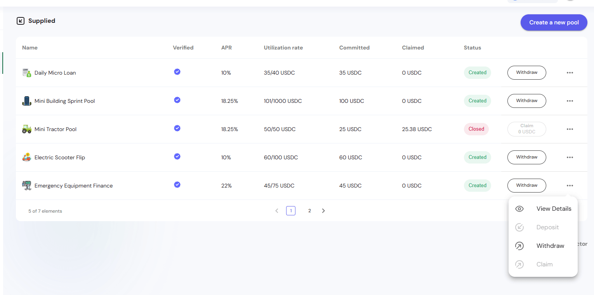
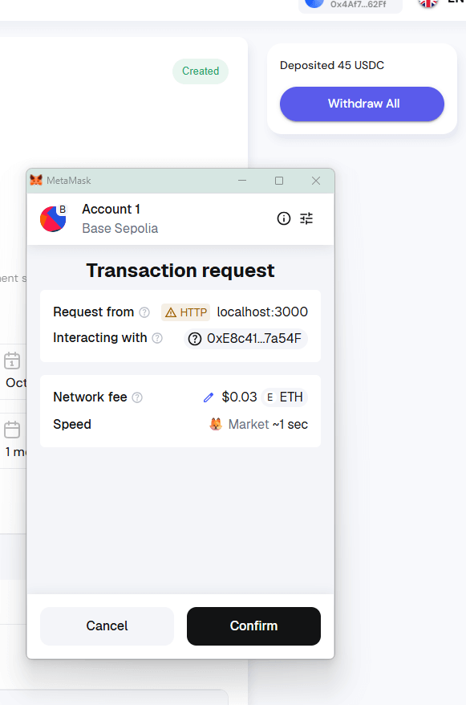
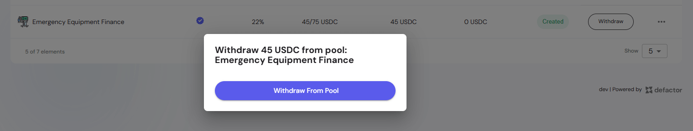
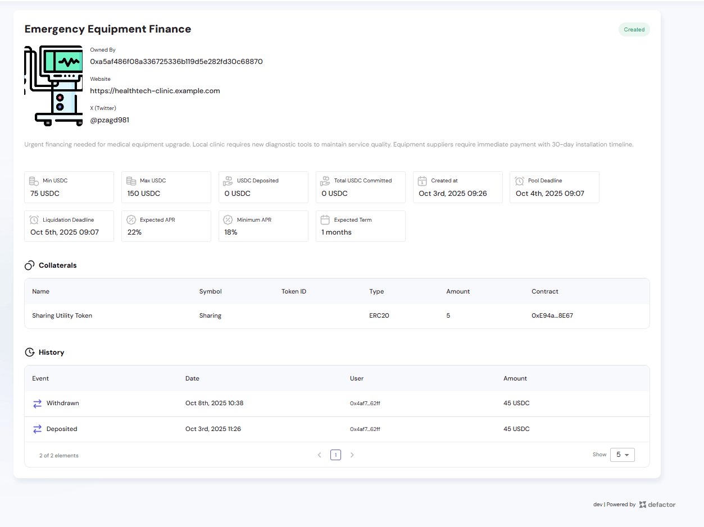
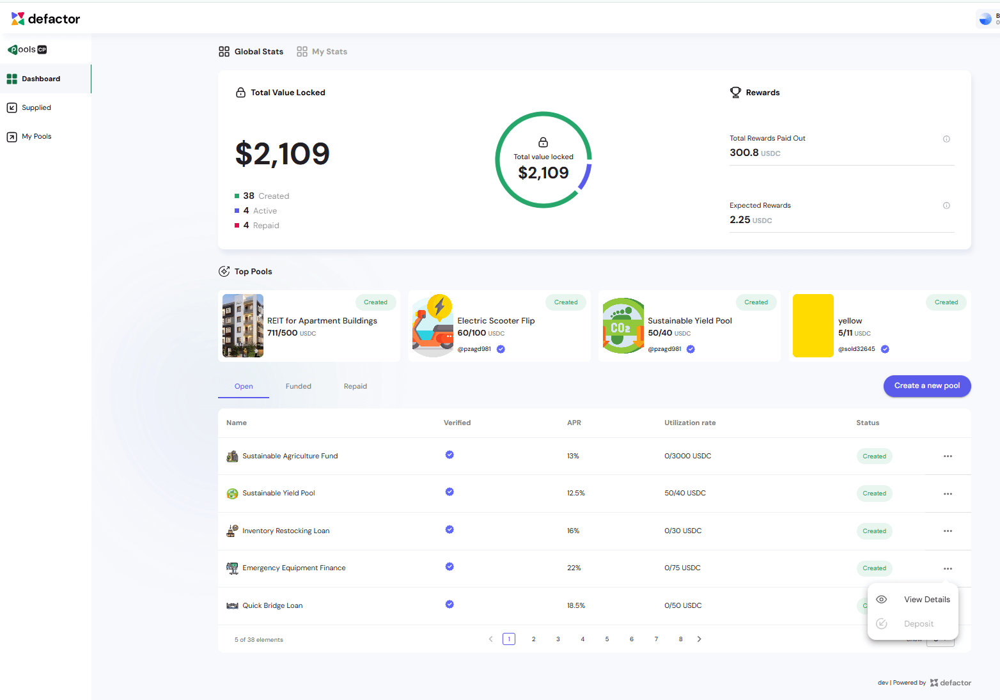

This guide explains what happens when a **CP Pool does not reach the minimum funding target** by its deadline. In this case, the pool is considered **Failed**, and investors are refunded their contributions.

---

## 1. What is a Failed Pool?

A pool is marked as **Failed** when:
- The **Pool Deadline** is reached
- The **Total COMMITTED** amount is **below the minimum required funding (Min USDC)**

Since the funding threshold was not reached, the pool **never becomes Active**, and the owner cannot collect funds.

**Example**: Emergency Equipment Finance pool
- Min USDC: **75 USDC**
- Max USDC: **150 USDC**
- USDC Deposited: **45 USDC** (below minimum)
- Total USDC Committed: **45 USDC**

*Pool detail view from investor perspective showing deposit status and pool information*

## 2. Owner Flow (Failed Pool)

### 2.1 Collection Disabled
- The **Collect** button never becomes active
- The owner cannot access or withdraw committed funds

*My Pools view from owner perspective showing the Emergency Equipment Finance pool in Created status with action menu options (only View Details)*

---

## 3. Investor Flow (Failed Pool)

### 3.1 Viewing Failed Pool Status
After the deadline passes, investors can see:
- Pool status: **Created** (but deadline passed)
- **Deposited 45 USDC** (at the top right)
- **Withdraw All** button becomes available
- All pool details remain visible:
  - APR: **22%** (not earned since pool failed)
  - Expected Term: **1 months**
  - Utilization rate: **45/75 USDC**

*Pool detail view showing "Deposited 45 USDC" with the Withdraw All button available*

### 3.2 Refund Process

#### Step 1: Navigate to the pool
Click on "Emergency Equipment Finance" from the dashboard or "My Pools" section

*Supplied view showing the Emergency Equipment Finance pool with Withdraw action available*

#### Step 2: Initiate withdrawal
Click the **"Withdraw All"** button (visible after deadline)

*Withdraw All button displayed at the top right of the pool details page*

#### Step 3: Confirm withdrawal
A modal appears asking to confirm withdrawal from the pool

*Withdrawal confirmation modal: "Withdraw 45 USDC from pool: Emergency Equipment Finance"*

#### Step 4: Click "Withdraw From Pool" button
The modal shows the withdrawal details and confirmation button

#### Step 5: Your wallet opens with a transaction request
- Transaction type: "Transaction request"
- Request from: localhost:3000 (or your domain)
- Interacting with: Contract address (0xE8c41...7a54F)
- Network fee: ~$0.03 ETH
- Speed: Market ~1 sec

#### Step 6: Confirm the transaction
Click **"Confirm"** in your wallet (MetaMask, Rainbow, or any other compatible wallet)

#### Step 7: Wait for confirmation
Transaction processes on the blockchain

#### Step 8: Funds returned
Your full deposit is refunded to your wallet

**Example**:
- Investor deposited **45 USDC** on Oct 3rd, 2025 11:26
- After deadline, investor withdraws **45 USDC** on Oct 8th, 2025 10:38
- Full amount returned with no fees deducted

### 3.3 History Updates

The **History section** tracks all activity:

**Before withdrawal**:

*History section showing only the Deposited event*

| Event | Date | User | Amount |
|-------|------|------|--------|
| Deposited | Oct 3rd, 2025 11:26 | 0x4af7...62ff | 45 USDC |

**After withdrawal**:

*History section showing both Withdrawn and Deposited events*

| Event | Date | User | Amount |
|-------|------|------|--------|
| Withdrawn | Oct 8th, 2025 10:38 | 0x4af7...62ff | 45 USDC |
| Deposited | Oct 3rd, 2025 11:26 | 0x4af7...62ff | 45 USDC |

This ensures complete transparency that all funds were returned.

### 3.4 Post-Withdrawal State
After successful withdrawal:
- **USDC Deposited**: updates to **0 USDC**
- **Total USDC Committed**: remains at **45 USDC** (historical record)
- Pool remains in the **My Pools** list for reference
- All transaction history is preserved

*Supplied table view after withdrawal showing updated status*

---

## 4. Key Differences from a Successful Pool

| Aspect | Successful Pool | Failed Pool |
|--------|----------------|-------------|
| Funding | Reaches minimum threshold | Below minimum threshold |
| Owner Action | Can collect funds | Cannot collect funds |
| Pool Status | Created → Active → Closed | Created → Failed |
| Investor Outcome | Receives deposit + APR rewards | Receives only initial deposit back |
| Rewards | APR earned over term | No APR earned |
| Withdrawal Timing | After pool closes or liquidation | After deadline passes |

---

## 5. Visual Indicators

### Dashboard View

- Pool appears in **"Top Pools"** section
- Shows **APR: 22%** and **Utilization rate: 0/75 USDC** (after withdrawal)
- **Status badge**: "Created" (green)
- **View Details** option available in actions menu

### Supplied View

*Supplied view showing the Emergency Equipment Finance pool with Withdraw action available*

- Pool appears in **"Supplied"** section
- Shows **APR: 22%** and **Utilization rate: 45/75 USDC**
- **Status badge**: "Created" (green)
- **Withdraw** button available in actions menu
- Three-dot menu shows additional options: View Details, Deposit, Withdraw, Claim

### Pool Detail View

*Complete pool detail page showing all information and Withdraw All button*

- **Created** badge at top right
- All pool information remains visible
- Prominent **"Withdraw All"** button
- History section shows complete transaction log
- Pool metrics clearly displayed

---

## 6. Important Notes

- **No Penalties**: Investors are not penalized for a failed pool
- **Gas Fees**: Investors only pay network gas fees for the withdrawal transaction
- **Timing**: Withdrawal can be initiated immediately after the deadline passes
- **Full Refund**: 100% of deposited USDC is returned
- **Transparency**: All transactions are recorded on-chain and visible in the History section
- **No Partial Withdrawals**: The "Withdraw All" button withdraws the entire deposited amount

---

## 7. Summary

- **Failed Pool** = insufficient funding by the deadline (below Min USDC)
- Owner **cannot collect** any funds from the pool
- Investors are **fully refunded** their contributions via "Withdraw All"
- **No rewards** (APR) are earned or distributed
- Complete **transparency** maintained via on-chain history logs
- Process is **straightforward**: one-click withdrawal after deadline