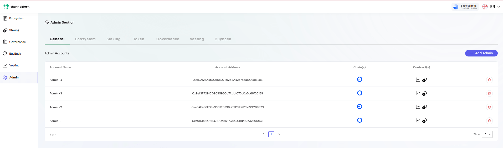

The **Admin Section** provides platform administrators with tools to configure, manage, and monitor all critical aspects of the Engage ecosystem.  
From here, project owners and authorized admins can control contracts, wallets, staking pools, vesting schedules, tokens, governance, and buyback mechanisms.  

This ensures transparent, secure, and efficient management of the entire ecosystem from a single interface.  

---

## Admin Section Dashboard  

The dashboard provides access to the following configuration areas:

- **General Settings** – Manage admin accounts, permissions, and contract access.  
- **Ecosystem Settings** – Allocate and monitor tokens across wallets and networks.  
- **Staking Settings** – Create and configure staking pools, manage APRs, and control contracts.  
- **Token Settings** – Add and manage tokens, set price sources, and ensure consistent metadata.  
- **Vesting Settings** – Configure vesting schedules, cliffs, and distribution batches.  
- **Governance Settings** – Manage proposals, members, and governance roles.  
- **Buyback Settings** – Control buyback wallets and ensure transparency of token repurchases.  

## Administrative Best Practices  

- **Role-based Access** – Use General Settings to ensure only authorized accounts have administrative permissions.  
- **Transparency First** – Maintain accurate wallet labels, icons, and token metadata to simplify audits.  
- **Regular Audits** – Review admin accounts, staking pools, vesting schedules, and governance members regularly.  
- **Emergency Controls** – Use pause/unpause functionality responsibly during incidents or upgrades.  

> The Admin Section centralizes ecosystem governance, ensuring administrators can manage operations confidently while maintaining transparency for the community.
