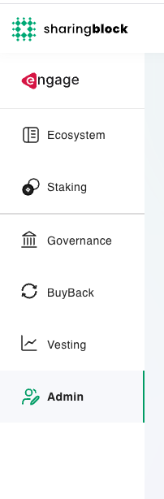

The Admin Section provides a secure and permissioned interface for managing core operational and configuration aspects of the Engage platform. It enables authorized team members to carry out high-impact actions related to governance, token vesting, liquidity pool setup, and system permissions.

This section is integral to maintaining the integrity of the ecosystem and ensuring that only designated actors can initiate or approve protocol-level changes. Role-based access is enforced through smart contract permissions, and all actions are executed transparently on-chain.

The module is designed to support evolving platform needs, with extensibility for managing ecosystem wallets, approving proposals, or coordinating token distributions.

---

## Overview

Defactor Engage provides a suite of powerful tools to administer and interact with the token economy. Admins can:

- Manage token metrics and ecosystem wallets
- Configure staking pools
- Oversee governance proposals and votes
- Monitor token buybacks
- Maintain transparency with community stakeholders
- Track vesting schedules and manage token distribution

## Role-Based Access

Only wallets designated as Admins can:

- Access the Admin tab
- Trigger system-level actions
- View restricted system logs

---

## Getting Started

**Accessing the Admin Dashboard**
1. Go to your Defactor Engage instance.
2. Connect your wallet (MetaMask, Trust Wallet, or any WalletConnect-supported wallet)
3. Ensure you're on the correct network (Polygon, Ethereum, Base, BNB Chain, or Algorand)
4. Admin privileges will automatically unlock advanced configuration options if your wallet is whitelisted
5. You will see the admin section in the main navigation bar

---

## Token Metrics & Wallets

**Token Supply & Distribution**

Admins can monitor:

- Total supply and circulating supply
- Staked tokens and buyback totals
- Network distribution (Ethereum, Polygon, etc.)
> 📝 *Tip: Hover over tooltips for deeper insights into how these numbers are calculated.*

**Ecosystem Wallet Management**

Engage displays all project-owned wallets, including:

- Wallet addresses
- Live balances
- Transaction history

Admins can assign labels and explanations to each wallet for added clarity. 
> 💡 *The ecosystem wallets configured here will be shown in the Ecosystem Dashboard. There is a default wallet that will be automatically assigned any unallocated funds.*

---

## Staking Management

Admins can create and manage staking pools with full control over:

- Token type (e.g., $FACTR)
- APR or APY rate
- Lock-up durations (flexible or fixed)
- Start and end dates
- Reward disbursement logic

**Setting Up a Staking Pool**

1. Navigate to Staking > Admin Panel 
2. Click Create New Pool
3. Fill in:
    - Pool Name
    - Lockup Period
    - Reward Rate (APY)
    - Accepted Token

4. Deploy the smart contract via your connected wallet
> ✅ *Engage handles smart contract deployment and staking logic — no manual coding required.*

---

## Governance Module

Engage supports decentralized governance using token-weighted voting.

**Creating a Proposal**

1. Go to Governance > Propose
2. Enter:
    - Title
    - Description (supporting text, rationale, thresholds)
    - Snapshot date: defines voting power based on token holdings
    - End date

3. Submit and sign the transaction
> 📈 *Only wallets with governance rights (e.g., minimum FACTR threshold) can submit proposals.*

**Admin Responsibilities**

- Moderating inappropriate or spam proposals
- Ensuring snapshot logic functions correctly
- Responding to questions or challenges from the community

---

## Buyback Dashboard

The **Buyback** section shows all automated buyback operations, including:

- Amount of tokens purchased
- Date of buyback
- Wallets used
- Lock-up durations

Admins can:

- Adjust the buyback configuration (e.g., frequency, allocation)
- Monitor token scarcity trends
- Export logs for treasury reporting

---

## Identity and Permission Management

Admins can whitelist users for:

- Governance proposal rights
- Staking eligibility (for compliance-required tokens like ERC-3643)
- Specific token use (e.g., ART issuance)

This is managed under:

`Admin > Permissions > Whitelist User`

Add a wallet address, assign roles, and save. You can also revoke roles at any time.

---

## Network & Token Configuration

Admins can:
- Add support for new blockchain networks (EVM-compatible)
- Register new tokens (ERC-20 or ERC-3643)
- Set compliance requirements per token
- Configure staking token compatibility

> 📋 *This is particularly important for platforms using Engage to manage third-party tokens, like Libertum's $LBM.*

---

## Vesting Schedules

The Vesting tab allows admins to securely manage token vesting for:
- Team members
- Advisors and investors
- Ecosystem partners

**Admin Capabilities:**
- Create new vesting schedules
- View unlock timelines and progress
- Cancel or adjust schedules (with proper rights)
- Monitor released vs. locked amounts

**How to Create a Vesting Entry:**
1. Navigate to Admin > Vesting
2. Click Create Vesting Schedule
3. Input:
   - Wallet address
   - Total amount
   - Start date
   - Cliff (optional)
   - Vesting duration & frequency
4. Confirm via wallet