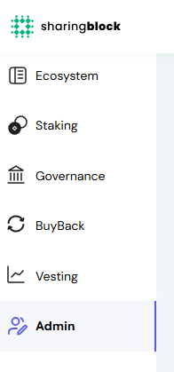

The **Admin Section** provides a secure and permissioned interface for managing all operational aspects of the Engage platform. It is accessible only to wallets designated as Admins and ensures that high-impact actions (like creating staking pools, managing governance, or assigning ecosystem wallets) are performed transparently on-chain.

---

## Overview  

From the Admin Section, authorized team members can:  

- Manage **Admin Accounts** (General Settings)  
- Configure **Ecosystem wallets and allocations**  
- Create and manage **Staking Pools**  
- Register and edit **Tokens**  
- Oversee **Governance proposals and members**  
- Set up and monitor **Vesting schedules**  
- Manage **Buyback wallets**  

This module ensures that project operations remain transparent, auditable, and aligned with governance processes.  

---

## Role-Based Access  

Only whitelisted admin wallets can:  

- Access the Admin tab  
- Trigger system-level actions (e.g., creating pools, assigning wallets)  
- View and edit restricted platform configurations  

Role-based access ensures that only designated actors control sensitive parts of the system.  

---

## Admin Subsections  

The Admin Section is organized into **seven key settings areas**:  

1. **[General Settings](./general-settings.md)** – Manage Admin Accounts.  
2. **[Ecosystem Settings](./ecosystem-settings.md)** – Configure ecosystem wallets and token allocations.  
3. **[Staking Settings](./staking-settings.md)** – Create and manage staking pools.  
4. **[Token Settings](./token-settings.md)** – Register and manage supported tokens.  
5. **[Governance Settings](./governance/index.md)** – Manage proposals and governance members.  
6. **[Vesting Settings](./vesting-settings.md)** – Create and oversee token vesting batches.  
7. **[Buyback Settings](./buyback-settings.md)** – Configure and label buyback wallets.  

---

## Getting Started  

1. Connect your wallet (MetaMask, Trust Wallet, or WalletConnect).  
2. Ensure you are on the correct supported chain (e.g., Base Sepolia, Ethereum, Polygon).  
3. If your wallet is whitelisted as an **Admin**, the Admin tab will appear in the sidebar.  
4. From there, you can access all Admin subsections for configuration and monitoring.  

---
