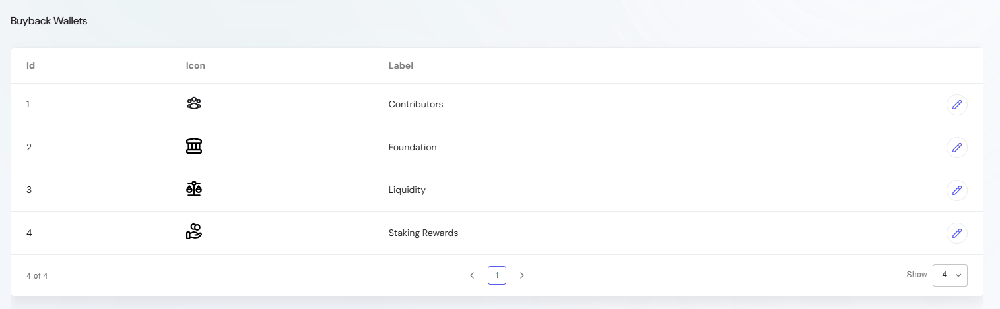
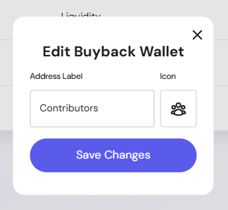

The **Buyback Settings** section provides administrators with control over wallets dedicated to buyback operations. These wallets are used to repurchase tokens from the market, fund ecosystem initiatives, or redistribute tokens to support liquidity and staking rewards.  

---

## Overview of the Buyback Section  

Administrators can:  
- View all registered buyback wallets.  
- Assign human-readable labels to wallets for clarity.  
- Select icons to visually distinguish wallet purposes.  
- Edit wallet details as strategies evolve.  

This ensures that token buybacks remain transparent, structured, and aligned with governance and ecosystem needs.  

---

## Buyback Wallets Table  

The **Buyback Wallets** list displays:  
- **ID** — Internal identifier for the wallet entry.  
- **Icon** — Visual representation of the wallet purpose.  
- **Label** — Human-readable label describing the wallet’s role (e.g., *Contributors*, *Foundation*, *Liquidity*, *Staking Rewards*).  

From this view, admins can:  
- Quickly identify the purpose of each wallet.  
- Ensure buyback reserves are properly categorized.  
- Edit wallet metadata when strategies or labels change.  

---

## Editing a Buyback Wallet  

When editing an existing wallet:  
- **Address Label*** — Enter or update the descriptive name for the wallet.  
- **Icon*** — Choose an icon that reflects the wallet’s role.  
- **Save Changes** — Confirm updates to reflect immediately in the Buyback Wallets table.  

> Wallets themselves remain controlled by the protocol; editing settings here only changes the label and icon for administrative clarity.  

---

## Best Practices  

- **Use descriptive labels** — e.g., “Foundation” or “Staking Rewards”.  
- **Standardize icons** — Use consistent icons across categories to avoid confusion.  
- **Review quarterly** — Ensure wallets reflect the current tokenomics and buyback strategy.  
- **Limit edits** — Keep labels stable to maintain transparency in reporting and auditing.  

---

## Example Buyback Wallets  

1. **Contributors** — Funds allocated to reward active community and team contributors.  
2. **Foundation** — Treasury wallet for foundation operations.  
3. **Liquidity** — Dedicated wallet to support market liquidity.  
4. **Staking Rewards** — Wallet supplying tokens for staking pool reward programs.  

---
