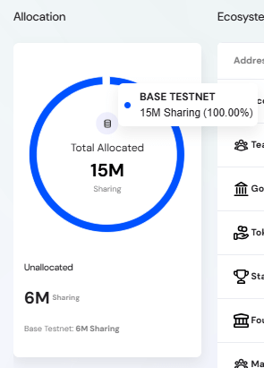

The **Ecosystem Settings** section provides administrators with tools to manage and allocate tokens across ecosystem wallets. This ensures proper tracking of distributed funds, transparency for stakeholders, and accountability in token usage.

---

## Overview of the Ecosystem Settings

The **Ecosystem Settings** section empowers administrators with comprehensive token management capabilities, ensuring transparent tracking and strategic allocation of project resources across the blockchain ecosystem.

### Administrative Capabilities

From this interface, administrators can:

- **Monitor Token Distribution** – View real-time allocation status and available token balances across all networks
- **Manage Wallet Registry** – Create and maintain ecosystem wallets with descriptive labels and visual identifiers
- **Configure Multi-Chain Support** – Assign wallet addresses to specific blockchain networks for cross-chain token management
- **Execute Strategic Allocations** – Distribute tokens to wallets based on project roadmap requirements and operational needs
- **Track Financial Health** – Monitor current balances, liquidity percentages, and allocation utilization rates

## Allocation Section

The **Allocation Section** provides a comprehensive view of token distribution across networks, displaying both allocated and unallocated token amounts. This pie chart visualization helps administrators understand the current allocation status and available tokens for distribution.

#### Chart Components

- **Total Allocated** – Central display showing the total amount of tokens currently allocated across all networks
- **Network Segments** – Colored pie chart sections representing each network's share of the total allocation
- **Total Unallocated Balance** – Overall remaining tokens available for distribution across all networks
- **Unallocated Balance by Network** – Detailed breakdown of remaining tokens available for allocation on each specific network

#### Tooltip Details

When hovering over a network segment, the tooltip displays:
- **Network Name** – The specific blockchain network
- **Allocated Amount** – Total tokens allocated to this network
- **Percentage** – Proportion of total allocation on this network

> This overview enables administrators to assess allocation distribution across networks and identify available tokens for future distribution. This helps ensure optimal resource management across the ecosystem.

This dashboard integrates with the Ecosystem Addresses table to provide complete visibility into how tokens are distributed both by network allocation and by specific wallet addresses.

## Ecosystem Addresses Table  

The **Ecosystem Addresses** table provides administrative control over wallet tracking and token allocation monitoring within the ecosystem. This interface allows admins to manage which wallets are monitored for transparency reporting.

#### Ecosystem Address Details

- **Address** – Shows the descriptive label (e.g., Team, Governance, Foundation) with the actual wallet address displayed underneath in parentheses
- **Amounts** – Total tokens originally allocated to this address 
- **Balance** – Current token balance remaining in the wallet
- **% Liquid** – Visual progress bar and percentage showing tokens that are currently unlocked and available for use
- **Actions** – Delete button (trash icon) to remove wallet entries that are no longer valid

> This table enables transparent tracking of token distribution across key ecosystem functions, with visual indicators showing liquidity status at a glance.

## Adding an Ecosystem Wallet  

### Ecosystem Address

To add a new wallet:  

1. Click **Add Wallet**.  
2. Enter the wallet details:  
   - **Address Label** — Descriptive label (e.g., *Staking Rewards*).  
   - **Icon** — Choose an icon to represent the wallet’s category.  
   - **Wallet Address** — The blockchain address.  
   - **Chain(s)** — Select the blockchain.
3. Click **Next** to proceed to allocation.  

### Allocating Tokens  

In the **Allocation** step:  
- Enter the amount of tokens to allocate to the wallet.  
- Review the remaining unallocated tokens displayed.  
- Confirm the allocation to finalize.  

The new wallet and its allocation will appear in the Ecosystem Addresses table.

## Best Practices  

- **Use clear labels** — Ensure wallet names make their purpose obvious (e.g., *Liquidity Support*, *Community Incentives*).  
- **Track unallocated tokens** — Always leave sufficient tokens unallocated for flexibility in future initiatives.  
- **Balance liquidity** — Ensure a a healthy percentage of liquid tokens to cover operational costs while maintaining vesting/locked tokens.  
- **Audit regularly** — Verify ecosystem wallet balances align with project goals and reports.  
- **Revoke unused wallets** — Delete entries for inactive or obsolete wallets to keep the list clean.  
