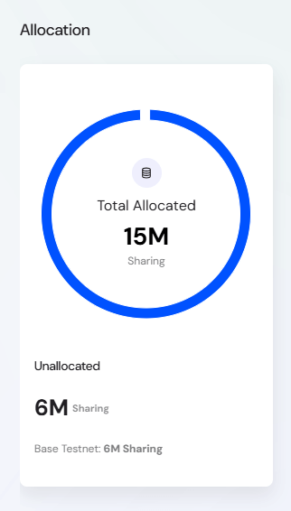
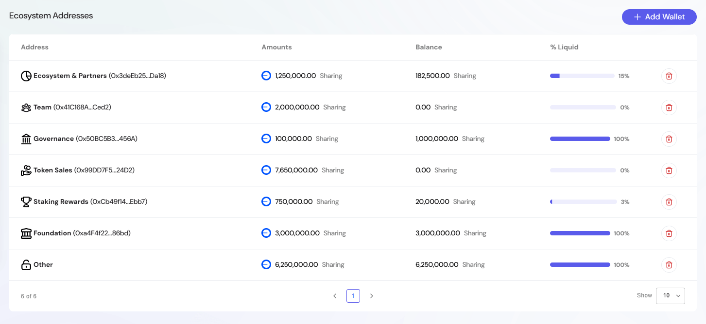
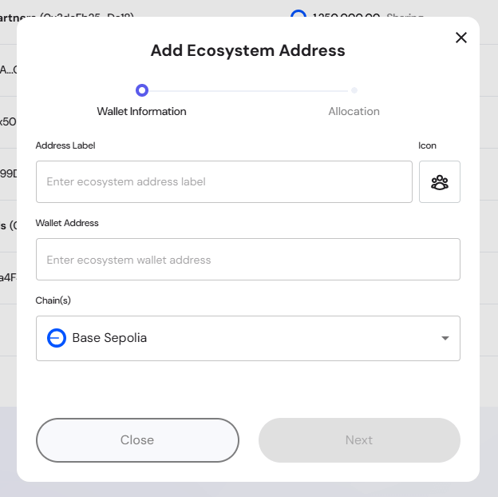
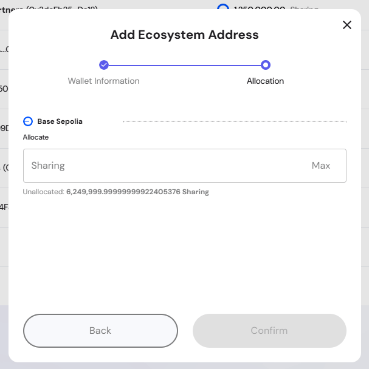

The **Ecosystem Settings** section provides administrators with tools to manage and allocate tokens across ecosystem wallets. This ensures proper tracking of distributed funds, transparency for stakeholders, and accountability in token usage.

---

## Overview of the Ecosystem Settings 

From here, administrators can:  
- View the total allocated and unallocated tokens.  
- Manage ecosystem wallets with descriptive labels and icons.  
- Assign wallet addresses to specific chains.  
- Allocate tokens to wallets based on project needs.  
- Track balances, liquid percentages, and allocations.  

This helps maintain visibility and control over how project tokens are distributed across categories such as **team**, **governance**, **foundation**, **liquidity**, and **staking rewards**.

---

## Allocation Summary  

The left-hand allocation chart shows:  
- **Total Allocated** — The total tokens distributed across ecosystem wallets.  
- **Unallocated** — The remaining tokens available for future allocation.  

Looking at this admin interface screenshot, I can see the actual table structure. Here's the improved documentation based on what's actually displayed:

## Ecosystem Addresses Table  

The **Ecosystem Addresses** table provides administrative control over wallet tracking and token allocation monitoring within the ecosystem. This interface allows admins to manage which wallets are monitored for transparency reporting.

#### Ecosystem Address Details

- **Address** – Shows the descriptive label (e.g., Team, Governance, Foundation) with the actual wallet address displayed underneath in parentheses
- **Amounts** – Total tokens originally allocated to this address 
- **Balance** – Current token balance remaining in the wallet
- **% Liquid** – Visual progress bar and percentage showing tokens that are currently unlocked and available for use
- **Actions** – Delete button (trash icon) to remove wallet entries that are no longer valid

> This table enables transparent tracking of token distribution across key ecosystem functions, with visual indicators showing liquidity status at a glance.

## Adding an Ecosystem Wallet  

To add a new wallet:  

1. Click **Add Wallet**.  
2. Enter the wallet details:  
   - **Address Label*** — Descriptive label (e.g., *Staking Rewards*).  
   - **Icon*** — Choose an icon to represent the wallet’s category.  
   - **Wallet Address*** — The blockchain address.  
   - **Chain(s)*** — Select the blockchain (e.g., Base Sepolia).  
3. Click **Next** to proceed to allocation.  

---

## Allocating Tokens  

In the **Allocation** step:  
- Enter the amount of tokens to allocate to the wallet.  
- Review the remaining unallocated tokens displayed.  
- Confirm the allocation to finalize.  

The new wallet and its allocation will appear in the Ecosystem Addresses table.

---

## Best Practices  

- **Use clear labels** — Ensure wallet names make their purpose obvious (e.g., *Liquidity Support*, *Community Incentives*).  
- **Track unallocated tokens** — Always leave sufficient tokens unallocated for flexibility in future initiatives.  
- **Balance liquidity** — Ensure a healthy % liquid to cover operational costs while maintaining vesting/locked tokens.  
- **Audit regularly** — Verify ecosystem wallet balances align with project goals and reports.  
- **Revoke unused wallets** — Delete entries for inactive or obsolete wallets to keep the list clean.  

---
