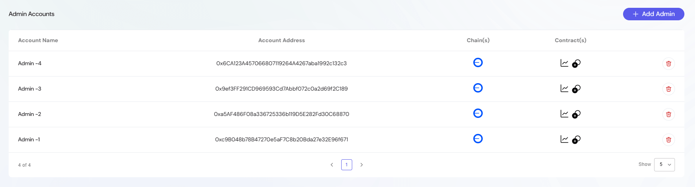
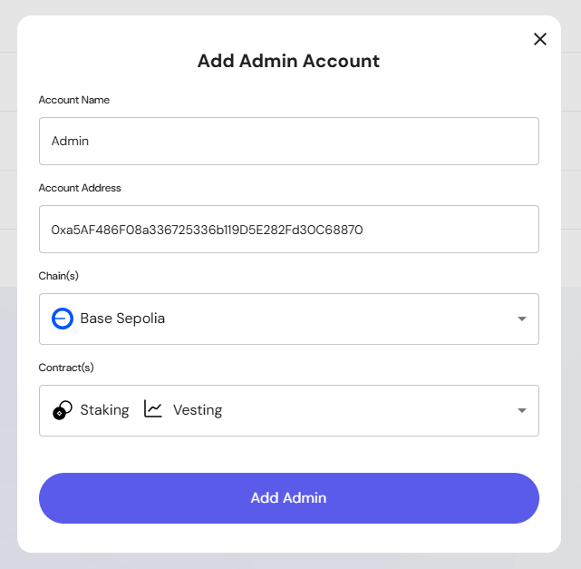

The **General Settings** section provides administrators with tools to manage **Admin Accounts** that have access to different contracts and chains. It ensures only authorized wallets can perform sensitive actions such as managing staking, vesting, and other ecosystem operations.  

---

## Overview of the General Settings

From here, project owners and managers can:  
- Add new admin accounts.  
- Assign chain and contract permissions to each admin.  
- View all registered admin accounts with their associated roles.  
- Remove admin accounts when access is no longer required.  

This ensures secure and transparent control over platform operations.  

---

## Admin Accounts Table  

The list displays all configured admin accounts with the following details:  

- **Account Name** — Human-readable identifier for the admin.  
- **Account Address** — Wallet address associated with the admin.  
- **Chain(s)** — Networks where the admin is authorized.  
- **Contract(s)** — Smart contracts the admin can manage (e.g., Staking, Vesting).  
- **Actions** — Delete an admin account if permissions should be revoked.  

---

## Adding an Admin  

To add a new admin account:  

1. Click **Add Admin**.  
2. Fill in the required fields:  
   - **Account Name*** — A descriptive label for the admin.  
   - **Account Address*** — The wallet address of the admin.  
   - **Chain(s)*** — Select the chain(s) where this admin will have access.  
   - **Contract(s)*** — Assign which contracts this admin can manage (e.g., Staking, Vesting).  
3. Click **Add Admin** to confirm.  

The new admin will appear in the table with their assigned permissions.  

---

## Best Practices  

- **Grant least privilege** — Only give admins access to the contracts and chains they actually need.  
- **Audit regularly** — Review the list of admins periodically and remove inactive or unneeded accounts.  
- **Use unique accounts** — Assign separate wallets for admin duties instead of personal wallets.  
- **Rotate access** — Update admin accounts if team members change roles or leave the project.  

---
