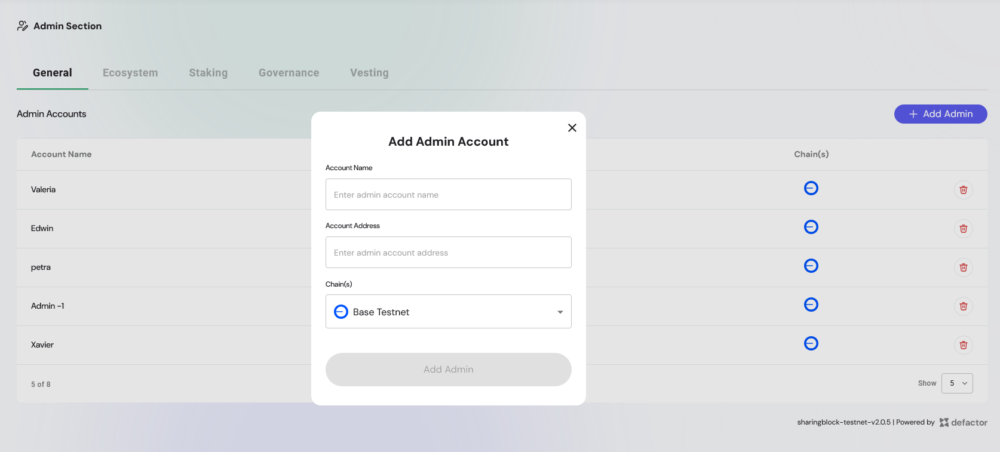

## Welcome to the General Section of the Engage Admin Panel!
This section provides core functionalities for monitoring, managing, and ensuring transparency across your project's token ecosystem.

---

## Overview of the General Section

The General section of the Engage Admin Panel serves as the operational cockpit for administrators, offering a centralized view of all essential token economy data and ecosystem management. It is designed to help you oversee and manage your token ecosystem with precision and transparency.

- Token supply and distribution

- Ecosystem wallet management

This section ensures administrators can track and optimize all token-related operations from a single dashboard.

---

## Admin Accounts

The **Admin Accounts** section in the Engage Admin panel allows designated project owners to manage who has administrative access to Engage's powerful governance and token management capabilities. This ensures only authorized individuals can execute sensitive actions like launching proposals, modifying pools, and updating vesting entries.

**What Are Admin Accounts?**

Admin Accounts are wallet addresses with elevated permissions on the Engage platform. These addresses can:

- Access restricted dashboard views
- Create or update staking pools
- Manage vesting schedules
- Submit and moderate governance proposals
- Configure token parameters
- View sensitive analytics or manage compliance

Only wallets listed as admins can see and use the admin interface.

**Admin Account Use Cases**

- Launching governance votes for protocol upgrades
- Configuring new token vesting schedules for partners or contributors
- Adjusting pool parameters after community feedback
- Registering new tokens or networks with compliance rules

Admin accounts are critical to the governance and operational lifecycle of a token-powered ecosystem.

### Adding or Removing Admins

To add an admin:

1. Navigate to the **Admin Section > General > Admin Accounts** section.
2. You will see a table of current admin wallet addresses.
3. Click **“Add Admin”** and input a valid wallet address.
4. Confirm the action via your connected wallet.

To remove an admin:
- Click the trash icon next to their address.
- Confirm the wallet signature to complete removal.

> 🛡️ *Only the primary contract owner or governance-approved multisig can update admin privileges.*

---

**Best Practices for Admin Account Management**

- Use **hardware wallets** for admin roles to reduce the risk of key compromise.
- Assign admin privileges based on roles (e.g., staking manager, vesting manager).
- Regularly review the admin list and remove inactive accounts.
- For DAOs, rotate admin keys or multisig signers in sync with governance cycles.