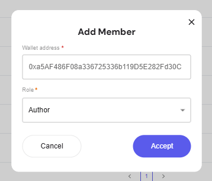

The **Members** section defines governance roles and permissions.  
Admins can assign or remove members, ensuring proper control over governance actions.

---

## Members List

View all governance participants along with their roles.  

- **Admin**: Full permissions to manage proposals and members  
- **Author**: Can create and edit proposals  

## Adding a Member

To add a member:  

1. Click **+ Add Member**  
2. Enter the member’s wallet address  
3. Select a role (*Admin* or *Author*)  
4. Click **Accept**  

## Removing a Member

Click the trash icon next to a member to revoke their governance role.
