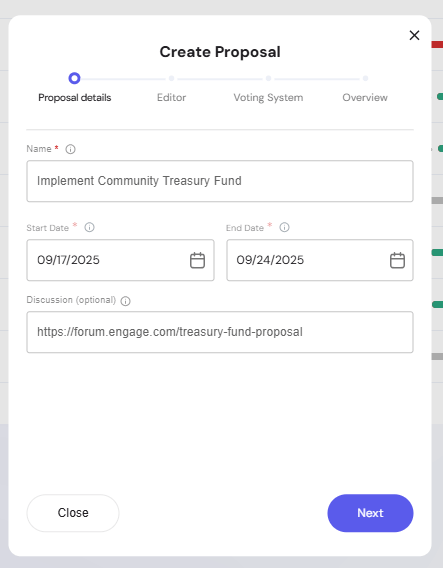
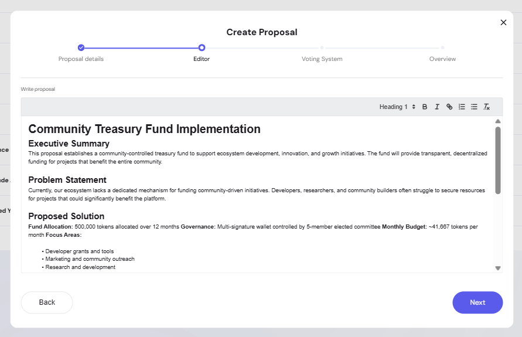
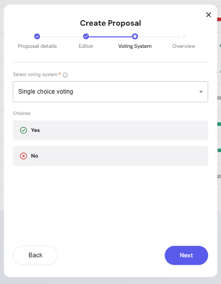
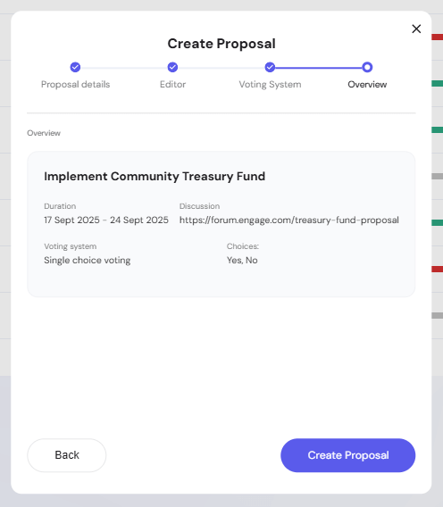
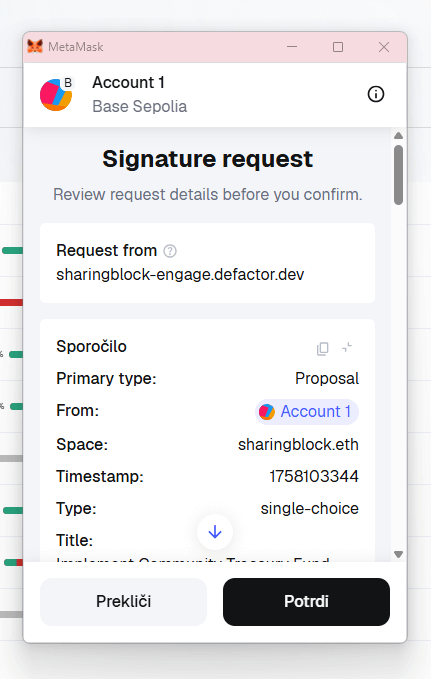
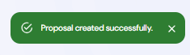
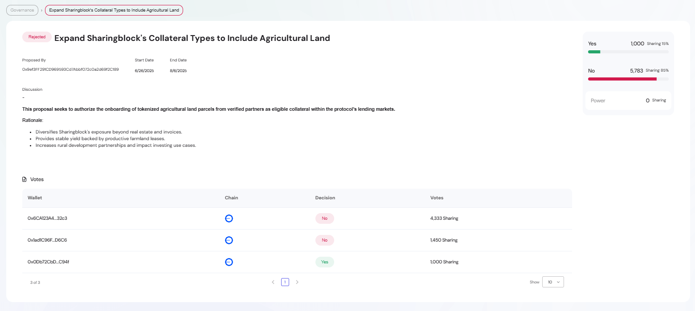
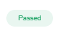
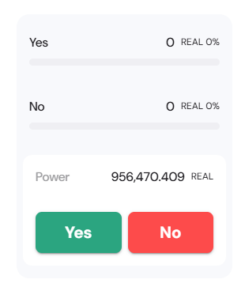

The **Proposals** section allows you to create, edit, and vote on governance proposals.  
Admins and authorized members can launch proposals, while community members participate in voting.

---

## Manage Proposals

On the main **Manage Proposals** page, you can see:

- A list of active and past proposals  
- Voting progress (including weighted voting power)  
- Proposal status: *In Progress* or *Finished*  

## Creating a Proposal

Click **+ Create Proposal** to start the process.  

1. **Proposal Details**  
   Enter the name, duration, and optional discussion link.  

   

2. **Editor**  
   Write a clear description of your proposal including an executive summary, problem statement, and solution.  
   Rich text formatting is supported.  

   

3. **Voting System**  
   Select how votes will be cast. Example: *Single choice voting* with Yes/No options.  

   

4. **Overview**  
   Review all proposal details before submitting.  

   

## Signing & Submission

After confirming, a MetaMask popup appears to sign the proposal request.  
This ensures the proposal is securely registered on-chain.  

Once signed, you’ll see a confirmation message:  

## Proposal Tracking

After submission, the proposal will be visible in the **Manage Proposals** list with live voting progress updates.

## Proposal Details Page

When you click on a proposal row in the **Manage Proposals** table, you will be redirected to the detailed view.  

This page shows:

- **Proposal status**: *Passed* or *Rejected* (once voting has ended)

- **Proposal metadata**: title, proposer, start/end date, discussion link  

- **Full proposal content**: executive summary, problem statement, proposed solution, implementation timeline, and budget  
- **Voting breakdown**: votes per wallet, decision (Yes/No), and voting power 

