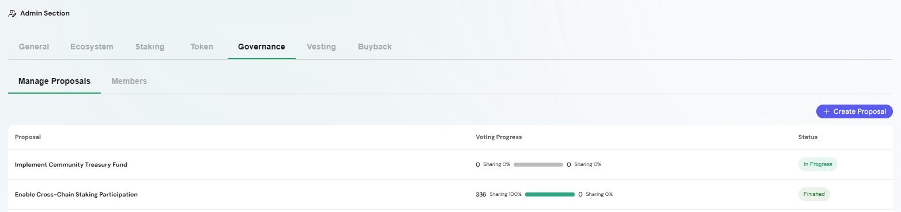
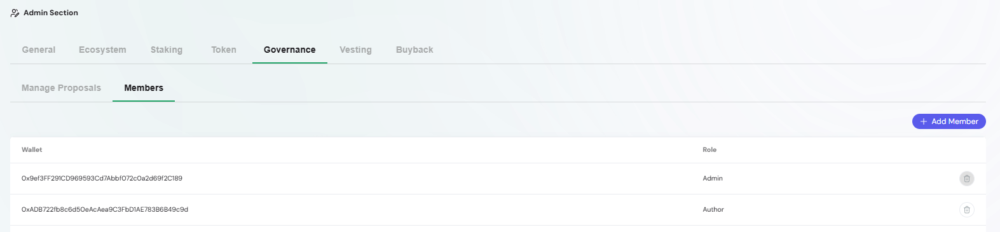

The Governance section enables community-driven decision-making through proposals and voting.  
It ensures transparency, decentralization, and accountability within the ecosystem.  

Governance is divided into two key areas:  

- [Proposals](./governance-proposals.md): Create, manage, and vote on governance proposals.  

- [Members](./governance-members.md): Manage governance participants and their roles.  

Use these subsections to configure decision-making processes and maintain a healthy governance framework.

