The **Staking Settings** section allows Admins to create, configure, and manage staking pools.  
From here, Admins can define APR rates, lock durations, reward tokens, and staking limits. They can also pause/unpause the staking contract for emergency or maintenance needs.

---

## Manage Staking Pools  

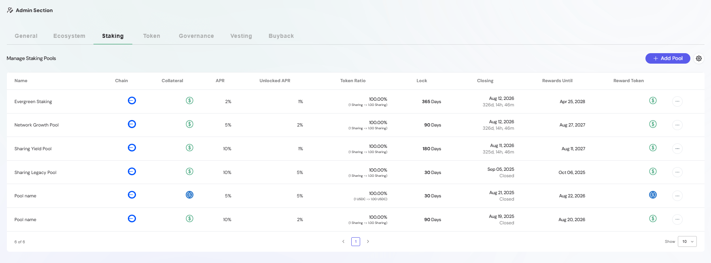

The **Manage Staking Pools** table displays all existing pools, including both active and closed ones. Each row shows:

- **Name** – Pool identifier (e.g., Evergreen Staking, Yield Pool)  
- **Chain** – The blockchain network where the pool is deployed  
- **Collateral** – Token required to stake  
- **APR & Unlocked APR** – Annual reward rate (locked vs. unlocked)  
- **Token Ratio** – Staking-to-reward conversion rate  
- **Lock** – Duration of the staking period (days)  
- **Closing** – Pool closing date/time  
- **Rewards Until** – Date when reward distribution ends  
- **Reward Token** – Token used for rewards  
- **Actions** – Options to edit or configure the pool  

## Add Pool  

Admins can create new staking pools by clicking **Add Pool**.  

### Step 1: Token Settings  

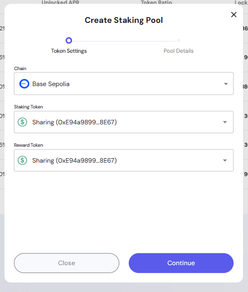

In this step, Admins define the blockchain and token parameters:  
- **Chain** – Select the blockchain network  
- **Staking Token** – Token users will lock into the pool  
- **Reward Token** – Token distributed as staking rewards  

Admins can choose from available tokens via the dropdown menu:  

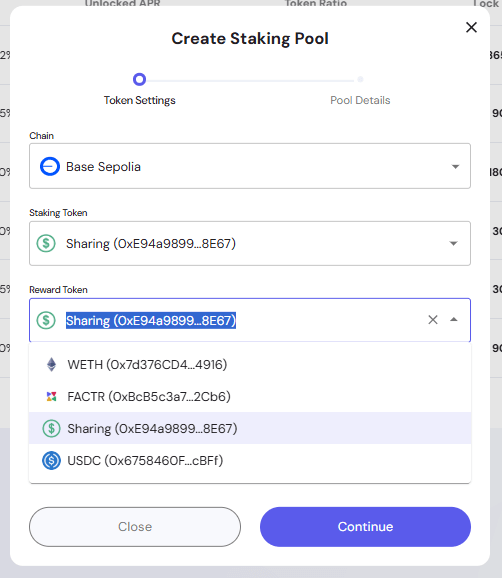

### Step 2: Pool Details  

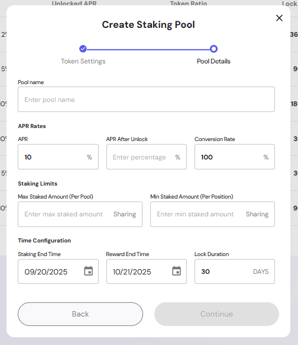

Admins configure pool parameters such as:  
- **Pool Name** – Custom name for the pool  
- **APR Rates** – Define base APR and APR after unlock  
- **Conversion Rate** – Token staking-to-reward conversion ratio  
- **Staking Limits** – Minimum and maximum staking amounts (per pool / per position)  
- **Time Configuration** –  
  - *Staking End Time* – When new positions can no longer be opened  
  - *Reward End Time* – Final date for reward distribution  
  - *Lock Duration* – Number of days tokens remain locked  

Once filled, Admins can continue and preview the pool before final confirmation.

## Pool Actions  

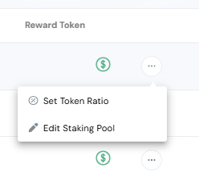

From the **Actions menu**, Admins can configure existing pools with two options:  

- **Edit Staking Pool** – Update pool parameters such as APR, lock duration, staking limits, or pool name.  
- **Set Token Ratio** – Adjust the staking-to-reward conversion ratio for a specific pool.  

### Edit Staking Pool  

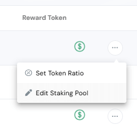  
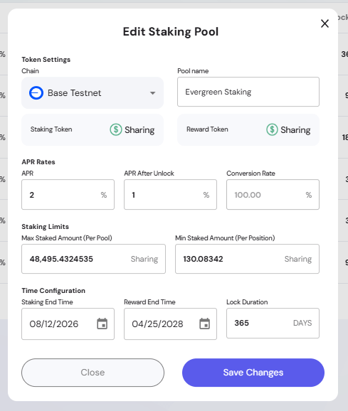

Admins can modify details of an active pool through the **Edit Staking Pool modal**:  
- **Chain & Tokens** – View and confirm the network, staking token, and reward token (not editable once deployed).  
- **Pool Name** – Update the name of the pool for better identification.  
- **APR & APR After Unlock** – Adjust reward rates. Validation ensures APR values do not exceed 100% and `APR After Unlock` cannot be higher than base APR.  
- **Staking Limits** – Update maximum staked amount per pool and minimum staked amount per position. The system prevents saving if `Max < Min`.  
- **Time Configuration** – Change staking end time, reward end time, and lock duration. Validation ensures reward end time is later than staking end + lock duration.  

> **Note:** Some updates (like APR, staking amounts, and reward timelines) trigger on-chain transactions, while others (like pool name) may only update metadata.  

### Set Token Ratio  

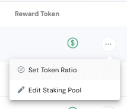  
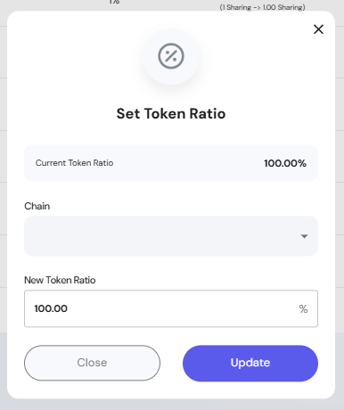

The **Set Token Ratio modal** allows Admins to adjust conversion between staked tokens and reward tokens:  
- **Current Token Ratio** – Displays the most recent ratio applied to the pool.  
- **Chain Selector** – Choose the blockchain network plan to update.  
- **New Token Ratio** – Enter the updated percentage. Validation rules include:  
  - Must be greater than 0%  
  - Cannot exceed 100%  
  - Must be a valid number  

Once confirmed, the update triggers a blockchain transaction to apply the new ratio.  

> Adjusting the token ratio can be used to fine-tune reward distribution without altering APR values or pool durations.  

## Contract Controls  

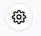  
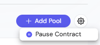

The **Settings button** opens administrative options, including:  
- **Pause Contract** – Temporarily pause all staking actions (e.g., during upgrades or incidents)  
- **Unpause Contract** – Resume staking operations  

When paused, a banner appears in the UI with the option to **Unpause Contract**.  

## Pools Table  

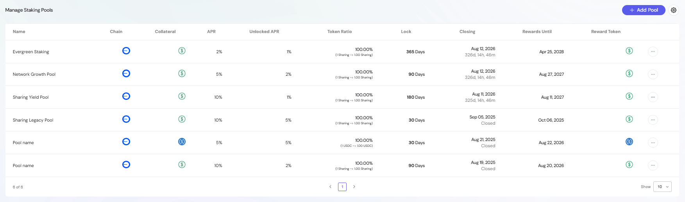

The pools table is the central management view. It provides filtering, pagination, and visibility into both active and closed staking pools.  

> Admins must ensure that reward timelines, APR values, and staking limits are configured correctly before deploying a new pool, as these settings directly impact user experience and smart contract interactions.  

## Validation Rules Summary  

To ensure staking pools are configured properly, the system enforces the following validation rules:  

- **Pool Name** – Must be between 3 and 30 characters.  
- **APR / APR After Unlock** – Cannot exceed 100%. `APR After Unlock` must not be greater than base APR.  
- **Staking Limits** – `Max Staked Amount` must be greater than `Min Staked Amount`.  
- **Reward End Time** – Must be later than `Staking End Time + Lock Duration`.  
- **Token Ratio** – Must be a valid number between 0% and 100% (cannot be 0).  

> If validation rules are not met, Admins cannot proceed with creating or editing a pool until corrections are made.
