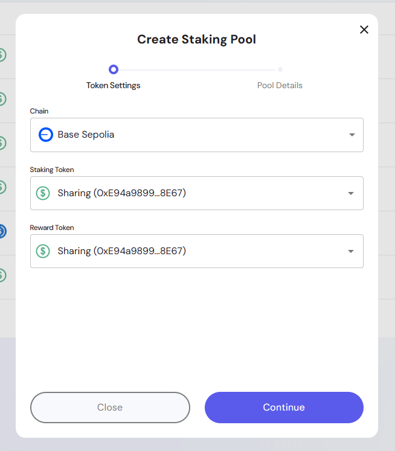
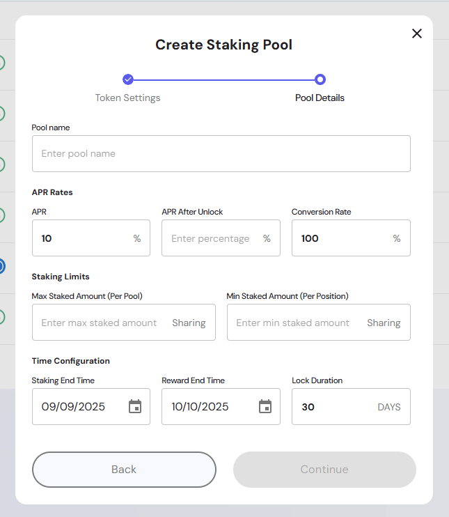
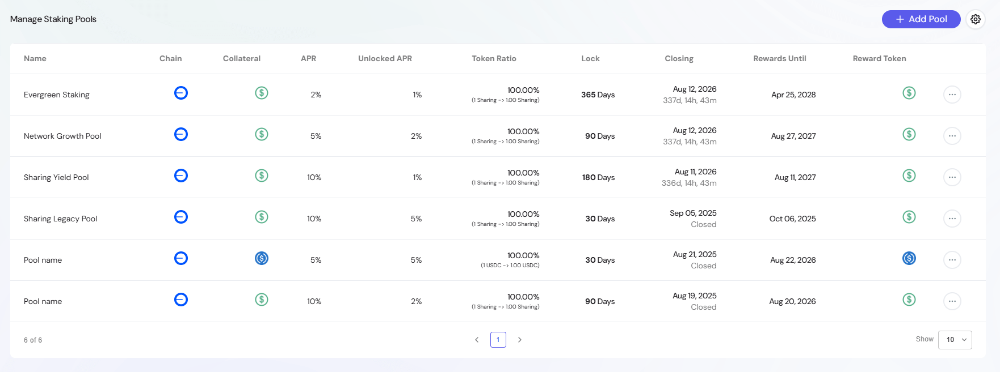

This section allows administrators to configure, launch, and manage staking pools across supported blockchains. It provides fine-grained controls for APR rates, staking limits, lock durations, and reward token distributions.  

---

## Overview of the Staking Settings  

The **Staking Settings** panel empowers project administrators to:  
- Create and configure new staking pools.  
- Manage active and closed pools.  
- Adjust reward tokenomics through APR rates and token conversion ratios.  
- Set lock durations, staking limits, and reward distribution end dates.  
- Monitor pool status and reward progress.  

By using this section, administrators ensure that staking mechanics align with the project’s ecosystem growth, governance incentives, and liquidity strategies.  

---

## Creating a Staking Pool  

When creating a pool, administrators go through **two configuration steps**:  

### 1. Token Settings  

Define the base chain and tokens used in the pool:  
- **Chain**: Select the blockchain network (e.g., Ethereum, Base Sepolia, Polygon).  
- **Staking Token**: The token that users will deposit into the pool.  
- **Reward Token**: The token distributed as staking rewards.  

> Tip: Staking and reward tokens may be the same (self-rewarding pool) or different (cross-token incentives).  

### 2. Pool Details  

Configure the operational parameters of the staking pool:  
- **Pool Name**: Assign a unique, descriptive name for easy tracking.  
- **APR Rates**:  
  - **APR**: Base annual percentage rate for staked assets.  
  - **APR After Unlock**: Optional adjusted APR for unlocked staking phases.  
  - **Conversion Rate**: Defines reward distribution ratio (e.g., `1 Token A = 100 Token B`).  
- **Staking Limits**:  
  - **Max Staked Amount (per pool)**: Caps the total stakable tokens in the pool.  
  - **Min Staked Amount (per position)**: Ensures a minimum user participation threshold.  
- **Time Configuration**:  
  - **Staking End Time**: Deadline for users to enter the pool.  
  - **Reward End Time**: Date when rewards stop accruing.  
  - **Lock Duration**: Fixed lock period per stake (e.g., 30, 90, 365 days).  

> Admins must configure all required fields before continuing. Unfilled or invalid fields disable the **Continue** button.  

---

## Managing Staking Pools  

Once pools are created, the **Admin Section** provides an overview table with live details:  
- **Name**: Pool name for quick reference.  
- **Chain**: Blockchain on which the pool operates.  
- **Collateral**: Token used for staking.  
- **APR / Unlocked APR**: Reward rates applied.  
- **Token Ratio**: Conversion rate between staked and reward tokens.  
- **Lock**: Lock duration in days.  
- **Closing**: Time left until staking closes (or "Closed").  
- **Rewards Until**: Date rewards will be distributed until.  
- **Reward Token**: The token used to pay out rewards.  

From this panel, administrators can:  
- Review active and expired pools.  
- Validate APR settings and conversion ratios.  
- Ensure lock durations and end dates align with project incentives.  

---

## Best Practices for Staking Configuration  

- **Balance APR and Token Supply**: Avoid setting overly high APRs that may dilute token value.  
- **Use Lock Durations Strategically**: Longer locks (180–365 days) encourage commitment, while shorter locks (30–90 days) boost liquidity.  
- **Diversify Reward Tokens**: Consider rewarding with governance tokens, stablecoins, or ecosystem assets.  
- **Monitor Closing Dates**: Plan new pools ahead of time so users always have staking opportunities available.  
- **Audit Limits**: Ensure maximum and minimum staking limits are realistic for community participation.  

---

## Example Use Cases  

1. **Liquidity Incentive Pool**:  
   - APR: 10%  
   - Lock: 90 Days  
   - Reward Token: Governance Token  

2. **Stablecoin Yield Pool**:  
   - APR: 5%  
   - Lock: 30 Days  
   - Reward Token: USDC  

3. **Evergreen Long-Term Pool**:  
   - APR: 2% (Unlocked APR 1%)  
   - Lock: 365 Days  
   - Reward Token: Native Token  

> These configurations can be mixed and tailored depending on ecosystem priorities (growth, governance, liquidity, or stability).  

---
