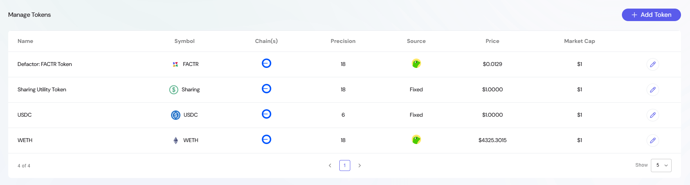
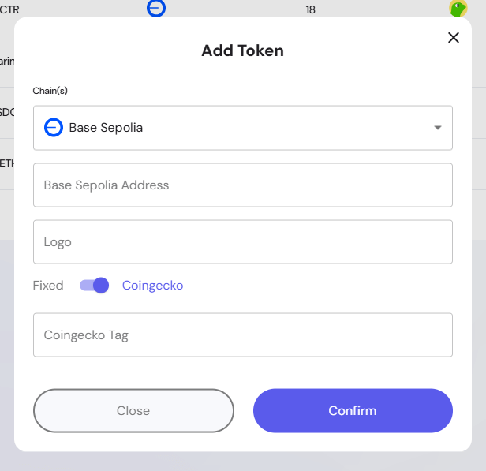

This section provides administrators with full control over the tokens that can be used across the platform. It ensures that staking pools, governance, and ecosystem activities have reliable token references with accurate pricing and metadata.

---

## Overview of the Token Settings  

The **Token Settings** panel enables project administrators to:  
- Add, edit, and manage tokens available within the ecosystem.  
- Define chain-specific contract addresses for tokens.  
- Set price sources (fixed values or Coingecko integration).  
- Maintain token metadata such as names, symbols, and logos.  

This section ensures that all staking, governance, and buyback activities reference validated token configurations.  

## Managing Tokens  

The **Manage Tokens** table displays all registered tokens with key details:  
- **Name**: Full token name (e.g., "Defactor: FACTR Token").  
- **Symbol**: The short symbol identifier (e.g., FACTR, USDC, WETH).  
- **Chain(s)**: The blockchain(s) where the token contract exists.  
- **Precision**: Number of decimals supported by the token (e.g., 18 for ERC-20).  
- **Source**: Determines pricing reference:  
  - **Fixed**: Price is manually set and remains constant.  
  - **Coingecko**: Live market price fetched using the Coingecko API.  

From this view, administrators can:  
- Verify token details before pool creation.  
- Edit token entries to adjust pricing or contract details.  
- Ensure consistent token metadata across the platform.  

## Adding a Token  

When adding a new token, admins configure several parameters:  

- **Chain(s)**: Select the blockchain network (e.g., Base Sepolia, Ethereum).  
- **Contract Address**: Enter the token’s smart contract address for the selected chain.  
- **Logo**: Optional upload or reference for the token’s logo icon.  
- **Price Source**: Choose between:  
  - **Fixed**: Manually enter a static token price.  
    - **Price**: Current value of the token (manual entry).  
    - **Market Cap**: Reference market capitalization, often placeholder for smaller tokens.  
  - **Coingecko**: Link the token to Coingecko by entering its tag for real-time updates.  
- **Confirm**: Save the new token to the system.  

> Tip: Using Coingecko ensures pricing stays in sync with market conditions, while **Fixed** is useful for stablecoins or testing environments.  

## Example Token Configurations  

1. **FACTR Token (Native Project Token)**  
   - Symbol: FACTR  
   - Source: Coingecko  

2. **Sharing Utility Token**  
   - Symbol: Sharing  
   - Source: Fixed ($1.00)  

3. **USDC (Stablecoin)**  
   - Symbol: USDC  
   - Source: Fixed ($1.00)  

4. **WETH (Wrapped Ethereum)**  
   - Symbol: WETH  
   - Source: Coingecko  

## Best Practices for Token Management  

- **Validate Contract Addresses**: Ensure tokens are added from verified contracts to prevent errors.    
- **Choose Price Source Wisely**: Use **Fixed** for stable assets and **Coingecko** for volatile assets.  
- **Update Logos for Clarity**: A visual token reference improves user experience in staking and governance UIs.  
- **Review Market Data**: Ensure pricing sources align with ecosystem reporting and staking calculations.  