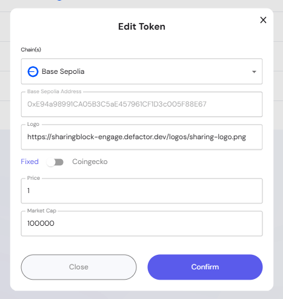

The **Token Settings** section provides administrators with full control over the tokens that can be used across the platform. It ensures that staking pools, governance, and ecosystem activities have reliable token references with accurate pricing and metadata.

---

## Overview of the Token Settings

The **Token Settings** panel enables project administrators to:  
- Add, edit, and manage tokens available within the ecosystem.  
- Define chain-specific contract addresses for tokens.  
- Set price sources (fixed values or Coingecko integration).  
- Maintain token metadata such as logos and pricing details.  
  - *Note: names, symbols, and decimals (precision) are automatically fetched from the token contract and cannot be changed manually.*  

This ensures that all staking, governance, and buyback activities reference validated token configurations.  

---

## Managing Tokens

The **Manage Tokens** table displays all registered tokens with key details:  
- **Name**: Full token name (fetched from the contract).  
- **Symbol**: Short symbol identifier (fetched from the contract).  
- **Chain(s)**: Blockchain(s) where the token contract exists.  
- **Precision**: Number of decimals supported by the token (fetched from the contract).  
- **Source**: Determines pricing reference:  
  - **Fixed**: Price is manually set and remains constant.  
  - **Coingecko**: Live market price fetched using the Coingecko API.  

From this view, administrators can:  
- Verify token details before pool creation.  
- Edit token entries to adjust pricing, contract addresses, or logos.  
- Ensure consistent token metadata across the platform.  

---

## Adding a Token

When adding a new token, admins configure several parameters:  

- **Chain(s)**: Select the blockchain network.  
- **Contract Address**: Enter the token’s smart contract address for the selected chain.  
- **Logo**: Provide a link (URL) to the token’s logo image. 
- **Price Source**: Choose between:  
  - **Fixed**: Manually enter a static token price.  
    - **Price**: Current value of the token (manual entry).  
    - **Market Cap**: Reference market capitalization, often used for internal tracking.  
  - **Coingecko**: Link the token to Coingecko by entering its tag for real-time updates.  
- **Confirm**: Save the new token to the system.  

> Tip: Using Coingecko ensures pricing stays in sync with market conditions, while **Fixed** is useful for stable assets or testing environments.  

---

## Editing a Token

Existing tokens can be edited to update metadata or change the price source:  
- Adjust the **Contract Address**, **Logo**, or **Source** settings.  
- Switch between **Fixed** and **Coingecko** pricing as needed.  
- Confirm the update to apply changes across the platform.  

---

## Best Practices for Token Management

- **Validate Contract Addresses**: Ensure tokens are added from verified contracts to prevent errors.  
- **Choose Price Source Wisely**: Use **Fixed** for stable assets and **Coingecko** for volatile assets.  
- **Update Logos for Clarity**: A visual token reference improves user experience in staking and governance UIs.  