The **Vesting Settings** section allows administrators to create, manage, and monitor token vesting schedules. It provides full control over batch allocations, recipient configuration, cliffs, and claimable amounts.

---

## Overview of the Vesting Settings

Administrators can:  
- Create vesting batches with defined recipients and custom token allocations
- Set vesting periods, start and end dates, and distribution frequencies
- Apply optional cliff periods with flexible timing options
- Add recipients individually or import bulk allocations via CSV
- Track progress of each batch
- Manage schedules with contract-level and individual batch actions
- Execute emergency controls including withdrawals, revocations, and contract pauses

This ensures long-term token distribution is transparent, predictable, and aligned with ecosystem growth while providing administrative flexibility for changing project requirements.

## Vesting Schedules List  

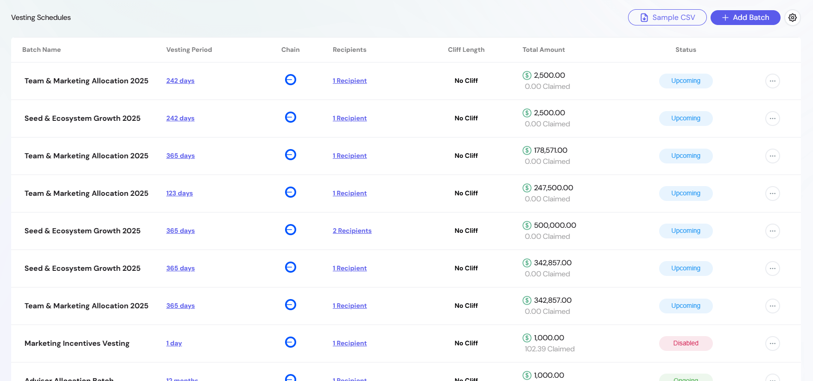

The schedules table provides a snapshot of all configured vesting batches.

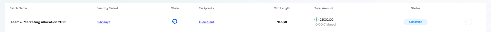

- **Batch Name** — Human-readable label for the allocation.  
- **Vesting Period** – Duration of the token release schedule (shown as a clickable link)  
  *The format (seconds, days, weeks, or months) depends on the chosen distribution frequency when the batch is created.*

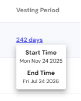

- **Chain** —  Blockchain network where vesting occurs (indicated by network logo).  
- **Recipients** — Number of participants in the vesting batch (clickable to view recipient details).  
- **Cliff Length** — Initial lock period before vesting starts (shows "No Cliff" if none configured).  
- **Total Amount** — otal tokens allocated, with claimed and unclaimed amounts indicated.  
- **Status** — Indicates lifecycle state (*Upcoming*, *Ongoing*, *Disabled*).  

## Creating a Vesting Batch  

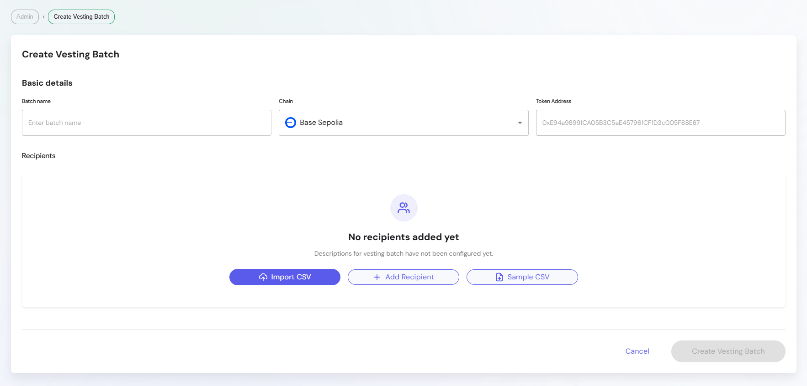

To create a new vesting batch:  

### 1. Basic Details  
- **Batch Name** — Descriptive label for the allocation.  
- **Chain** — Select the blockchain (e.g., Base Sepolia).  
- **Token Address** —  Smart contract address of the token being distributed (pre-configured by project administrators during vesting setup).

### 2. Recipients  

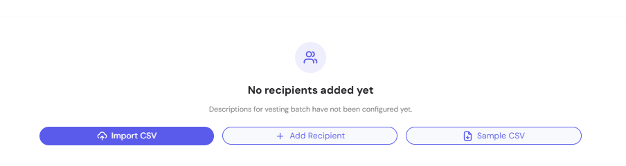

Admins can add recipients in three ways:  
- **Import CSV** — Upload bulk allocations via CSV file.  
- **Add Recipient** — Manually input recipient details.  
- **Sample CSV** — Download a template for quick setup.  

### 3. Add Recipient Fields  

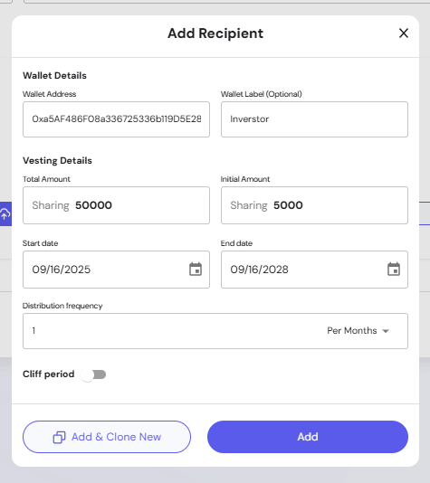

When adding manually, each recipient requires:  
1. **Wallet Address** — EVM-compatible address.  
2. **Wallet Label** — Human-readable identifier.  
3. **Total Amount** — Overall allocation.  
4. **Initial Amount** — Tokens that become available at the vesting start date. These are released upfront (if any), before the remaining allocation follows the vesting schedule.
5. **Start Date / End Date** — Defines vesting duration.  
6. **Distribution Frequency** — Interval of token release.

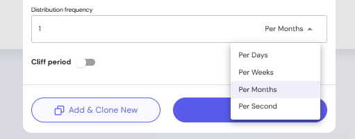

7. **Cliff Period (optional)** — Initial lock period that prevents token access until a specified date.

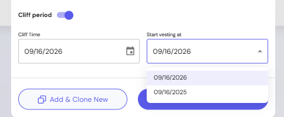

   - **Cliff Time** — Choose when the cliff period ends

   **Vesting Start Options:**
   - **Cliff Time** — Vesting starts only after cliff period ends, only initial amount available at cliff completion
   - **Start Date** — Vesting begins immediately, tokens accumulate during cliff period and become claimable when cliff ends

## Managing Batches

### Contract-Level Actions

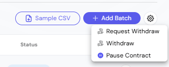

Actions available above the vesting schedules table:

- **Sample CSV** — Download a template for bulk recipient setup
- **Add Batch** — Create a new vesting schedule
- **Request Withdraw** — Initiates a withdrawal request for the contract. This blockchain transaction starts the withdrawal process and sets a mandatory 30-day waiting period before funds can be released. The 30-day delay is designed as a safeguard for emergency situations.

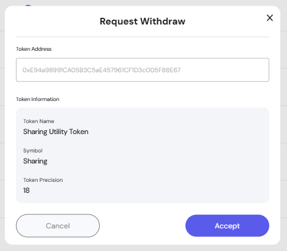

- **Withdraw** — Can be executed only after the 30-day waiting period following a withdrawal request. This action transfers the requested funds from the vesting contract and finalizes the release.
- **Pause Contract** — Temporarily halt vesting activity

### Individual Batch Actions

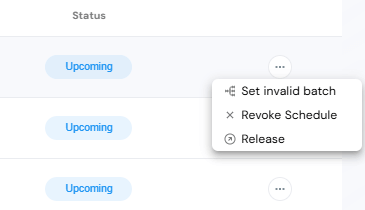

Each batch has lifecycle controls available from the row action menu:

- **Set Invalid Batch** — Mark a whole batch as invalid so that no further amounts can be released. The batch can be validated again later if needed.

- **Revoke Schedule** — Cancel a specific vesting schedule so that no further amounts can be released. This action is permanent and cannot be undone.

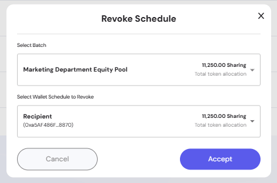

- **Release** — Trigger distribution of claimable tokens

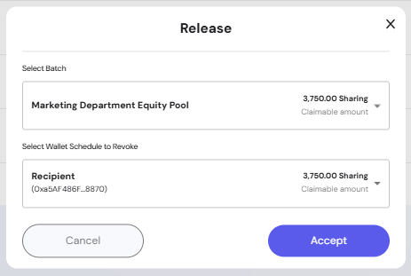

### Batch Status Types

The interface displays different status indicators:
- **Upcoming** — Vesting schedule not yet started
- **Ongoing** — Currently active vesting distribution  
- **Disabled** — Batch marked as invalid or paused