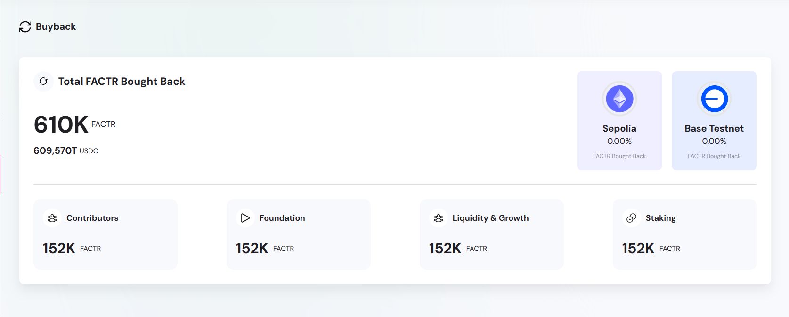
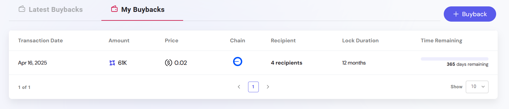

The BuyBack module offers a transparent framework for implementing deflationary tokenomics by leveraging protocol-generated revenue to repurchase tokens from the open market. Designed to strengthen token value and demonstrate commitment to long-term ecosystem sustainability, this mechanism serves as an automated link between platform usage and token demand.

Token buybacks are typically funded through fees collected from various modules within the ecosystem. Once collected, these funds are converted and used to acquire tokens from decentralized exchanges. The repurchased tokens are then locked for a specified period, reducing circulating supply and reinforcing scarcity.

The module supports any ERC-20 token and can be customized to align with project-specific treasury strategies. A production-ready example is available at the [Engage Platform Demo](https://sharingblock-engage.defactor.dev/buy-back), showcasing real-time buyback activity and historical data.

---

## How It Works

- Usage fees (paid in USDC) from platform modules are aggregated.
- These funds are used to automatically **buy tokens on the open market**.
- Purchased tokens are **locked for 12 months**, reducing circulating supply.

---

## Features

- View **total tokens bought back** in real time.
- Explore **personal buyback history** under "My Buybacks".
- Monitor **frequency and volume** of market buybacks.

---

## Dashboard Elements

The buyback dashboard gives a clear summary of the user's buyback progress:

- **Total Bought Back** – Cumulative amount of tokens repurchased.
- **Latest Buybacks** – Time-stamped records of recent buybacks.
- **My Buybacks** – History of individual user contributions and allocations.
- **Buyback Form** – Interface (if enabled) to trigger manual buybacks.

---

## My Buybacks

To enhance individual user transparency, the "My Buybacks" section allows users to view a history of their contributions. This feature helps track personal engagement and locked tokens.

Here, users can:

- View total personal buyback amounts.
- See historical buyback timestamps.
- Understand their impact on token circulation.
