The **BuyBack Module** enables token holders and ecosystem participants to repurchase tokens from the market, supporting token scarcity and long-term value. This module provides tools for executing both regular and custom buyback programs while tracking all buyback activity transparently.

Users can initiate buybacks, monitor their transaction history, and view ecosystem-wide buyback metrics that contribute to token economics and protocol sustainability.

## Dashboard Overview

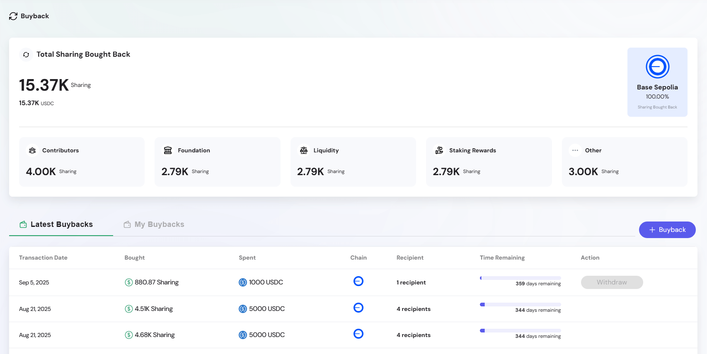

The buyback dashboard displays **Buyback Metrics** at the top, followed by two main table views:

- **Latest Buybacks** – Recent buyback transactions across the ecosystem
- **My Buybacks** – Personal buyback history and user-initiated transactions

Users can seamlessly switch between the Latest and My Buybacks tables to monitor ecosystem-wide buyback activity and track their personal contribution to token repurchasing programs. The buyback metrics section provides an overview of total tokens bought back and their allocation across different ecosystem categories.

## Buyback Metrics

The dashboard displays comprehensive buyback statistics:

### Total Tokens Bought Back

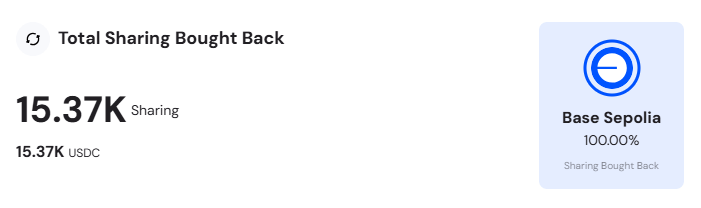

- **Total tokens repurchased** – Shows the aggregate amount of tokens bought back from the market
- **USD equivalent value** – Displays the total USDC spent on all buyback operations
- **Chain Distribution** – Breakdown of buyback activity across supported blockchain networks with percentage allocation

### Ecosystem Allocation Breakdown

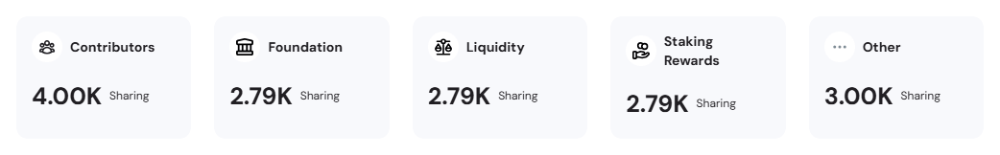

The buyback metrics show how repurchased tokens are distributed across different ecosystem categories. These categories are configured and managed by administrators in the **[Admin -> Buyback Settings](/docs/engage/front-end-ui/admin-section/engage-frontend-admin-section-buyback-settings#)**.

**Example categories may include:**

- **Contributors** – Tokens allocated to project contributors and team members
- **Foundation** – Tokens designated for foundation operations and governance  
- **Liquidity** – Tokens reserved for liquidity provision and market making
- **Staking Rewards** – Tokens allocated for staking reward distribution
- **Other** – Tokens assigned to miscellaneous ecosystem needs and future initiatives

Each category is defined with a specific icon and label that can be customized through the admin interface. Administrators can modify these categories, add new ones, or adjust their designations to match the project's evolving needs.

## Buybacks Tables

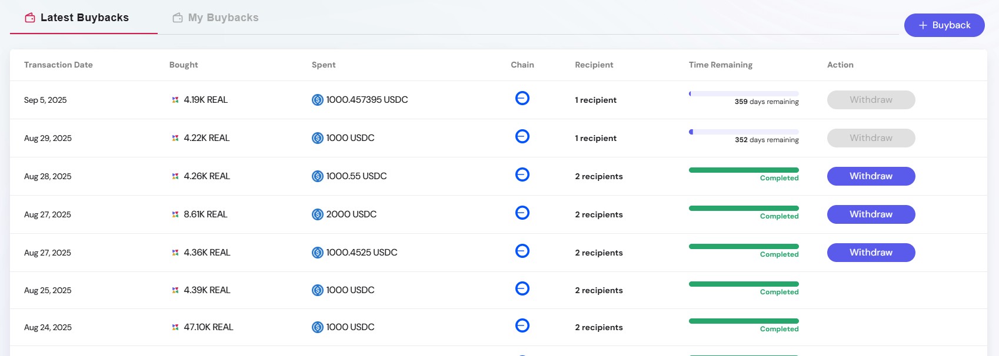

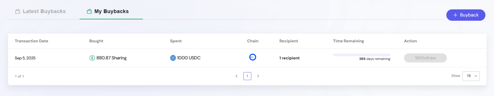

The buyback tables (Latest Buybacks and My Buybacks) display transaction details with the following columns:

### Transaction Details
- **Transaction Date** – When the buyback was executed
- **Bought** – Amount of tokens purchased
- **Spent** – USDC amount used for the buyback
- **Chain** – Blockchain network where transaction occurred
- **Recipient** – Shows number of recipients in summary view; click to expand and view detailed wallet addresses and token amounts for each recipient

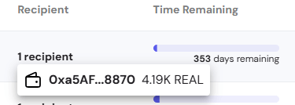

- **Time Remaining** – Days until tokens become available/unlocked
- **Action** – Available actions (Withdraw when eligible)

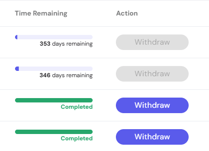

## Initiating a Buyback

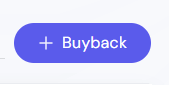

Users can initiate buyback transactions by clicking the **+ Buyback** button, which opens the buyback configuration modal.

### Buyback Types

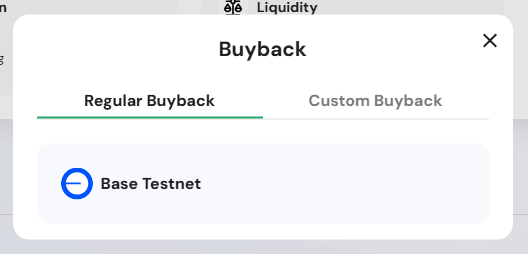

The buyback interface offers two main options:

- **Regular Buyback** – Simplified buyback with predefined allocation across ecosystem categories
- **Custom Buyback** – Advanced option allowing custom recipient specification and flexible allocation

### Network Selection

Before configuring buyback parameters, users must select the blockchain network where the transaction will be executed. The interface displays available networks with their corresponding icons and names.

### Regular Buyback Configuration

The Regular Buyback option provides a streamlined interface for executing buybacks with predefined allocation settings.

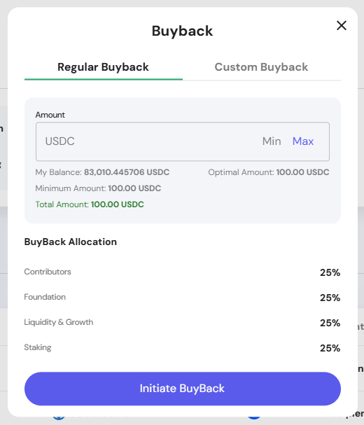

#### Amount Configuration

**Spending Parameters:**

- **Amount Field** – Enter the USDC amount you want to spend on the buyback
- **Balance Display** – Shows your current wallet balance for reference
- **Min/Max Options** – Quick selection buttons for minimum or maximum amounts
- **Optimal Amount** – System-suggested optimal buyback amount
- **Minimum Amount** – Required minimum spend threshold
- **Total Amount** – Final calculated amount to be spent

#### Buyback Allocation

Regular buybacks automatically distribute purchased tokens across predefined ecosystem categories with equal allocation.

#### Execution

Once the amount is configured and allocation is reviewed, users can proceed by clicking **Initiate BuyBack** to execute the transaction with the standard distribution model.

### Custom Buyback Configuration

The Custom Buyback option provides advanced users with flexible recipient specification and allocation control.

#### Initial Setup

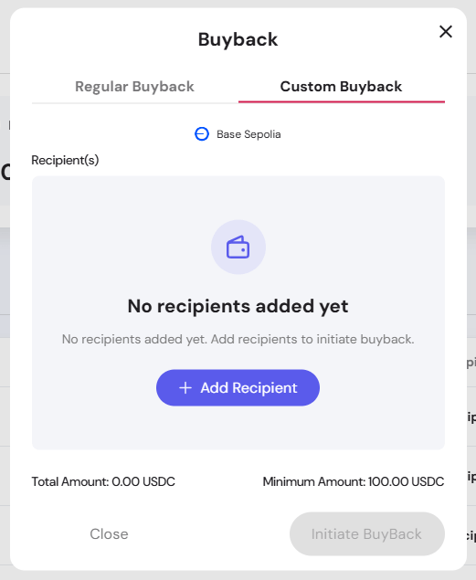

When first accessing Custom Buyback, the interface displays:

- **Network Selection** – Choose the blockchain network
- **Empty Recipients State** – "No recipients added yet" message with guidance
- **Add Recipient Button** – Primary action to begin configuring custom recipients
- **Amount Tracking** – Shows Total Amount and Minimum Amount requirements

#### Adding Recipients

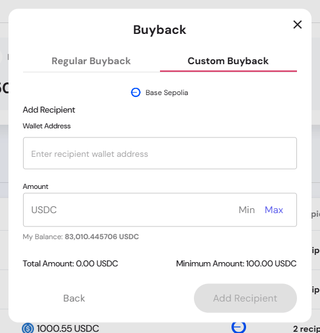

The recipient addition process includes:

**Recipient Configuration:**
- **Wallet Address Field** – Enter the recipient's wallet address
- **Amount Field** – Specify USDC amount to allocate to this recipient
- **Balance Display** – Shows your current wallet balance for reference
- **Min/Max Options** – Quick selection buttons for amount setting

**Navigation:**
- **Back Button** – Return to recipients list
- **Add Recipient Button** – Confirm and add the configured recipient

#### Recipients Summary

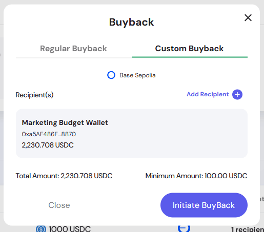

Once recipients are added, the interface displays:

**Recipient Details:**
- **Custom Label** – Shows recipient identifier or custom name
- **Wallet Address** – Truncated address display
- **Allocated Amount** – USDC amount assigned to each recipient
- **Add Recipient Option** – Ability to add additional recipients

**Execution Controls:**
- **Total Amount Calculation** – Automatically calculates total across all recipients
- **Minimum Amount Validation** – Ensures requirements are met
- **Initiate BuyBack Button** – Execute the custom buyback transaction

#### Key Features

- **Multiple Recipients** – Add multiple wallet addresses with individual allocations
- **Flexible Amounts** – Set custom USDC amounts for each recipient
- **Real-time Totals** – Automatic calculation of total buyback cost
- **Validation** – Ensures minimum amounts and wallet address formats are correct