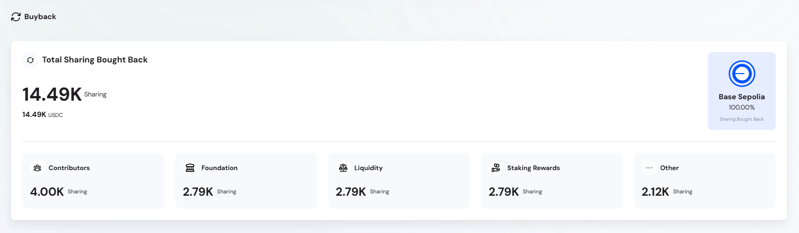

The **BuyBack Module** enables token holders and ecosystem participants to repurchase tokens from the market, supporting token scarcity and long-term value. This module provides tools for executing both regular and custom buyback programs while tracking all buyback activity transparently.

Users can initiate buybacks, monitor their transaction history, and view ecosystem-wide buyback metrics that contribute to token economics and protocol sustainability.

## Dashboard Overview

The buyback dashboard provides two main views:

- **Latest Buybacks** – Recent buyback transactions across the ecosystem
- **My Buybacks** – Personal buyback history and user-initiated transactions

Users can seamlessly switch between these views to monitor ecosystem-wide buyback activity and track their personal contribution to token repurchasing programs.

## Buyback Metrics

The dashboard displays comprehensive buyback statistics:

### Total Sharing Bought Back
- **15.37K Sharing** – Total tokens repurchased from the market
- **15.37K USDC** – USD equivalent value of buybacks executed
- **Chain Distribution** – Shows buyback activity across supported networks (Base Sepolia: 100%)

### Ecosystem Allocation Breakdown
- **Contributors** – 4.00K Sharing (26.0%)
- **Foundation** – 2.79K Sharing (18.2%)
- **Liquidity** – 2.79K Sharing (18.2%)
- **Staking Rewards** – 2.79K Sharing (18.2%)
- **Other** – 3.00K Sharing (19.5%)

## Latest Buybacks

The Latest Buybacks section shows real-time ecosystem activity:

### Transaction Details
- **Transaction Date** – When the buyback was executed
- **Bought** – Amount of Sharing tokens purchased (with $ indicator)
- **Spent** – USDC amount used for the buyback
- **Chain** – Blockchain network where transaction occurred
- **Recipient** – Number of recipients receiving the bought tokens
- **Time Remaining** – Days until tokens become available/unlocked
- **Action** – Available actions (Withdraw when eligible)

### Example Transactions
Recent buyback activity shows consistent market participation:
- 880.87 Sharing bought for 1000 USDC (Sep 5, 2025)
- 4.51K Sharing bought for 5000 USDC (Aug 21, 2025)
- 1.15K Sharing bought for 1200 USDC (Aug 14, 2025)

## My Buybacks

The My Buybacks section provides personalized tracking:

### Personal Transaction History
- **User-Specific Transactions** – Only displays buybacks initiated by the connected wallet
- **Withdrawal Status** – Shows when tokens become available for withdrawal
- **Transaction Details** – Complete record of personal buyback activity

### Transaction Management
- **Withdraw Function** – Claim purchased tokens when lock period expires
- **Time Tracking** – Monitor remaining days until withdrawal eligibility
- **Action Buttons** – Intuitive interface for managing buyback positions

## Initiating a Buyback

### Regular Buyback Process

Users can execute standard buybacks through a streamlined interface:

1. **Select Buyback Type** – Choose between Regular or Custom Buyback
2. **Network Selection** – Pick target blockchain (e.g., Base Testnet)
3. **Configure Parameters** – Set amount and allocation preferences

### Regular Buyback Configuration

**Amount Settings:**
- **Spending Amount** – Enter USDC amount to spend
- **Balance Display** – Shows available wallet balance
- **Min/Max Limits** – Optimal amount suggestions (100.00 USDC minimum)

**Buyback Allocation:**
- **Contributors** – 25%
- **Foundation** – 25%
- **Liquidity & Growth** – 25%
- **Staking** – 25%

### Custom Buyback Options

For advanced users requiring specific allocation:

**Recipient Management:**
- **Add Recipients** – Specify custom wallet addresses
- **Amount Allocation** – Set individual buyback amounts per recipient
- **Wallet Verification** – Ensure valid recipient addresses

**Custom Configuration:**
- **Recipient Details** – Label recipients (e.g., "Marketing Budget Wallet")
- **Amount Distribution** – Flexible allocation across multiple wallets
- **Total Amount Tracking** – Real-time calculation of total buyback cost

## Transaction Lifecycle

### Execution Phase
- **Parameter Setting** – Configure buyback amount and recipients
- **Transaction Submission** – Sign blockchain transaction to execute buyback
- **Market Purchase** – Tokens are bought from available liquidity

### Lock Period
- **Time Lock** – Purchased tokens enter a lock period (typically 300+ days)
- **Progress Tracking** – Daily countdown until withdrawal eligibility
- **Status Monitoring** – Real-time updates on lock status

### Withdrawal Phase
- **Eligibility Check** – Verify lock period completion
- **Withdrawal Action** – Claim purchased tokens to wallet
- **Transaction Completion** – Tokens become fully available for use

## Core Benefits

- **Token Scarcity** – Reduces circulating supply through market repurchases
- **Price Support** – Buyback activity can positively impact token price
- **Ecosystem Health** – Demonstrates protocol commitment to token value
- **Transparency** – All buyback activity is publicly visible and auditable
- **Flexible Allocation** – Support both automated and custom distribution models

## Buyback Categories

### Regular Buybacks
- **Automated Distribution** – Equal allocation across ecosystem categories
- **Simplified Process** – One-click execution with preset parameters
- **Ecosystem Balance** – Maintains proportional token distribution

### Custom Buybacks
- **Targeted Recipients** – Specify exact wallet addresses
- **Variable Allocation** – Custom amount distribution
- **Strategic Purchasing** – Support specific initiatives or wallets

## Example Use Cases

- **Protocol Treasury** – Execute buybacks to reduce token supply and support price
- **Reward Programs** – Buy tokens for distribution to active participants
- **Liquidity Management** – Repurchase tokens to rebalance ecosystem allocations
- **Strategic Initiatives** – Fund specific programs through targeted buybacks
- **Market Stabilization** – Counter selling pressure during market volatility

## Best Practices

### Before Executing Buybacks
- **Check Market Conditions** – Consider current token price and liquidity
- **Verify Recipients** – Ensure all wallet addresses are correct
- **Plan Distribution** – Decide on allocation strategy for purchased tokens

### During Buyback Process
- **Monitor Gas Fees** – Account for transaction costs on chosen network
- **Confirm Parameters** – Double-check amounts and recipient details
- **Track Progress** – Monitor transaction confirmation and execution

### After Buyback Completion
- **Track Lock Periods** – Monitor time remaining until withdrawal eligibility
- **Plan Withdrawals** – Prepare for token distribution when locks expire
- **Analyze Impact** – Review buyback effects on token metrics and ecosystem health