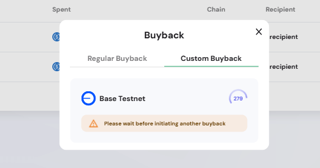

The **BuyBack Module**  allows you to repurchase tokens from the open market to support token scarcity and long-term value. It provides tools for both regular and custom buyback programs, tracking all activity transparently. You can initiate new buybacks, monitor your history, and view ecosystem-wide buyback metrics that contribute to the token economy’s sustainability.

## Dashboard Overview

The buyback dashboard displays **Buyback Metrics** at the top, followed by two main table views:

- **Latest Buybacks** – Recent buyback transactions across the entire ecosystem, including buybacks initiated by other participants or the platform itself.
- **My Buybacks** – Your personal buyback history, showing transactions you initiated. This view requires your web3 wallet to be connected; only then will your contributions appear here.

You can switch between these two tables to monitor overall ecosystem activity and track your own participation in buyback programs. The metrics section provides an overview of the total tokens bought back and their allocation across different ecosystem categories.

## Buyback Metrics

The dashboard displays comprehensive statistics on all buyback activity.

### Total Tokens Bought Back

- **Total tokens repurchased** – The aggregate number of tokens repurchased from the market to date
- **USD equivalent value** – The total amount of USDC spent on all buyback operations
- **Chain Distribution** – Shows the proportion of buyback activity on each supported blockchain (e.g., Ethereum, Base, Polygon), expressed as a percentage of the total

### Ecosystem Allocation Breakdown

The metrics also show how repurchased tokens are distributed across ecosystem categories. These allocations are configured and managed by administrators in **[Admin -> Buyback Settings](/docs/engage/front-end-ui/admin-section/engage-frontend-admin-section-buyback-settings#)**.

**Example categories may include:**

- **Contributors** – Tokens allocated to project contributors and team members
- **Foundation** – Tokens designated for foundation operations and governance  
- **Liquidity** – Tokens reserved for liquidity provision and market making
- **Staking Rewards** – Tokens allocated for staking reward distribution
- **Other** – Tokens assigned to miscellaneous ecosystem needs and future initiatives

Each category is defined with a specific icon and label that can be customized in the admin interface. Administrators can edit categories to match evolving project requirements.

## Buybacks Tables

The buyback tables (Latest Buybacks and My Buybacks) display transaction details with the following columns:

### Transaction Details
- **Transaction Date** – When the buyback was executed
- **Bought** – Amount of tokens purchased
- **Spent** – USDC amount used for the buyback
- **Chain** – Blockchain network where transaction occurred
- **Recipient** – Shows number of recipients in summary view; click to expand and view detailed wallet addresses and token amounts for each recipient

- **Time Remaining** – Time until tokens become available/unlocked

> Once this reaches zero, the buyback becomes eligible for withdrawal.

- **Action** – Available actions (Withdraw when eligible)

> For your own buybacks, a Withdraw button will appear once the lock period has ended. Clicking it triggers an on-chain transaction that releases the locked tokens to their configured recipients.

## Initiating a Buyback

Users can initiate buyback transactions by clicking the **+ Buyback** button, which opens the buyback configuration modal.

### Buyback Types

The buyback interface offers two main options:

- **Regular Buyback** – Simplified buyback with predefined allocation across ecosystem categories
- **Custom Buyback** – Advanced option allowing custom recipient specification and flexible allocation

### Network Selection

Before configuring buyback parameters, users must select the blockchain network where the transaction will be executed. The interface displays available networks with their corresponding icons and names.

### Regular Buyback Configuration

The Regular Buyback option provides a streamlined interface for executing buybacks with predefined allocation settings.

#### Amount Configuration

**Spending Parameters:**

- **Amount Field** – Enter the USDC amount you want to spend on the buyback
- **Balance Display** – Shows your current wallet balance for reference
- **Min/Max Options** – Quick selection buttons for minimum or maximum amounts
- **Optimal Amount** – System-suggested optimal buyback amount
- **Minimum Amount** – Required minimum spend threshold
- **Total Amount** – Final calculated amount to be spent

#### Buyback Allocation

Regular buybacks automatically distribute purchased tokens across predefined ecosystem categories with equal allocation.

#### Execution

Once the amount is configured and allocation is reviewed, users can proceed by clicking **Initiate BuyBack** to execute the transaction with the standard distribution model.

### Custom Buyback Configuration

The Custom Buyback option provides advanced users with flexible recipient specification and allocation control.

#### Initial Setup

When first accessing Custom Buyback, the interface displays:

- **Network Selection** – Choose the blockchain network
- **Empty Recipients State** – "No recipients added yet" message with guidance
- **Add Recipient Button** – Primary action to begin configuring custom recipients
- **Amount Tracking** – Shows Total Amount and Minimum Amount requirements

#### Adding Recipients

The recipient addition process includes:

**Recipient Configuration:**
- **Wallet Address Field** – Enter the recipient's wallet address
- **Amount Field** – Specify USDC amount to allocate to this recipient
- **Balance Display** – Shows your current wallet balance for reference
- **Min/Max Options** – Quick selection buttons for amount setting

**Navigation:**
- **Back Button** – Return to recipients list
- **Add Recipient Button** – Confirm and add the configured recipient

#### Recipients Summary

Once recipients are added, the interface displays:

**Recipient Details:**
- **Custom Label** – Shows recipient identifier or custom name
- **Wallet Address** – Truncated address display
- **Allocated Amount** – USDC amount assigned to each recipient
- **Add Recipient Option** – Ability to add additional recipients

**Execution Controls:**
- **Total Amount Calculation** – Automatically calculates total across all recipients
- **Minimum Amount Validation** – Ensures requirements are met
- **Initiate BuyBack Button** – Execute the custom buyback transaction

## Transaction Execution

### Wallet Integration

When you click **Initiate BuyBack**, your wallet shows transaction details including spending amount, network fees, and contract address.

### Success Confirmation

After successful execution, the system shows the completed transaction with network confirmation and prevents additional buybacks until the cooldown period expires.

#### Key Features

- **Multiple Recipients** – Add multiple wallet addresses with individual allocations
- **Flexible Amounts** – Set custom USDC amounts for each recipient
- **Real-time Totals** – Automatic calculation of total buyback cost
- **Validation** – Ensures minimum amounts and wallet address formats are correct