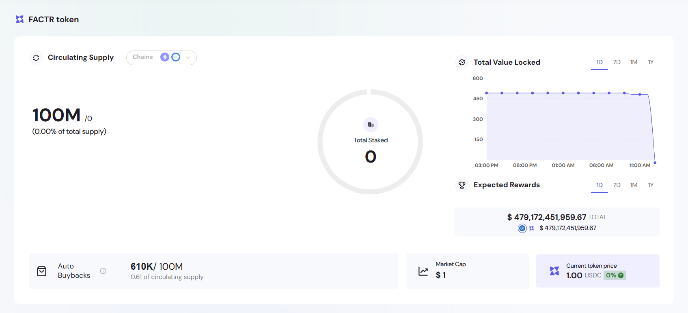

The Engage ecosystem is a modular suite of smart contract tools and dashboards designed to streamline the deployment and management of token-based incentive programs. It empowers web3 projects, DAOs, and digital asset communities to create trustless reward mechanisms that foster participation, loyalty, and alignment between stakeholders.

Engage provides the foundational infrastructure for composable engagement strategies, including staking, vesting, claiming, and contribution tracking. It integrates seamlessly with existing wallets and supports any ERC-20 token, making it adaptable to various use cases across DeFi, RWA, and DAO ecosystems.

Accessible via the [Engage Platform Demo](https://sharingblock-engage.defactor.dev/), the ecosystem showcases real-time interaction with on-chain contracts, giving projects a transparent and customizable interface to launch, monitor, and scale engagement programs.

## Key Modules

- **Staking** – Lock tokens in customizable pools to incentivize long-term holding and participation.
- **Vesting** – Distribute tokens over time to contributors, team members, or investors.
- **Buybacks** – Automatically buy back $FACTR tokens from the open market using revenue collected across the ecosystem. Bought-back tokens are locked for a fixed period (typically 1 year), supporting token scarcity and reinforcing long-term value through a circular economy.

## Core Benefits

- **No-code front-end** – Launch and manage programs directly from a user-friendly dashboard.
- **Composable contracts** – Combine modules to suit specific community or project needs.
- **Cross-chain support** – Compatible with Ethereum, Polygon, and other EVM networks.
- **Secure & Transparent** – Built on audited smart contracts with full on-chain visibility.

## Dashboard Features

The ecosystem dashboard gives a clear summary of the user's ecosystem progress:

- **Dynamic Time Frames** – Toggle between 1D, 7D, 1M, and 1Y for TVL and rewards data.
- **Chain Filters** – View statistics across supported EVM-compatible chains.
- **Interactive Visualizations** – Hover to inspect historical data points and activity changes.

## Example Use Cases

- **DAOs** – Automate reward mechanisms for contributors, voters, and members.
- **DeFi Projects** – Deploy staking and vesting campaigns to bootstrap liquidity and participation.
- **RWA Platforms** – Implement long-term incentive strategies for real-world asset tokenization.
- **Web3 Communities** – Gamify engagement and align user behavior with ecosystem growth.
