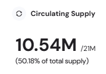
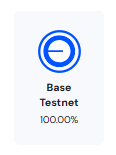
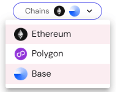
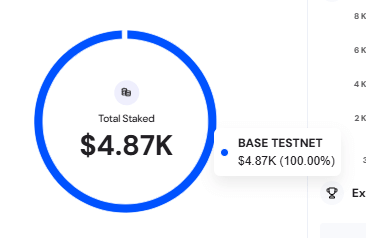
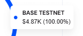
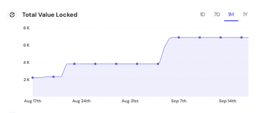
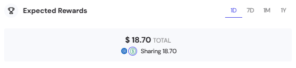
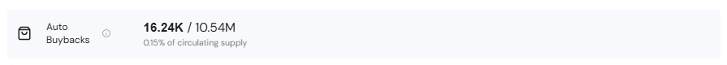
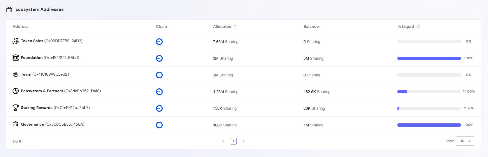

The **Ecosystem Module** provides a real-time dashboard for monitoring the health and activity of the Engage token economy. It aggregates metrics like circulating supply, total staked value, liquidity allocations, buybacks, and expected rewards.  

This module ensures transparency by showing both system-wide token metrics and detailed ecosystem wallet distributions. It is accessible to all users, while Admins configure wallets and allocations via the **[Admin → Ecosystem Settings](/docs/engage/front-end-ui/admin-section/engage-frontend-admin-section-ecosystem-settings#)**.

---

## Dashboard Overview  

The ecosystem dashboard displays:
- **Circulating Supply** – Current tokens in circulation compared to total supply
- **Network Distribution Badges** – Visual indicators showing token allocation across different blockchain networks  
- **Chain Selector** – Multi-chain dropdown menu for selecting supported networks
- **Total Staked Value Chart** – Circular visualization of USD equivalent tokens staked across networks
- **TVL Historical Graph** – Time-series chart of Total Value Locked with 1D, 7D, 1M, and 1Y filters
- **Expected Rewards** – Projected earnings forecast for stakers over selected time periods
- **Auto Buybacks** – Tokens repurchased from market and returned to ecosystem
- **Token Metrics** – Market capitalization and current token price indicators
- **Ecosystem Addresses Table** – Token allocation breakdown across ecosystem addresses

### Circulating Supply  

Displays the current number of tokens in circulation compared to the total supply.  
> This metric helps users track inflation/deflation of the token and monitor how much of the total supply is actively available in the market.

### Badges (Network Distribution)

The badges section displays the distribution of your token supply across different blockchain networks. Each badge represents a specific network where your tokens are deployed.

#### Network Badge Details

Each badge contains:
- **Network Name** - The blockchain network (e.g., Base Testnet, Ethereum, Polygon)
- **Network Logo** - Visual identifier for the blockchain
- **Percentage** - Proportion of your total token supply on this network
- **Visual Indicator (Circle)** - The colored circle surrounding each network logo also provides a visual representation of the distribution percentage, making it easy to quickly compare allocations across networks at a glance

#### Distribution Calculation

The **percentage (%)** shown in each badge indicates **what portion of your total token supply exists on that specific blockchain network**.

### Chain(s) Selector  

Toggle between supported chains such as Base, Ethereum, and Polygon.  
> Engage supports **multi-chain compatibility**, allowing users to view metrics across all integrated networks without switching applications.  

### Total Staked Value Chart

Shows the USD equivalent of all tokens currently staked across networks. The display features a circular progress indicator that visualizes the staking distribution.

> This value reflects community participation and helps measure ecosystem security and engagement through staking.

#### Chart Elements

The Total Staked Value display includes:
- **USD Amount** - The total dollar value of all staked tokens across networks
- **Visual Indicator (Circle)** - Colored circular progress ring showing staking distribution across networks, with segments representing each network's proportion of the total staked value

#### Details Tooltip

When hovering over a specific colored segment of the chart circle, a tooltip appears displaying:
- **Network Name** - The specific blockchain
- **Staked Amount** - USD value staked on that network
- **Percentage Distribution** - Proportion of total staking on each network

The tooltip provides granular visibility into how staking is distributed across your supported blockchain networks, helping users understand which networks have the highest staking participation.

### TVL Graph  

Provides a historical chart of **Total Value Locked** (TVL), filterable by 1D, 7D, 1M, and 1Y.  
> Tracking TVL over time gives insights into growth trends, liquidity inflows, and long-term holder confidence.  

### Expected Rewards  

Displays projected rewards to be earned by stakers and participants over a chosen time period.  
> This forecast helps users estimate returns based on staking activity and pool performance.  

### Auto BuyBacks

Displays the total number of tokens repurchased from the market and returned to the ecosystem.  

  > The metric shows both the absolute buyback amount, the current circulating supply, and the percentage of supply repurchased.  

### Token Metrics  

- **Market Cap** – Calculated based on circulating supply × token price.  
- **Current Token Price** – Fetched from Coingecko or defined as fixed in **[Admin → Token Settings](/docs/engage/front-end-ui/admin-section/engage-frontend-admin-section-token-settings#)**.  

### Ecosystem Addresses  

The **Ecosystem Addresses** table displays token allocation details for each tracked wallet within the ecosystem, providing transparency into how tokens are distributed across different organizational functions.

#### Ecosystem Address Details

- **Address Label** – Descriptive name for the wallet's purpose (e.g., Token Sales, Foundation, Team, Ecosystem & Partners, Staking Rewards, Governance)
- **Wallet Address** – The blockchain address of the ecosystem wallet
- **Allocated** – Total tokens originally assigned to this address
- **Balance** – Current token balance remaining in the wallet
- **% Liquid** – Percentage of tokens that are unlocked and available for use

> This table helps stakeholders understand token distribution patterns and track how allocated funds are being utilized across different ecosystem functions.

#### Configuration

Admins configure these wallet addresses and their allocations through **[Admin → Ecosystem Settings](/docs/engage/front-end-ui/admin-section/engage-frontend-admin-section-ecosystem-settings#)**.