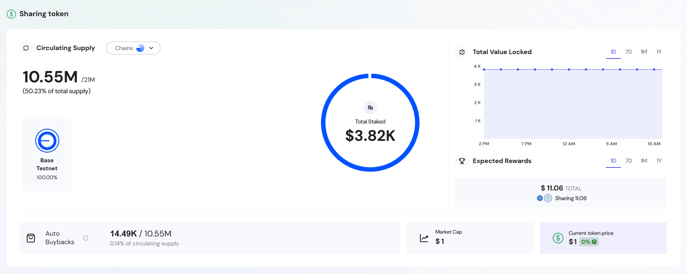
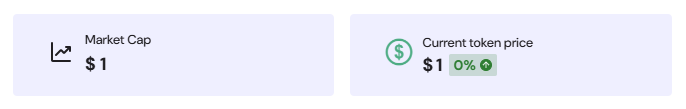

The **Ecosystem Module** provides a real-time dashboard for monitoring the health and activity of the Engage token economy. It aggregates metrics like circulating supply, total staked value, liquidity allocations, buybacks, and expected rewards.  

This module ensures transparency by showing both system-wide token metrics and detailed ecosystem wallet distributions. It is accessible to all users, while Admins configure wallets and allocations via the **Admin Section**.

---

## Dashboard Overview  

The ecosystem dashboard displays:  
- **Circulating Supply** – Current tokens in circulation relative to total supply.  
- **Total Staked Value** – USD equivalent of tokens staked across all pools.  
- **TVL Graph** – Historical Total Value Locked, filterable by 1D, 7D, 1M, and 1Y.  
- **Expected Rewards** – Forecast of rewards accrued within the selected time frame.  
- **Auto Buybacks** – Shows tokens already repurchased from the market.  
- **Chain Filters** – Toggle between supported chains (e.g., Base, Ethereum, Polygon).  

---

## Token Metrics  

- **Market Cap** – Calculated based on circulating supply × token price.  
- **Current Token Price** – Fetched from Coingecko or defined as fixed in Admin → Token Settings.  

---

## Ecosystem Addresses  

The **Ecosystem Addresses** table shows how tokens are allocated across different categories:  

- **Address Label** – e.g., *Token Sales, Foundation, Team, Ecosystem & Partners, Staking Rewards, Governance*.  
- **Allocated** – Total assigned tokens.  
- **Balance** – Remaining tokens available in that wallet.  
- **% Liquid** – Percentage of tokens unlocked and usable.  

Admins configure these wallets and allocations in **Admin → Ecosystem Settings**.  

---

## Key Modules Integrated  

- **Staking** – Lock tokens in customizable pools to incentivize long-term holding and participation.  
- **Vesting** – Distribute tokens over time to contributors, team members, or investors.  
- **Buybacks** – Track and display auto buybacks executed by the protocol, supporting token scarcity and reinforcing long-term value.  

---

## Core Benefits  

- **User-friendly dashboard** – Easily monitor circulating supply, staking, rewards, and buybacks.  
- **Cross-chain visibility** – View metrics across Base, Ethereum, Polygon, and other supported networks.  
- **Transparent allocations** – Track how tokens are distributed across ecosystem wallets.  
- **Auditable on-chain data** – All displayed metrics come directly from audited smart contracts.  

---

## Example Use Cases  

- **DAOs** – Track ecosystem rewards and ensure treasury transparency.  
- **DeFi Projects** – Monitor staking, vesting, and buybacks to assess protocol health.  
- **RWA Platforms** – Showcase token allocations for investors in real-world asset projects.  
- **Web3 Communities** – Provide members with transparent views of token activity and reward flows.  
