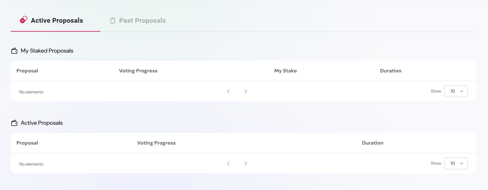
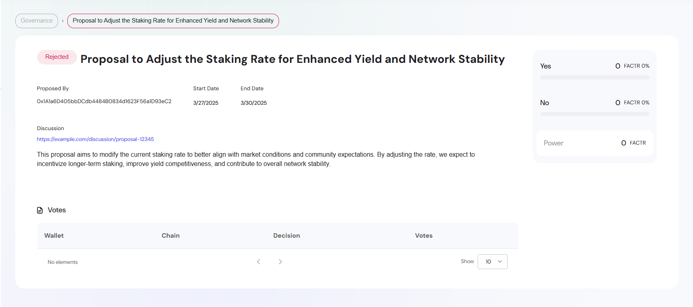

The governance module enables decentralized decision-making by allowing token holders to vote on proposals that influence the strategic and operational direction of a project. Integrated within the Engage platform, it provides a structured and transparent mechanism to facilitate protocol evolution, parameter updates, treasury actions, and other community-driven changes.

Governance functionality relies on token-weighted voting, with voting power determined through a snapshot mechanism. This approach captures token balances at a specific block height to ensure fairness and prevent manipulation. Proposals include detailed metadata such as voting thresholds, durations, and quorum requirements, allowing for consistent and auditable decision-making processes.

Designed for flexibility, the governance module is compatible with any ERC-20 governance-enabled token. It can be integrated across a wide range of DeFi, DAO, or real-world asset ecosystems where decentralized coordination is essential.

An example instance of the governance interface is available at the [Engage Platform Demo](https://sharingblock-engage.defactor.dev/governance), which illustrates real-time voting, proposal tracking, and snapshot-based logic in action.

---

## Core Functionality

- **Submit proposals** for new initiatives or upgrades.
- **Vote on proposals** using token weight.
- **View voting history** and proposal details.
- **Snapshot-based system** to calculate voting power.

---

## How Governance Works

1. **Proposal Creation** – Community or admin users submit proposals with descriptions, thresholds, and timelines.
2. **Voting Period** – Token holders vote during the open window.
3. **Snapshot Date** – Determines voting power based on wallet holdings.
4. **Result Tally** – After the end date, results are finalized.

---

## Voting Metadata

- **Title** – Summary of the proposal topic
- **Description** – Full explanation, criteria, and rationale
- **Snapshot Date** – Timestamp when wallet balances are captured
- **End Date** – Last day to cast votes

---

## Example Proposal Detail

This example displays a **rejected proposal** that aimed to modify staking rates. The metadata section includes:

- **Start & End Dates**
- **Voting Outcome & Stake Power**
- **On-chain Discussion Link**
- **Wallet Voting Breakdown**
