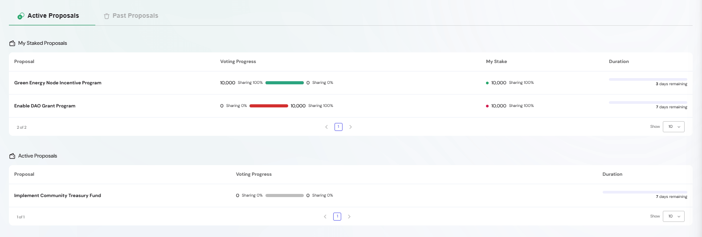
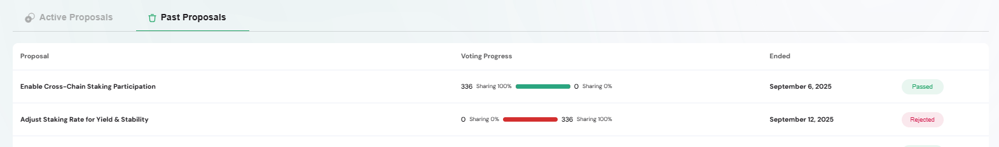
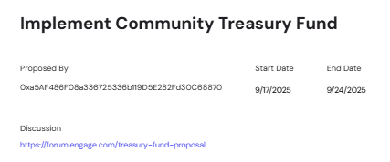
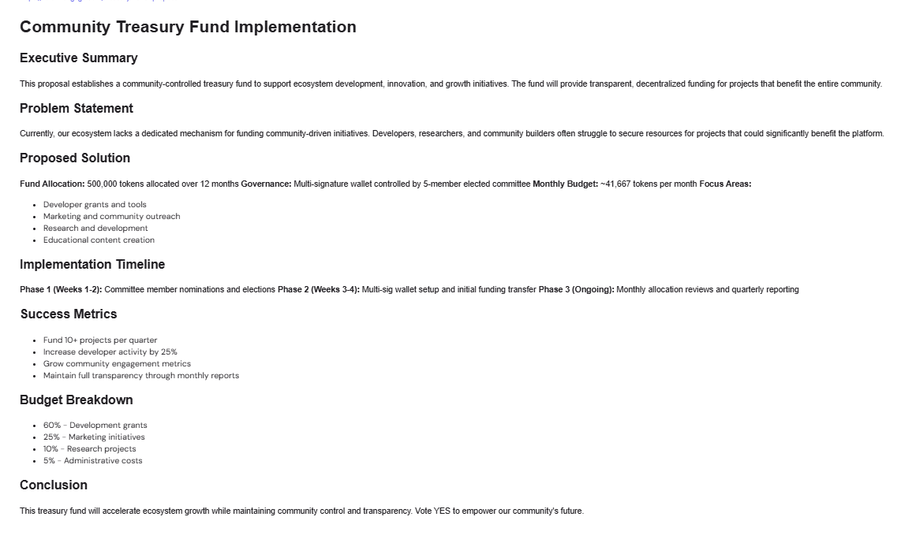
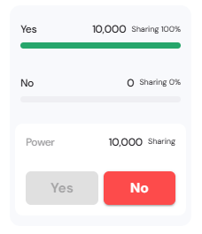
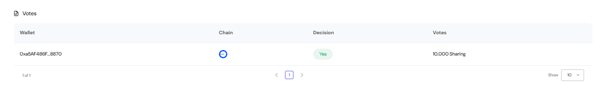

The **Governance Module** enables decentralized decision-making by allowing token holders to participate in proposal voting and community governance.  
This ensures transparency, accountability, and community-driven control over protocol development, parameter changes, and strategic initiatives.

Token holders can view active and past proposals, cast votes, and track their participation directly in the governance dashboard.  

---

## Dashboard Overview

The governance dashboard provides two main sections:

### Active Proposals 

Currently open proposals accepting votes. This section is split into:

- **My Staked Proposals** – Personalized view showing proposals the user has already voted on or staked in, including voting power used and duration left.  
- **Active Proposals** – List of all currently open proposals available for voting.

### Past Proposals
Historical record of proposals with final outcomes and voting statistics.

Users can seamlessly switch between these tabs to track ongoing governance activity, monitor decision history, and review their personal participation.

## Proposal Detail View

When clicking on a proposal row, users are taken to the detailed proposal page.

Each proposal provides detailed information for informed decision-making:

### Proposal Information

- **Proposal Title** – Clear, descriptive name (e.g., *Green Energy Node Incentive Program*)  
- **Proposed By** – Wallet address of the proposal creator  
- **Timeline** – Start date and end date for the voting period  
- **Discussion Link** – External link to community discussion  

> New proposals can be created, managed, or updated via
> **[Admin → Governance Settings Manage Proposals](/docs/admin-section/governance/proposals)**.

### Proposal Content

Includes structured sections such as:  

- **Executive Summary** – Short overview of the proposal’s purpose  
- **Problem Statement** – What issue the proposal addresses  
- **Proposed Solution** – Actions or changes to implement  
- **Implementation Timeline** – Milestones and expected phases  
- **Budget Breakdown** – Allocation of funds or resources  
- **Conclusion** – Final call to action  

### Voting Interface

- **Real-time Results** – Vote counts updated live  
- **Vote Distribution** – Visual progress bars (Yes/No percentages)  
- **User’s Voting Power** – Shows personal stake and influence  
- **Vote Buttons** – Cast a *Yes* or *No* vote, confirmed via blockchain transaction  

### Vote Tracking Table

- **Wallet Address** – Voter’s on-chain identity  
- **Chain** – Network where the vote is registered  
- **Decision** – *Yes* or *No* with color-coded indicators  
- **Vote Weight** – Number of tokens used in the vote  

## Voting Process

### How to Vote
1. **Review Proposal** – Read full content and linked discussion  
2. **Check Eligibility** – Ensure tokens are staked for governance  
3. **Cast Vote** – Select *Yes* or *No*  
4. **Confirm Transaction** – Sign the blockchain transaction  
5. **Track Progress** – See updated results in real-time  

### Voting Requirements

- **Staked Tokens** – Users must have tokens staked to participate in governance 
- **One Vote Per Proposal** – Each wallet can cast one vote per proposal  
- **Voting Power** – Determined by the amount of staked tokens 

## Proposal Lifecycle

### Active Phase
- **Proposal Submission** – A governance proposal is published  
- **Voting Period** – Token holders can vote during the open window  
- **Real-time Tracking** – Votes and results update instantly  

### Resolution Phase
- **Vote Tallying** – Final count determines proposal outcome  
- **Execution** – If passed, proposal is implemented  
- **Archive** – Proposal moves to Past Proposals for transparency  

## Core Benefits

- **Community Control** – Token holders steer the protocol  
- **Transparency** – All proposals and votes are publicly verifiable  
- **Accountability** – Every decision has a recorded history  
- **Engagement** – Encourages active participation in governance  
- **Sustainability** – Builds a decentralized and resilient ecosystem  

> For administrators, governance rules and controls — such as managing proposals or maintaining member permissions — can be configured in **[Admin → Governance Settings](/docs/engage/front-end-ui/admin-section/governance-settings#)**.