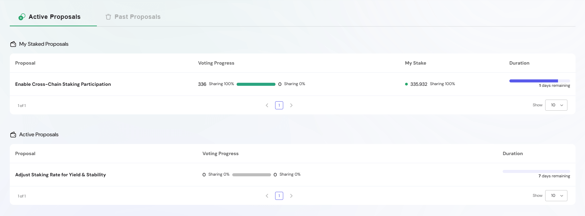
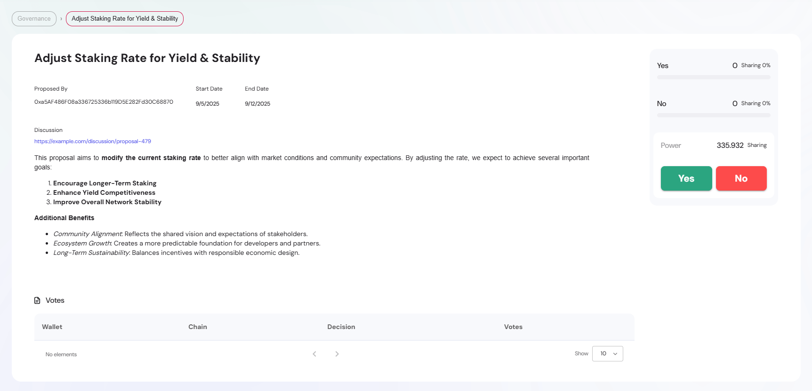

The **Governance Module** enables decentralized decision-making by allowing token holders to participate in proposal creation, voting, and community governance. This module provides transparency and democratic control over protocol changes, parameter adjustments, and strategic initiatives.

Token holders can view active and past proposals, participate in voting, and track their governance participation through an intuitive dashboard interface.

---

## Dashboard Overview

The governance dashboard provides two main views:

### Active Proposals 
Currently open proposals accepting votes, including:

  - **Active proposals** open to all users and
  - **My Staked Proposals**: Personalized view showing user's participation and voting power.

### Past Proposals
Historical proposals with final outcomes and voting results.

Users can seamlessly switch between these views to monitor ongoing governance activity, review decision history, and track their personal involvement in the governance process.

## Proposal Detail View

Each proposal provides detailed information for informed decision-making:

### Proposal Information
- **Proposal Title** – Clear, descriptive name (e.g., "Adjust Staking Rate for Yield & Stability")
- **Proposed By** – Wallet address of the proposal creator
- **Timeline** – Start date and end date for the voting period
- **Discussion Link** – External link to community discussion forum

### Proposal Content
- **Objective Statement** – Clear explanation of what the proposal aims to modify
- **Key Goals** – Numbered list of specific outcomes:
  1. Encourage Longer-Term Staking
  2. Enhance Yield Competitiveness  
  3. Improve Overall Network Stability

### Additional Benefits
- **Community Alignment** – How the proposal reflects stakeholder vision
- **Ecosystem Growth** – Impact on developer and partner participation
- **Long-Term Sustainability** – Balance between incentives and economic design

### Voting Interface
- **Real-time Results** – Live vote tallies showing "Yes" and "No" counts
- **Vote Distribution** – Visual progress bars showing current percentages
- **User's Voting Power** – Display of personal stake and voting influence
- **Vote Buttons** – Clear "Yes" and "No" options for casting votes

### Vote Tracking Table
- **Wallet Address** – Individual voter identification
- **Chain** – Blockchain network where the vote was cast
- **Decision** – Vote choice (Yes/No) with colored indicators
- **Vote Weight** – Number of tokens used in the vote

## Voting Process

### How to Vote

1. **Review Proposal** – Read the full proposal details and discussion
2. **Check Eligibility** – Ensure tokens are properly staked for governance
3. **Cast Vote** – Select "For" or "Against" the proposal
4. **Confirm Transaction** – Sign the blockchain transaction to record your vote
5. **Track Progress** – Monitor real-time voting results

### Voting Requirements

- **Minimum Stake** – Tokens must be staked to participate in governance
- **Lock Period** – Staked tokens may have lock-up requirements during voting
- **One Vote Per Proposal** – Each staking position gets one vote per proposal

## Proposal Lifecycle

### Active Phase
- **Proposal Submission** – Community or team submits governance proposal
- **Voting Period** – Token holders cast votes over specified timeframe
- **Real-time Tracking** – Vote counts and participation rates update live

### Resolution Phase
- **Vote Tallying** – Final count determines proposal outcome
- **Execution** – Passed proposals trigger protocol changes or actions
- **Documentation** – Results are recorded in Past Proposals for transparency

## Core Benefits

- **Democratic Control** – Token holders direct protocol evolution
- **Transparency** – All votes and outcomes are publicly visible
- **Participation Rewards** – Incentives for active governance engagement
- **Historical Record** – Complete archive of all governance decisions
- **Real-time Updates** – Live voting progress and participation metrics