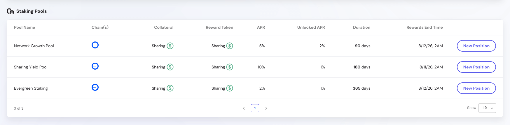
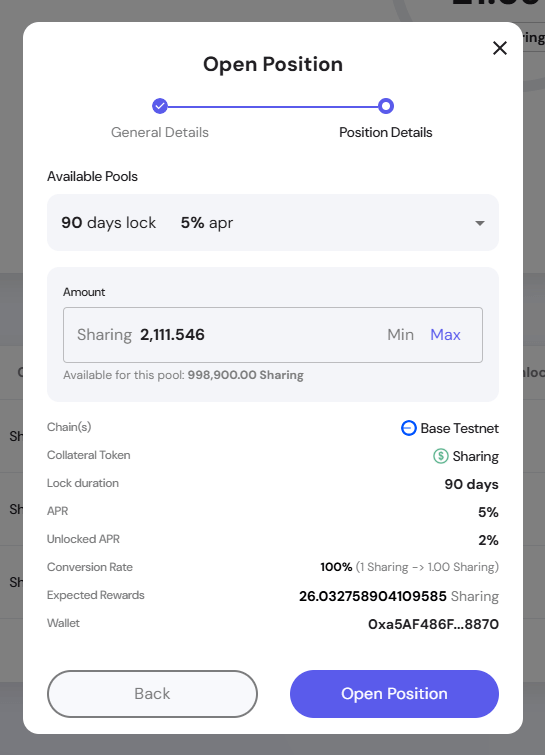
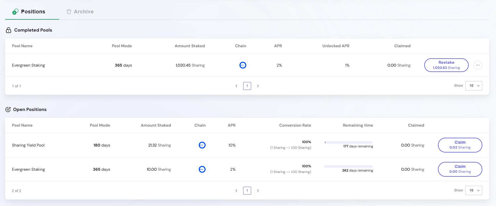

The **Staking Module** allows users to lock tokens into configurable pools and earn rewards based on pool parameters. It provides a clear interface to track your total value locked, ecosystem contribution, expected rewards, and staking history.  

Staking is central to reinforcing token utility, governance participation, and long-term alignment between community members. Engage supports flexible staking strategies such as different lockup durations, varied APRs, and multiple pools.

---

## Dashboard Overview  

The main staking dashboard includes:  
- **My Total Value Locked (TVL)** – Total value of tokens you have staked.  
- **My Contribution to the Ecosystem** – Displays your percentage share of the ecosystem’s staked tokens.  
- **Rewards Panel** – Breakdown of rewards received, expected rewards, and claimable tokens.  
- **Claim Now** – Button to withdraw currently unlocked rewards.  

## Staking Pools  

The **Staking Pools** section lists all available pools with details such as:  
- **Pool Name** – Identifier of the staking pool.  
- **Chain(s)** – Blockchain network hosting the pool.  
- **Collateral / Reward Token** – Token deposited and token rewarded.  
- **APR / Unlocked APR** – Annual percentage rates (locked vs. unlocked).  
- **Duration** – Lockup period (e.g., 30, 90, 180, 365 days).  
- **Rewards End Time** – Final date when rewards stop.  
- **New Position** – Button to join the pool.  

## Opening a Staking Position  

To open a new staking position:  
1. Choose a pool from the **Staking Pools** table.  
2. Click **New Position**.  
3. Enter the amount of tokens to stake.  
4. Confirm the transaction in your wallet.  

## Positions  

The **Positions** section shows both open and completed pools:  

- **Completed Pools** – Pools where the lock period ended; tokens and rewards can be restaked or have already been claimed. 
- **Open Positions** – Active stakes with details like pool mode, amount staked, APR, conversion rate, remaining time, and claimable rewards.   
- **Archive Tab** – Historical record of older completed positions.  

## Claiming Rewards  

Rewards can be claimed directly from the dashboard:  
- **Claim Now** – Appears on the Rewards panel if tokens are unlocked.  
- **Claim (per pool)** – Button within Open Positions to withdraw rewards from a specific pool.  
- **Restake** – Available for completed pools to re-enter with previously staked tokens.  

## Key Features  

- **Multiple staking pools** with different APRs and lockup durations.  
- **Real-time rewards** displayed in the dashboard and pools list.  
- **Wallet integration** with MetaMask, Rainbow Wallet, WalletConnect and more.  
- **Flexible management** – Users can open, close, claim, or restake positions as needed.  
