The **Staking Module** enables users to lock tokens into pools and earn rewards over time. It provides a transparent view of total staked value, contribution to the ecosystem, active and completed positions, and claimable rewards.  

This module ensures accessibility for all users while Admins manage staking pools, reward rates, and token configurations via the **[Admin → Staking Settings](/docs/engage/front-end-ui/admin-section/engage-frontend-admin-section-staking-settings#)**.

---

## Dashboard Overview  

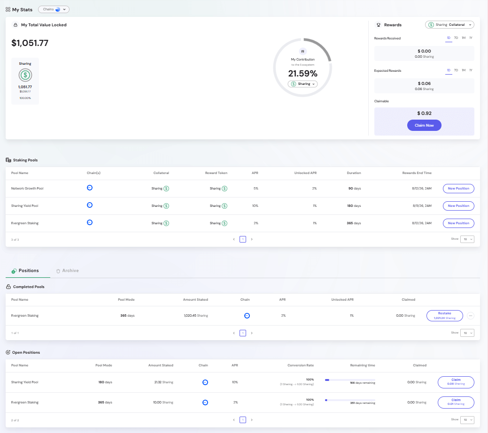

The staking dashboard displays:
- **Chain Selector** – Dropdown for switching between supported networks  
- **My Stats** – User overview with TVL, contribution percentage, and rewards  
- **Staking Pools Table** – Available pools with APR, duration, and reward details  
- **Positions Table** – Lists both open and completed positions  
- **Archive** – Records of past staking activity  

## Chain Selector  

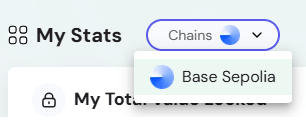

Users can toggle between supported networks using the **multi-chain selector**.  

> Engage supports **multi-chain staking**, allowing participants to manage and view stakes across all integrated blockchains from a single dashboard.

## My Stats  

The **My Stats** section provides users with a personalized overview of their staking performance and contributions within the ecosystem.  

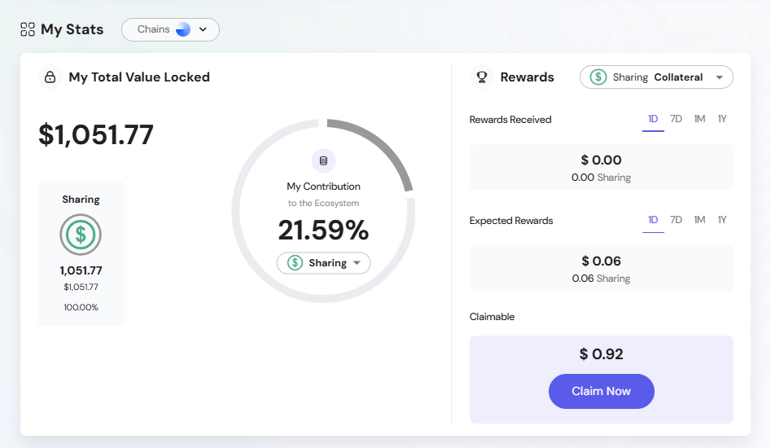

### My Total Value Locked (My TVL)  

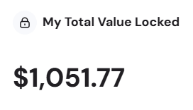

Displays the **total value of tokens the user has staked**, shown in USD equivalent.  
> This metric gives users a quick overview of the overall value they have locked across all staking pools.

#### TVL Badge Details  

The badges section breaks down how a user’s staked value is distributed across tokens.

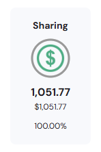

Each badge contains:  
- **Token Name** – The staking token (e.g., Sharing, WETH, FACTR, USDC)  
- **Token Logo** – Visual identifier for the staked token  
- **Staked Amount** – The number of tokens currently locked in staking  
- **USD Value** – Dollar equivalent of the staked tokens  
- **Percentage** – Proportion of this token compared to the user’s overall staked value  
- **Visual Indicator (Circle)** – The surrounding circle provides a visual cue of the distribution percentage, making it easy to compare how much of the user’s total staked value is allocated per token type  

> When only one token is staked, the badge will display **100% allocation**. In multi-token scenarios, the badge set provides a clear snapshot of portfolio diversification across different staked assets.

### Contribution to Ecosystem  

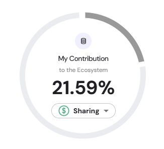

The **Contribution to Ecosystem** chart visualizes the user’s share of the total staking pool for a selected token. It calculates how much of the staked collateral belongs to the user versus other participants.

#### Chart Details  

- **Circular Contribution Chart** – Displays the user’s percentage contribution relative to the total staked collateral for the selected token.  
- **Tooltip (My Contribution)** – Shows the exact token amount staked by the user along with their percentage share.  
  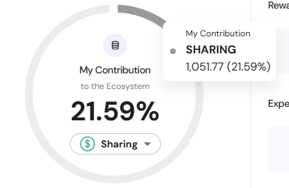  
- **Tooltip (Others)** – Displays the aggregated token amount and percentage contributed by all other stakers in the pool.  
  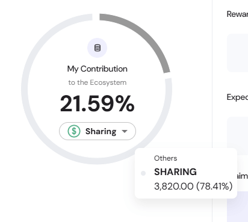  

#### Distribution Calculation  

If the user is the only participant, the chart will show **100% contribution**. Otherwise, the chart splits into two slices:  
- **My Contribution** – User’s staked amount  
- **Others** – Remaining pool amount  

> This visualization provides clear insight into the user’s weight within the ecosystem and highlights how much influence their stake carries compared to the rest of the participants.

### Rewards  

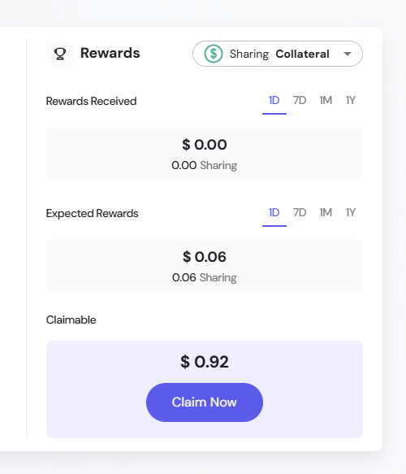

Provides a detailed breakdown of staking rewards:  
- **Rewards Received** – Tokens already earned and available for claim  
- **Expected Rewards** – A forward-looking estimate of potential earnings
- **Claimable Balance** – Tokens available for immediate withdrawal  

#### Rewards Token Selector  

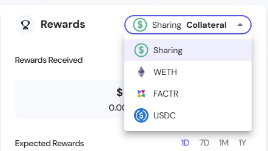

Allows switching between supported collateral/reward tokens such as Sharing, WETH, FACTR, or USDC.  

> This feature ensures users can view and claim rewards specific to the token type they staked.

#### Rewards Claim Button  

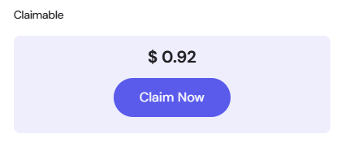

Users can collect accumulated rewards with the **Claim Now** button.  

## Staking Pools  

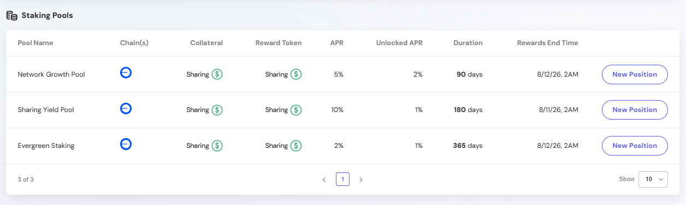

The **Staking Pools** table lists all available pools and their parameters:  
- **Pool Name** – Pool identifier (e.g., Network Growth Pool, Yield Pool, Evergreen Staking)  
- **Chain(s)** – Supported networks  
- **Collateral** – Token required for participation  
- **Reward Token** – Token distributed as rewards  
- **APR / Unlocked APR** – Rates for locked vs unlocked staking  
- **Duration** – Length of staking period
- **Rewards End Time** – Pool’s expiration date  
- **New Position** – Action to start staking in the pool  

## Positions  

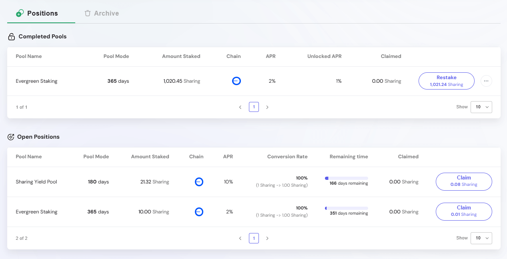

The **Positions** section shows all current and past user stakes. It is divided into **Completed Pools** and **Open Positions**.

### Completed Pools  

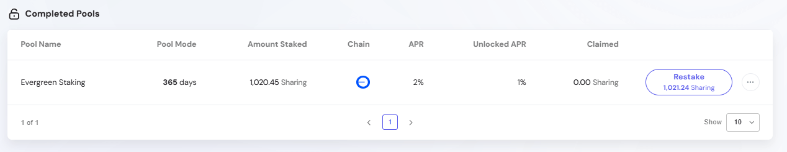

- **Pool Name** – Pool staked in  
- **Pool Mode** – Lock duration chosen  
- **Amount Staked** – Tokens previously locked  
- **Chain** – Network used  
- **APR & Unlocked APR** – Applied reward rates  
- **Claimed** – Rewards already withdrawn  
- **Restake** – Option to reinvest tokens into a new pool cycle  

### Open Positions  

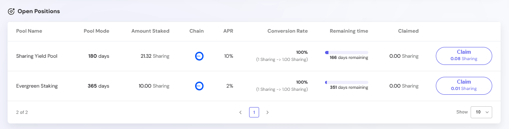

- **Pool Name** – Current active pool  
- **Pool Mode** – Lock duration selected  
- **Amount Staked** – Tokens actively locked  
- **APR & Conversion Rate** – Returns and staking-to-reward ratio  
- **Remaining Time** – Days left in staking cycle  
- **Claimed** – Rewards earned so far  
- **Claim Button** – Allows partial reward claims before the pool finishes  

## Archive  

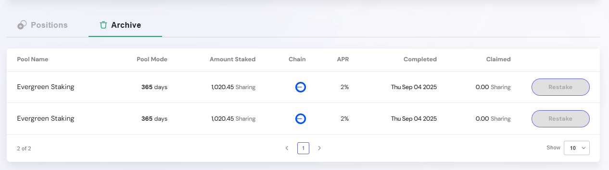

The **Archive** tab provides a historical record of all completed staking positions:  
- Shows pool details, durations, amounts staked, and claimed rewards  
- Provides a **Restake** option for re-activating previous positions  

> Archive ensures transparency and enables long-term tracking of staking activity.
