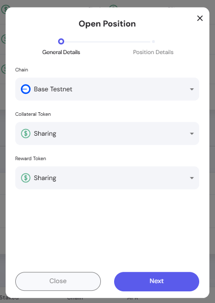
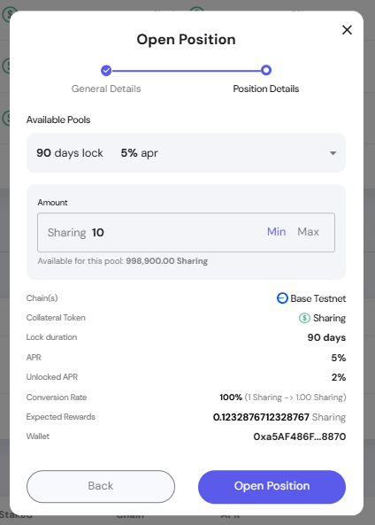
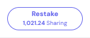
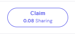

The **Staking Module** enables users to lock tokens into pools and earn rewards over time. It provides a transparent view of total staked value, contribution to the ecosystem, active and completed positions, and claimable rewards.  

This module ensures accessibility for all users while Admins manage staking pools, reward rates, and token configurations via the **[Admin → Staking Settings](/docs/engage/front-end-ui/admin-section/engage-frontend-admin-section-staking-settings#)**.

---

## Dashboard Overview  

The staking dashboard displays:
- **Chain Selector** – Dropdown for switching between supported networks  
- **My Stats** – User overview with TVL, contribution percentage, and rewards  
- **Staking Pools Table** – Available pools with APR, duration, and reward details  
- **Positions Table** – Lists both open and completed positions  
- **Archive** – Records of past staking activity  

## Chain Selector  

Users can toggle between supported networks using the **multi-chain selector**.  

> Engage supports **multi-chain staking**, allowing participants to manage and view stakes across all integrated blockchains from a single dashboard.

## My Stats  

The **My Stats** section provides users with a personalized overview of their staking performance and contributions within the ecosystem.  

### My Total Value Locked (My TVL)  

Displays the **total value of tokens the user has staked**, shown in USD equivalent.  
> This metric gives users a quick overview of the overall value they have locked across all staking pools.

#### TVL Badge Details  

The badges section breaks down how a user’s staked value is distributed across tokens.

Each badge contains:  
- **Token Name** – The staking token (e.g., Sharing, WETH, FACTR, USDC)  
- **Token Logo** – Visual identifier for the staked token  
- **Staked Amount** – The number of tokens currently locked in staking  
- **USD Value** – Dollar equivalent of the staked tokens  
- **Percentage** – Proportion of this token compared to the user’s overall staked value  
- **Visual Indicator (Circle)** – The surrounding circle provides a visual cue of the distribution percentage, making it easy to compare how much of the user’s total staked value is allocated per token type  

> When only one token is staked, the badge will display **100% allocation**. In multi-token scenarios, the badge set provides a clear snapshot of portfolio diversification across different staked assets.

### Contribution to Ecosystem  

The **Contribution to Ecosystem** chart visualizes the user’s share of the total staking pool for a selected token. It calculates how much of the staked collateral belongs to the user versus other participants.

#### Chart Details  

- **Circular Contribution Chart** – Displays the user’s percentage contribution relative to the total staked collateral for the selected token.  
- **Tooltip (My Contribution)** – Shows the exact token amount staked by the user along with their percentage share.  
    
- **Tooltip (Others)** – Displays the aggregated token amount and percentage contributed by all other stakers in the pool.  
    

#### Distribution Calculation  

If the user is the only participant, the chart will show **100% contribution**. Otherwise, the chart splits into two slices:  
- **My Contribution** – User’s staked amount  
- **Others** – Remaining pool amount  

> This visualization provides clear insight into the user’s weight within the ecosystem and highlights how much influence their stake carries compared to the rest of the participants.

### Rewards  

Provides a detailed breakdown of staking rewards:  
- **Rewards Received** – Tokens already earned and available for claim  
- **Expected Rewards** – A forward-looking estimate of potential earnings
- **Claimable Balance** – Tokens available for immediate withdrawal  

#### Rewards Token Selector  

Allows switching between supported collateral/reward tokens such as Sharing, WETH, FACTR, or USDC.  

> This feature ensures users can view and claim rewards specific to the token type they staked.

#### Rewards Claim Button  

Users can collect accumulated rewards with the **Claim Now** button.  

## Staking Pools  

The **Staking Pools** table lists all available staking opportunities. Each row provides essential parameters for comparing pools and deciding where to stake:  
- **Pool Name** – Pool identifier (e.g., Network Growth Pool, Yield Pool, Evergreen Staking)  
- **Chain(s)** – Networks where the pool is active  
- **Collateral** – Token required for participation  
- **Reward Token** – Token distributed as staking rewards  
- **APR / Unlocked APR** – Annual reward rate, showing locked vs unlocked percentages  
- **Duration** – Length of the staking period
- **Rewards End Time** – When the pool finishes distributing rewards  
- **New Position** – Action button that opens the **Open Position modal** to begin staking  

### Open Position Modal  

Opening a new position is a **guided, two-step process** designed to help users configure and confirm their stake.  

#### Step 1: General Details  

In this step, users must:  
- **Select Chain** – Choose the blockchain network to stake on  
- **Select Collateral** – Pick the token they wish to stake  
- **Select Reward Token** – Choose which token they want to earn as rewards  

Validation ensures that all three fields are selected before continuing.  
> If no eligible pools exist for the chosen combination, the system displays a message "There are no pools available with this configuration." informing the user.  

#### Step 2: Position Details  

In this step, users define their stake:  
- **Amount** – Enter the number of tokens to lock  
- **Min/Max Buttons** – Quick actions to set the minimum or maximum allowable amount  
- **Validation** – Real-time error handling prevents over-staking or invalid inputs  
- **Pool Info** – Displays key details such as APR, duration, and remaining capacity  

> Once confirmed, the transaction is executed on-chain. If approval is needed (first-time staking with a token), the system automatically prompts the user to approve token spending.  

## Positions  

The **Positions** section shows all current and past user stakes. It is divided into **Completed Pools** and **Open Positions**.

### Completed Pools  

The **Completed Pools** table shows all staking positions that have finished their lock duration. It provides a summary of the original stake and options for reusing those tokens.  

Each row contains:  
- **Pool Name** – The pool in which the stake was originally placed  
- **Pool Mode** – The lock duration chosen  
- **Amount Staked** – Number of tokens previously locked in the pool  
- **Chain** – The blockchain network where the pool was active  
- **APR & Unlocked APR** – Applied reward rates during the staking period  
- **Claimed** – Rewards already withdrawn from the position  
- **Restake** – A quick action to reinvest the matured tokens into a new staking cycle  

#### Restake Button  

The **Restake** button allows users to instantly roll over their matured stake into a new pool without manually withdrawing and re-staking.  

When selected:  
- The system calculates the eligible restake amount (original staked tokens + any accrued rewards).  
- Users confirm the restake transaction in their wallet (e.g., MetaMask).  
- Tokens are redeployed into the same or updated pool configuration depending on availability.  

> This feature simplifies the reinvestment process, enabling continuous staking participation with minimal effort.

### Open Positions  

The **Open Positions** table displays all currently active stakes that are still within their lock duration. This view helps users monitor ongoing commitments and claim partial rewards before completion.  

Each row contains:  
- **Pool Name** – The active pool where tokens are staked  
- **Pool Mode** – Lock duration selected (e.g., 90d, 180d, 365d)  
- **Amount Staked** – Tokens actively locked in the pool  
- **APR & Conversion Rate** – Annual reward rate and the staking-to-reward ratio  
- **Remaining Time** – Number of days left until the stake matures  
- **Claimed** – Rewards already collected so far  
- **Claim Button** – Quick action to withdraw claimable rewards before the pool finishes  

#### Claim Button  

The **Claim** button allows users to collect earned rewards while their position is still active.  

When selected:  
- The system calculates the amount available to claim.  
- A transaction request is triggered in the user’s connected wallet (e.g., MetaMask).  
- Once confirmed, the claimed rewards are transferred to the user’s wallet while the principal stake remains locked until maturity.  

> This feature provides flexibility by allowing users to realize part of their earnings during the staking cycle without closing their entire position.

## Archive  

The **Archive** tab provides a historical record of all staking positions that have fully completed their cycle. It acts as a permanent log of past activity, including pool details, durations, amounts staked, and rewards claimed.  

- **Pool Name** – The pool where tokens were originally staked  
- **Pool Mode** – Duration of the staking period
- **Amount Staked** – Number of tokens originally locked in the pool  
- **Chain** – The blockchain network where the stake took place  
- **APR** – Reward rate applied during the staking period  
- **Completed** – Date when the stake reached maturity  
- **Claimed** – Rewards already collected from that position  
- **Restake (Disabled)** – Displayed as inactive in the Archive view, since archived positions cannot be reinvested  

> ℹ️ **Note:** Once a position has been completed or **unstaked**, the smart contract marks it as **closed**.  
> Such positions cannot be restaked.
> For continued staking, users must open a **new position** in one of the currently active pools.  

Archive ensures transparency and enables long-term tracking of staking activity.

