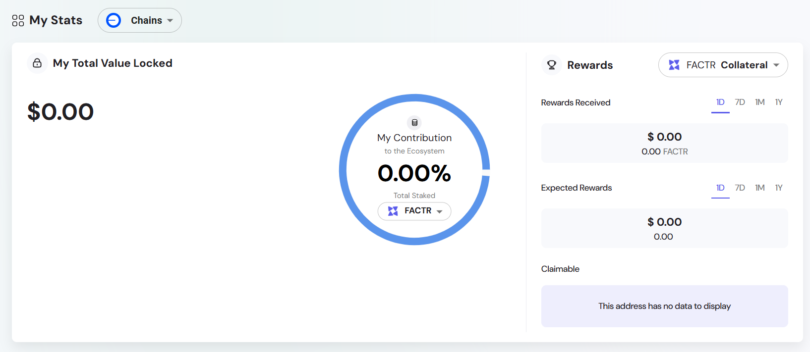

The staking module enables the creation and management of on-chain incentive programs designed to promote long-term token holding and community participation. As part of the Engage platform, it allows tokens to be locked into configurable pools, rewarding participants based on duration, pool parameters, and overall network engagement.

Staking is a key mechanism for reinforcing token utility, enhancing governance participation, and driving alignment between ecosystem stakeholders. The module is designed for flexibility, supporting various staking strategies including fixed lockup periods, tiered reward structures, and multi-token implementations.

The system is token-agnostic, compatible with any ERC-20 asset that meets basic liquidity and composability standards. This makes it suitable for a wide range of DeFi, RWA, and DAO applications seeking to implement sustainable incentive models.

A live example of this staking module in production is available at the [Engage Platform Demo](https://sharingblock-engage.defactor.dev/staking), showcasing real-time reward tracking and multiple pool configurations.

## Key Features

- **Multiple staking pools** with varying lockup periods and reward rates.
- **Real-time reward tracking** through the Engage dashboard.
- **Claim functionality** available during or after lockup ends.
- **Seamless wallet integration** for MetaMask, Trust Wallet, and WalletConnect.

## How Staking Works

1. **Connect Wallet** – Ensure your wallet is connected to the correct chain (Ethereum, Polygon, etc.).
2. **Select Pool** – Choose a staking pool that matches your desired duration and yield.
3. **Stake Tokens** – Enter the number of tokens and confirm the transaction.
4. **Earn Rewards** – View accrued rewards in real time.
5. **Claim or Unstake** – Once the lockup period ends, click 'Unstake & Claim' or 'Claim' to receive rewards.

## Opening a Staking Position

To initiate a new staking position:

- Select the **chain**, **collateral token**, and **reward token**.
- Configure your staking duration and confirm the transaction.

## Viewing and Managing Positions

Stakeholders can view active and completed staking positions via the **Positions** section:

- **Open Positions** – Currently staked pools, with data on APR, lockup time, and chain.
- **Completed Pools** – Historical data on claimed and expired pools.

## Dashboard Elements

The **My Stats** dashboard provides a real-time overview of your ecosystem contribution:

- **Available** – Tokens earned and ready to be claimed.
- **Received** – Historical record of claimed tokens.
- **Locked** – Tokens currently staked in a pool.
- **APY** – Annual yield offered by the selected pool.
