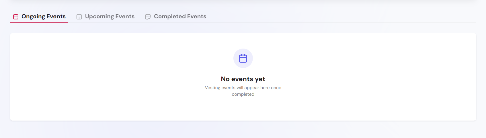
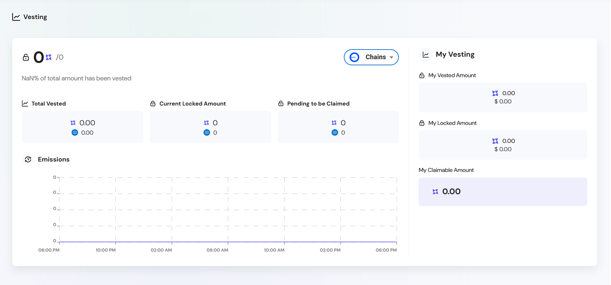

The Vesting module enables time-based, structured distribution of tokens according to predefined schedules. It is typically used to manage allocations for contributors, investors, core team members, and ecosystem participants, ensuring long-term alignment with project objectives and token supply discipline.

By enforcing lock-up periods and gradual token release, the vesting mechanism helps mitigate premature sell-offs, build trust with stakeholders, and enhance transparency across token allocations. Vesting plans can vary in complexity and duration and are fully trackable through the Engage platform.

The module is compatible with any ERC-20 token and supports a wide range of vesting scenarios, including linear, cliff-based, or milestone-driven schedules.

A live example of the module in action can be accessed via the [Engage Platform Demo](https://sharingblock-engage.defactor.dev/vesting).

---

## Core Functionality

- Visualize your vesting timeline and upcoming unlocks
- Claim unlocked tokens directly from the interface
- Review all past and future vesting events in real time

Vesting is structured into three event categories:

- **Ongoing Events** – Active vesting periods in progress.
- **Upcoming Events** – Future scheduled releases.
- **Completed Events** – Finalized distributions and fully vested tokens.

---

## Vesting Details

- Tokens are locked and released based on predefined schedules
- Users see their **Allocated**, **Claimed**, and **Remaining** balances
- Vesting events are categorized into **Ongoing**, **Upcoming**, and **Completed**

---

## How to Claim

1. Navigate to the Vesting tab in Engage
2. Connect your wallet and select the vesting plan
3. If tokens are unlocked, click **Claim**
4. Confirm the transaction in your wallet

---

## Dashboard Elements

The main vesting dashboard gives a clear summary of the user's vesting progress:

- **My Vesting** – Personal breakdown of allocations and events
- **Claimable Amount** – Tokens ready for withdrawal
- **Event Graph** – Visual timeline of release schedule
