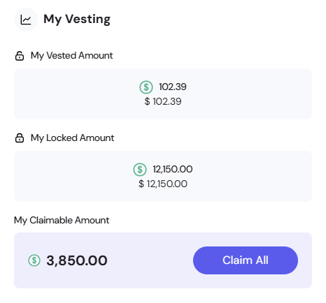

The **Vesting Module** enables controlled token distribution over time to contributors, team members, investors, and other stakeholders. This module provides transparency and predictability for token releases while maintaining ecosystem stability through gradual emission schedules.

Users can monitor their vesting progress, view emission charts, track claimable amounts, and manage their vesting events through an intuitive dashboard interface.

---

## Dashboard Overview

The vesting dashboard displays **comprehensive vesting metrics** and provides three main event views:

- **Ongoing Events** – Currently active vesting schedules
- **Upcoming Events** – Future vesting batches yet to begin
- **Completed Events** – Finished vesting schedules

Users can seamlessly switch between these views to monitor active vesting progress, preview upcoming distributions, and review completed vesting history.

## Vesting Metrics

The dashboard displays comprehensive vesting statistics and personal tracking information.

### Vesting Progress Overview

The vesting progress section displays:

- **Current Vested Amount** – Shows tokens currently vested out of total allocation (e.g., 2.84K /16.48M)
- **Progress Percentage** – Indicates the percentage of total allocation that has been vested to date
- **Lock Icon** – Visual indicator showing that tokens are part of a controlled vesting schedule

This section provides a quick overview of overall vesting progress across all active schedules.

### Key Vesting Statistics

#### System-Wide Metrics:

- **Total Vested** – Aggregate tokens released across all participants
- **Current Locked Amount** – Tokens currently locked in active vesting schedules  
- **Pending to be Claimed** – Vested tokens available for withdrawal

#### Personal Tracking:

- **My Vested Amount** – Tokens you have received from vesting
- **My Locked Amount** – Your tokens currently in vesting schedules
- **My Claimable Amount** – Tokens ready for you to claim

## Emissions Chart

The emissions chart provides visual tracking of token release over time with an interactive timeline display.

### Chart Features
- **Timeline View** – Historical token releases displayed over months with cumulative growth
- **Time Filters** – Toggle between 1D, 7D, 1M, and 1Y views in the top-right corner
- **Interactive Tooltip** – Hover over data points to see specific emission details, timestamps, total emissions amount, and percentage changes
- **Cumulative Display** – Shows total accumulated emissions as a rising line chart over the selected time period

### Tooltip Information
When hovering over chart data points, the tooltip displays:
- **Date and Time** – Specific timestamp for the data point
- **Total Emissions** – Cumulative token amount released up to that point
- **Percentage Change** – Growth percentage showing emission changes from baseline

## My Vesting

The My Vesting section provides personalized vesting information:

### Personal Metrics
- **My Vested Amount** – Total tokens you've received with USD value
- **My Locked Amount** – Your tokens currently locked in vesting
- **My Claimable Amount** – Tokens ready for immediate withdrawal

### Claim Functionality
- **Claim All Button** – One-click claiming of all available vested tokens
- **Real-time Updates** – Amounts update as vesting schedules progress
- **Transaction History** – Track your claiming activity over time

## Vesting Events

The vesting events table displays detailed information about all vesting schedules:

### Event Categories

**Ongoing Events** – Active vesting schedules currently distributing tokens
**Upcoming Events** – Future vesting batches scheduled to begin  
**Completed Events** – Finished vesting schedules with full distribution

### Event Details

Each vesting event shows:

- **Batch Name** – Descriptive identifier for the vesting schedule
- **Vesting Period** – Duration of the token release schedule
- **Chain** – Blockchain network where vesting occurs
- **Recipients** – Number of participants in the vesting batch
- **Cliff Length** – Initial lock period before any tokens are released
- **Total Amount** – Total tokens allocated to the vesting schedule
- **Status** – Current state and time remaining

