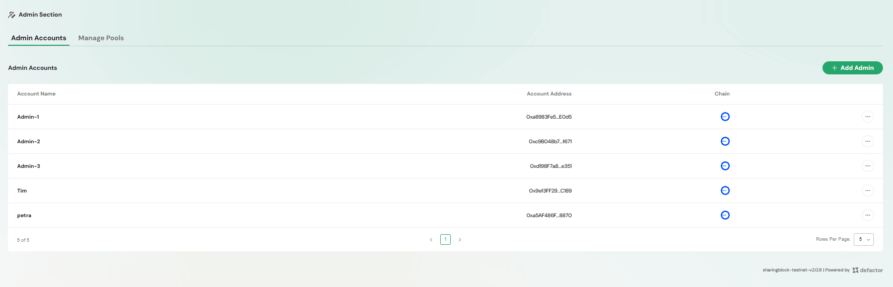
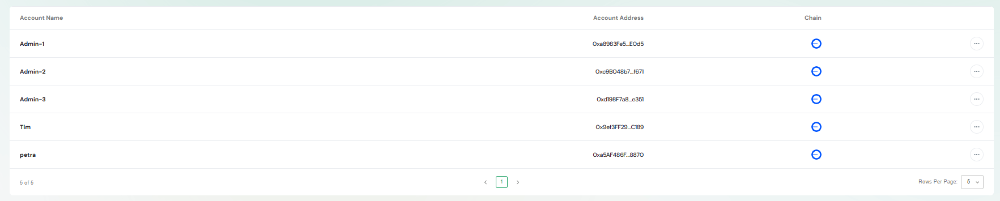
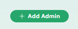
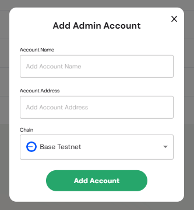
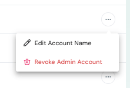
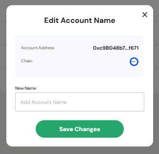
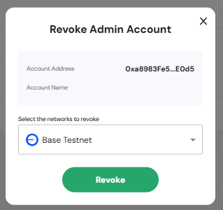

The **Admin Accounts Settings** page allows administrators to manage which accounts have admin privileges for pools on the Defactor platform. From here, admins can view all existing accounts, add new accounts, edit their details, or revoke access.  

---

## Overview of the Admin Accounts  

  

The Admin Accounts section is part of the **Admin Section** in the Pools UI. It provides:  
- A list of all accounts with administrative access.  
- The ability to add, edit, or revoke admin accounts.  
- Contextual controls for updating account details via row actions.   

## Admin Accounts Table  

  

The **Admin Accounts Table** lists all accounts currently registered as pool administrators.  

**Column Structure**  
- **Account Name** – Human-readable label for the admin
- **Account Address** – The blockchain wallet address associated with the admin.  
- **Chain** – The chain to which the admin account is linked
- **Actions** – Row-level menu for editing or revoking the account.  

**Table Controls**  
- Pagination at the bottom allows navigation across multiple pages of accounts.  
- Configurable **Rows per Page** setting to adjust how many accounts are displayed.  

> This table provides a clear overview of all admins with the ability to quickly check their associated addresses and chains.  

## Actions & Modals  

The **Actions & Modals** section contains all interactive dialogs and quick actions you can use to manage admin accounts. These ensure you can perform account management tasks directly from the Admin Accounts page.  

### Add Admin Action  

  

Clicking the **Add Admin** button opens a modal for registering a new admin account.  

#### Add Admin Modal  

  

The **Add Admin Account** modal contains the following fields:  
- **Account Name** – Label for identifying the admin within the UI.  
- **Account Address** – The wallet address of the new admin.  
- **Chain** – Dropdown selector for choosing the blockchain network.

**Add Account Button** – Confirms the action and registers the account as an admin.  
**Close (X)** – Cancels the action and closes the modal without changes.  

> This feature ensures only approved accounts gain administrative access, providing security and flexibility in managing pools.  

### Edit Account Name  

  
  

Allows renaming an admin account for easier identification.  
- **Account Address** – Shows the wallet address (fixed).  
- **Chain** – Displays the linked network.  
- **New Name** – Field to update the display name for the account.  
- **Save Changes Button** – Confirms and updates the account name.  

> This action improves readability and makes it easier to manage accounts in the table.  

### Revoke Admin Account  

  
  

Removes administrative rights from an account.  
- **Account Address** – Shows the wallet address of the admin being revoked.  
- **Account Name** – Label of the account.  
- **Select Network** – Choose the chain from which to revoke access.  
- **Revoke Button** – Confirms and removes admin permissions.  

> Revoking access is a security measure, ensuring only valid and active accounts retain admin privileges.  
