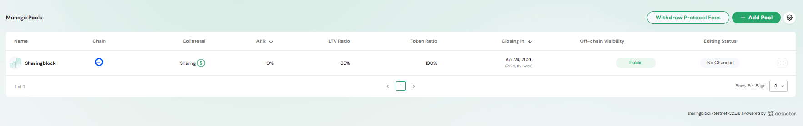
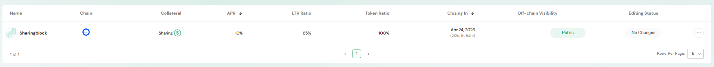
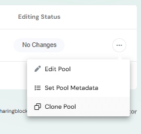
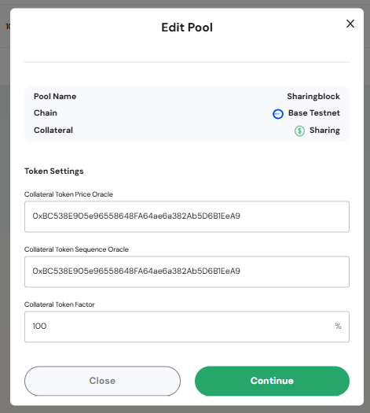
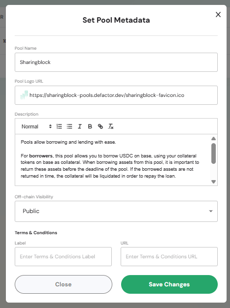
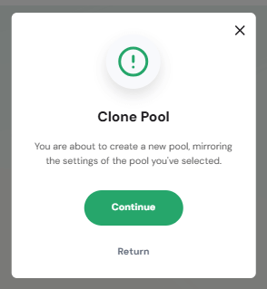
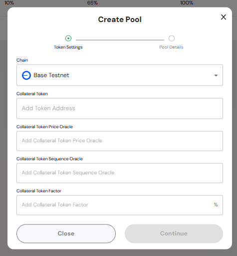
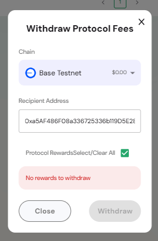
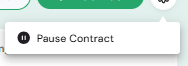

The **Manage Pools Settings** page allows administrators to configure and manage all pools on the Defactor platform. From here, admins can view pool parameters, create new pools, update metadata, edit technical details, withdraw protocol fees, or pause contracts when required.  

---

## Overview of the Manage Pools  

  

The Manage Pools section is part of the **Admin Section** in the Pools UI. It provides:  
- A full list of pools configured on the platform.  
- Options to add, edit, clone, or update metadata for pools.  
- Access to administrative actions such as withdrawing protocol fees or pausing contracts.  

## Manage Pools Table  

  

The **Manage Pools Table** lists all pools currently registered.  

**Column Structure**  
- **Name** – Pool identifier with branding.  
- **Chain** – Blockchain network where the pool is deployed.  
- **Collateral** – Accepted collateral token(s).  
- **APR** – Annual Percentage Rate applied to borrowing.  
- **LTV Ratio** – Loan-to-Value ratio required for borrowing.  
- **Token Ratio** – Ratio of collateral tokens to pool value.  
- **Closing In** – Pool’s maturity or end date.  
- **Off-chain Visibility** – Visibility setting (e.g., *Public*).  
- **Editing Status** – Indicates whether changes are pending or saved.  
- **Actions** – Contextual menu for editing, cloning, or updating pool metadata.  

**Table Controls**  
- Pagination to navigate through multiple pool entries.  
- **Rows per Page** selector for adjusting display size.  

## Actions & Modals  

### Table Row Actions  

  

Each row has an actions menu (**⋮**) that provides multiple options for pool management.  

#### Edit Pool  

  

Allows updating technical parameters of the pool:  
- **Pool Name, Chain, Collateral** – Reference details.  
- **Token Settings** – Update oracle addresses and token factor.  
- **Continue Button** – Saves changes to the pool configuration.  

#### Set Pool Metadata  

  

Provides fields for descriptive and branding updates:  
- **Pool Name** – Display name of the pool.  
- **Pool Logo URL** – Link to pool logo.  
- **Description** – Free-text field for borrower/lender instructions or notes.  
- **Off-chain Visibility** – Controls pool visibility (e.g., Public, Comming Soon, Hidden).  
- **Terms & Conditions** – Add labels and URLs for compliance.  

#### Clone Pool  

  

Creates a new pool by duplicating the settings of an existing pool.  
- **Continue Button** – Confirms cloning and opens the configuration flow for the new pool.  

> This action helps quickly deploy similar pools without re-entering all parameters.  

### Add Pool Action  

  

Clicking the **Add Pool** button opens the pool creation flow.  

#### Create Pool Modal  

  

The **Create Pool Modal** contains two configuration steps:  

**1. Token Settings**  
- **Chain Selector** – Choose the blockchain network (e.g., Base Testnet).  
- **Collateral Token** – Add the token address to be used as collateral.  
- **Collateral Token Price Oracle** – Address of the price oracle contract.  
- **Collateral Token Sequence Oracle** – Address of the sequence oracle.  
- **Collateral Token Factor** – Percentage factor defining token weighting.  

**2. Pool Details (next step, not shown in screenshot)**  
- Define APR, LTV ratio, max pool capacity, and pool dates.  

**Continue Button** – Proceeds to the Pool Details step and completes setup.  

### Withdraw Protocol Fees Action  

  

Clicking the **Withdraw Protocol Fees** button opens a modal to transfer accumulated fees.  

#### Withdraw Protocol Fees Modal  

  

- **Chain Selector** – Choose the network for the withdrawal.  
- **Recipient Address** – Enter the wallet address to receive protocol fees.  
- **Protocol Rewards** – Checkbox to select/clear available rewards.  
- **Withdraw Button** – Confirms and executes withdrawal (disabled if no rewards are available).  

### Pause/Resume Contract Action  

  

The **Pause Contract** action (accessed via the settings gear icon) allows administrators to pause pool contracts.  
- When paused, no new supply or borrow actions can be performed.  
- Useful for maintenance, audits, or responding to security incidents.  
- Resuming reactivates pool functionality.  

> This action ensures admins have an emergency control mechanism to safeguard users and funds.  
