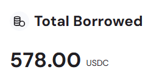
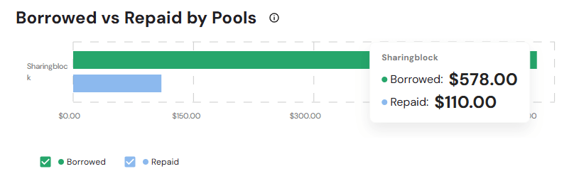
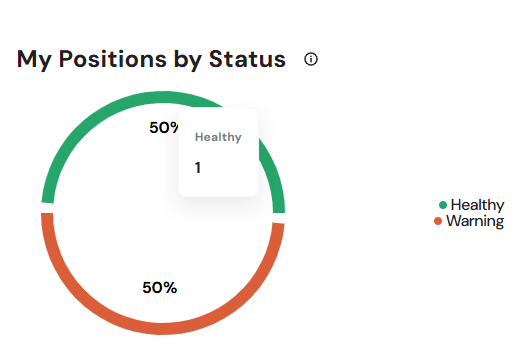
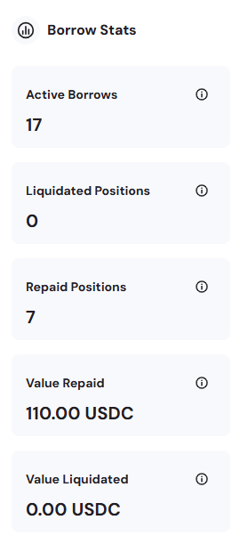
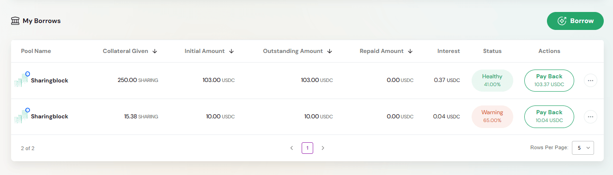
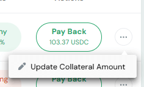
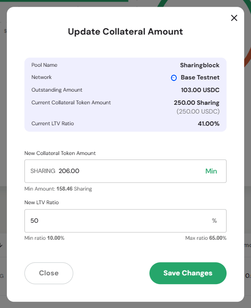
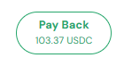

The **Borrowed** page provides a comprehensive view of all your borrowing positions across pools on the Defactor platform. It serves as your debt management hub for tracking borrowed assets, collateral positions, and managing loan repayments.

## Dashboard Overview  

The dashboard provides:  
- **Total Borrowed** – Aggregate value of all assets currently borrowed across pools  
- **Borrowed vs Repaid by Pools** – Bar chart comparing borrowed amounts against repayments per pool  
- **My Positions by Status** – Circular chart showing the health of borrowing positions (healthy vs warning)  
- **Borrow Stats Panel** – Key performance metrics including active borrows, liquidated positions, repaid positions, and repayment values  
- **My Borrows Table** – Detailed view of each borrow position with sortable columns and management actions  

## Overview Metrics

### Total Borrowed  

**Primary Metric Display**  
- Large numerical display showing total borrowed amount  
- Denominated in USDC  
- Represents aggregate debt across all pool positions  

### Borrowed vs Repaid by Pools  

The **Borrowed vs Repaid** chart compares the total borrowed amounts to the repaid amounts for each pool.  

**Horizontal Bar Chart**  
- Provides a side-by-side view of **borrowed amounts** versus **repaid amounts**  
- Breaks down repayment progress **pool by pool**  
- Uses a two-color visualization:  
  - **Borrowed** (green bar) – Principal amount borrowed from each pool  
  - **Repaid** (blue bar) – Amount already repaid to each pool  

**Tooltip Details**  
When hovering over a pool, the tooltip displays:  
- **Borrowed** – The total amount borrowed from the pool  
- **Repaid** – The total amount already repaid to that pool  

> This chart makes it easy to track repayment progress and evaluate how much debt is still outstanding in each pool.  

### My Positions by Status  

The **My Positions by Status** chart provides a quick snapshot of the health of all your borrowing positions.  

**Circular Progress Chart**  
- Displays the proportion of positions by status (e.g., Healthy, Warning)  
- Each status is represented by a **distinct color** for clarity  

**Tooltip Details**  
When hovering over the chart, tooltips display the exact counts:  
- **Healthy** – Positions with adequate collateralization  
- **Warning** – Positions nearing liquidation thresholds  

> This chart provides an at-a-glance health check of your borrowing portfolio, highlighting whether positions are safe or require immediate attention.  

### Borrow Stats Panel  

  

The **Borrow Stats Panel** provides a quick snapshot of your borrowing activity. Each metric comes with a clear explanation for better understanding:  

- **Active Borrows** – Number of open borrow positions that are **currently accruing interest**.  
- **Liquidated Positions** – Borrow positions that have been **fully or partially liquidated**.  
- **Repaid Positions** – Borrow positions that have been **fully repaid**.  
- **Value Repaid** – The **total amount repaid** (principal + interest), shown in USDC.  
- **Value Liquidated** – The **total amount recovered through liquidation** (principal + interest), shown in USDC.  

> These tooltips ensure users immediately understand whether a metric refers to open debt, repaid debt, or amounts lost to liquidation. Together, they give a clear overview of borrowing performance, repayment progress, and risk exposure.  

## My Borrows Management  

### Borrow from Pool

#### Action Button

  

Opens the modal to create a new borrowing position.  

####  Modal  

The **Borrow from Pool** modal lets you configure and confirm a new borrowing position.  

**Pool Selection**  
- **Chain Selector** – Dropdown for blockchain network 
- **Pool Selector** – Dropdown for available pools  

**Pool Information**  
- **APR** – Annual percentage rate for borrowing costs  
- **Collateral** – Required collateral type  
- **End Date** – Pool closure or maturity date  
- **Wallet** – Connected wallet address (truncated)  

**Borrow Amount Configuration**  
- **Amount Input** – Field for entering borrow amount, with Min/Max buttons  
- **Collateral Required** – Calculated requirement for requested amount  
- **My Collateral Balance** – Available collateral balance in wallet  
- Real-time validation of collateral sufficiency  

**Borrow** Button – Confirms and executes the borrowing transaction after validation.  

### My Borrows Table  

The **My Borrows Table** lists all borrowing positions, showing collateral, debt, repayments, and health status.  

**Column Structure**  
- **Pool Name** – Pool identifier with logo/branding  
- **Collateral Given** – Amount of collateral provided (sortable)  
- **Initial Amount** – Original borrowed amount (sortable)  
- **Outstanding Amount** – Current debt balance (sortable)  
- **Repaid Amount** – Total repaid value in USDC (sortable)  
- **Interest** – Accrued interest charges  
- **Status** – Health of the position (Healthy %, Warning %)  
- **Actions** – Available actions such as **Pay Back** or **Update Collateral Amount**  

  

> The table provides a complete view of each borrow position, combining repayment progress, health indicators, and direct management actions.  

### Advanced Position Management  

**Update Collateral Amount** – Opens a modal to adjust collateral for an active position, helping to restore or improve health.  

The **Update Collateral Amount Modal** includes:  
- Pool and network details  
- Current outstanding amount  
- Current collateral token amount and loan-to-value (LTV) ratio  
- Input field for **New Collateral Token Amount** with Min/Max validation  
- New LTV ratio calculation in real time  
- **Save Changes** button to confirm update  

> This feature allows proactive management of collateralization ratios, reducing the risk of liquidation.  

  
**Pay Back** – Available on active positions, showing the outstanding repayable amount in USDC.  