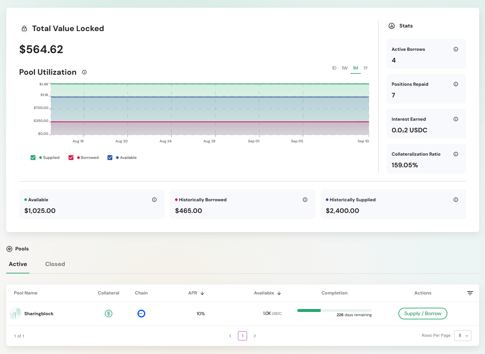
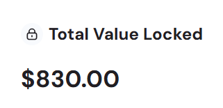
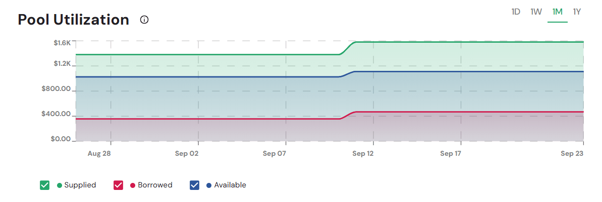
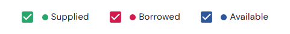
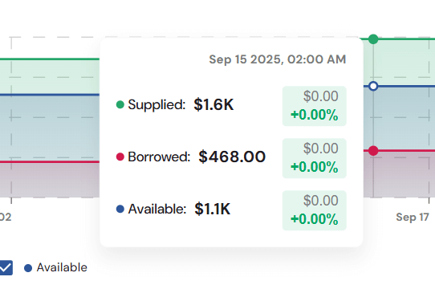
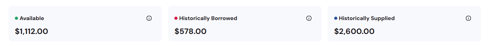
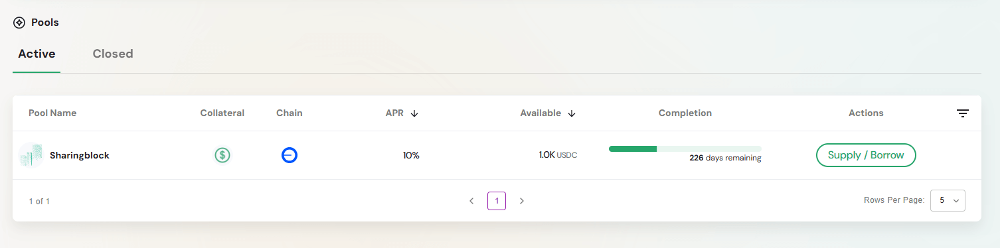
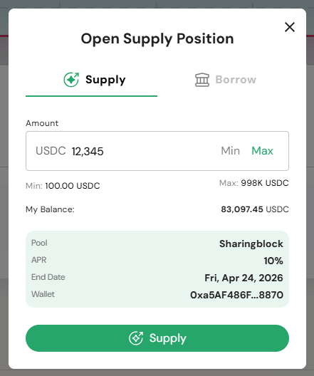

The **Pools Dashboard** is your main control center for managing lending and borrowing on the Defactor platform. It brings together key metrics, liquidity insights, and quick actions so you can easily track pool activity and manage your positions.

---

## Dashboard Overview  

The dashboard provides:  
- **Total Value Locked (TVL)** – Overall assets supplied across pools  
- **Pool Utilization Chart** – Interactive chart showing supply, borrow, and available liquidity over time  
- **Pool Activity Summary** – Key metrics for available liquidity, historically borrowed, and historically supplied assets  
- **Personal Performance Metrics** – Track your active borrows, repayments, interest earned, and collateralization ratio  
- **Active and Closed Pools Table** – Manage pool positions with direct supply/borrow actions  

## Key Metrics Overview  

### Total Value Locked (TVL)  

Large numerical display showing **total value locked**, placed centrally to highlight its importance.  
> Reflects the total value of assets you have supplied to pools.  

### Pool Utilization Chart  

The **Pool Utilization Chart** provides a visual breakdown of liquidity over time. It shows how much has been **supplied**, **borrowed**, and remains **available** in the pools.

**Interactive Time Series Visualization**  
- Multi-line chart with selectable filters:  
  - **1D** – View changes within the last 1 day  
  - **1W** – View changes within the last 1 week  
  - **1M** – View changes within the last 1 month  
  - **1Y** – View changes within the last 1 year  

**Chart Legend**  

- **Supplied** – Assets you’ve provided to pools (green line)  
- **Borrowed** – Assets borrowed from pools (red/pink line)  
- **Available** – Liquidity remaining in pools for borrowing (blue line)  

**Tooltip Details**  

When hovering over the chart, a tooltip displays exact values for the selected time point:  
- **Supplied** – Amount currently supplied to pools  
- **Borrowed** – Amount currently borrowed from pools  
- **Available** – Liquidity still available in pools  

> This chart helps users quickly understand liquidity trends and balance between supplied, borrowed, and available assets over different timeframes.  

### Pool Activity Summary  

The **Pool Activity Summary** highlights three key liquidity metrics, each with contextual explanations available via tooltips:

- **Available** – Net funds accessible for borrowing or withdrawal from the active pool, calculated as *Total Supplied minus Total Borrowed*.  
- **Historically Borrowed** – The total amount that has ever been borrowed from the pool, including all borrowing regardless of repayment status.  
- **Historically Supplied** – The cumulative amount that has been supplied into the pool across all periods, without considering the current status of those funds.  

> These metrics provide quick insight into pool health by showing how much liquidity remains available, how much has been borrowed, and the total supply history.  

### Active and Closed Pools Table

#### Status Tabs  
- **Active** – Currently operational pools  
- **Closed** – Completed or inactive pools  

#### Active Pools Table  

**Column Structure:**  
- **Pool Name** – Identifier and branding  
- **Collateral** – Accepted collateral types  
- **Chain** – Blockchain network (chain icons shown)  
- **APR** – Annual Percentage Rate (sortable)  
- **Available** – Liquidity available for borrowing (sortable)  
- **Completion** – Timeline and progress  
- **Actions** – Supply / Borrow options  

> This table helps you compare pool conditions and take action directly from the dashboard.  

## Pool Interaction Workflow  

Both **Supply** and **Borrow** actions follow the same process:  
1. Click **Supply / Borrow**  
2. Select the desired action (**Supply** or **Borrow**)  
3. Enter the amount (within limits)  
4. Confirm the transaction  

> A unified workflow makes it easy to manage both supplying and borrowing through a consistent interface.  

## Dashboard Benefits  

- **Comprehensive Portfolio View** – All positions visible at a glance, helping you understand your exposure quickly.  
- **Risk Assessment Tools** – Monitor collateralization ratios to avoid liquidation and maintain healthy positions.  
- **Yield Optimization** – Compare APRs across pools to identify the most profitable opportunities.  
- **Historical Analysis** – Track pool growth, supply, and borrowing trends over time for better decision-making.  
- **Multi-pool Management** – Manage multiple positions from one interface without switching screens.  
- **Real-time Liquidity** – Instantly see available borrowing capacity so you can act on opportunities immediately.  
