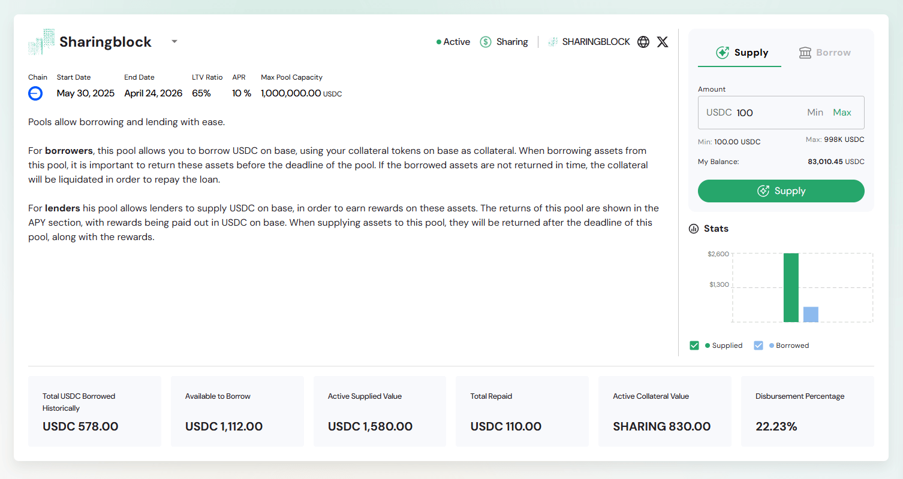

The Pool Details page provides comprehensive information about a specific lending/borrowing pool, including pool parameters, supply/borrow functionality, performance statistics, and transaction history. This page is accessed by clicking on any pool row from the main pools dashboard.

---

## Pool Header Information

### Pool Identity and Status

**Pool Branding**
- Pool name with logo/icon (e.g., "Sharingblock")
- Dropdown selector for pool navigation: Dropdown navigation allows quick switching between pools on different chains without returning to the main list
- Status indicators: Active, Sharing, SHARINGBLOCK

**Network and Social Links**
- Chain identifier with network icon
- Social media links (X/Twitter integration)
- External link indicators for verification

### Core Pool Parameters

**Timeline Information**
- **Start Date**: Pool launch date
- **End Date**: Pool closure/maturity date
- **Chain**: Blockchain network specification

**Financial Metrics**
- **LTV Ratio**: Loan-to-Value percentage
- **APR**: Annual Percentage Rate
- **Max Pool Capacity**: Maximum pool size in USDC

### Pool Description

**Functionality Overview**
- "Pools allow borrowing and lending with ease"
- Detailed explanation of pool mechanics for both borrowers and lenders
- Risk and reward structure explanation

---

## Pool Interaction Interface

### Supply/Borrow Tabs

**Supply Tab (Active)**
- Primary interface for lending to the pool
- Amount input with Min/Max buttons
- Balance verification and limits display
- Green "Supply" button for transaction execution

**Borrow Tab**
- Interface for borrowing from the pool
- Collateral requirements and calculations
- Risk assessment and liquidation warnings

### Supply Configuration

**Amount Input**
- USDC denomination with numerical input
- Min/Max quick selection buttons
- Minimum and maximum limits display
- Current wallet balance verification

**Transaction Validation**
- Real-time balance checking
- Limit enforcement
- Fee calculation and display

---

## Pool Statistics Dashboard

### Visual Performance Chart

**Supply vs Borrowed Visualization**
- Bar chart showing pool utilization
- Green bars for supplied amounts
- Blue bars for borrowed amounts
- Y-axis scaling with dollar amounts

### Key Performance Metrics

**Financial Overview (6 Key Metrics)**
- **Total USDC Borrowed Historically**: Cumulative borrowing activity
- **Available to Borrow**: Current liquidity available
- **Active Supplied Value**: Current lending positions
- **Total Repaid**: Historical repayment amounts
- **Active Collateral Value**: Current collateral backing
- **Disbursement Percentage**: Pool utilization ratio

**Real-time Values**
- All metrics displayed in USDC or relevant token amounts
- Percentage calculations for ratios and utilization
- Historical vs current value comparisons

---

## User Position Management

### My Supplies Section

**Supply Position Table**
- **Pool Name**: Identity with logo/branding
- **Initial Amount**: Original supply contribution
- **Outstanding Amount**: Current position value
- **Rewarded**: Earned interest/rewards
- **Start Time**: Position creation timestamp
- **End Time**: Position maturity date
- **Status**: Current position state ("In Progress")

**Management Actions**
- **Withdraw All**: Bulk withdrawal option
- **Withdraw**: Individual position withdrawal
- Position-specific action buttons

### My Borrows Section (if applicable)
- Similar table structure for borrowing positions
- Collateral tracking and health monitoring
- Repayment options and liquidation warnings

---

## Transaction History and Analytics

### Position Tracking
- Chronological transaction history
- Supply and withdrawal records
- Interest accrual tracking
- Performance analytics over time

### Risk Management
- Collateralization ratio monitoring
- Liquidation threshold alerts
- Health score indicators
- Market condition impacts

---

## Pool Risk and Compliance

### Security Features
- **Smart Contract Verification**: Contract address display
- **Audit Information**: Security audit status
- **Insurance Coverage**: Protection mechanisms
- **Regulatory Compliance**: Legal framework adherence

### Risk Disclosures
- **Liquidation Risks**: Collateral liquidation scenarios
- **Market Risks**: Price volatility impacts
- **Smart Contract Risks**: Technical risk factors
- **Regulatory Risks**: Legal and compliance considerations

---

## User Experience Features

### Interface Design
- **Responsive Layout**: Optimized for various screen sizes
- **Real-time Updates**: Live data refresh and synchronization
- **Visual Feedback**: Clear status indicators and progress tracking
- **Accessibility**: Screen reader support and keyboard navigation

### Navigation and Controls
- **Tab-based Interface**: Supply/Borrow mode switching
- **Quick Actions**: Min/Max buttons for common amounts
- **Batch Operations**: Withdraw All functionality
- **History Access**: Complete transaction record viewing

---

## Integration Features

### Wallet Connectivity
- **Multi-wallet Support**: Various wallet integrations
- **Balance Verification**: Real-time balance checking
- **Transaction Signing**: Secure transaction approval
- **Network Switching**: Automatic network detection

### DeFi Ecosystem
- **Cross-protocol Integration**: Compatibility with other DeFi protocols
- **Token Standards**: ERC20 and other standard support
- **Oracle Integration**: Price feed connectivity
- **Governance Participation**: Pool governance voting rights

---

## Pool Management Tools

### For Liquidity Providers
- **Yield Optimization**: APR tracking and comparison
- **Risk Assessment**: Pool health monitoring
- **Portfolio Management**: Multi-pool position tracking
- **Reward Claiming**: Interest and incentive collection

### For Borrowers
- **Collateral Management**: Collateral ratio optimization
- **Loan Management**: Repayment scheduling and tracking
- **Risk Monitoring**: Liquidation prevention tools
- **Cost Analysis**: Interest rate and fee tracking