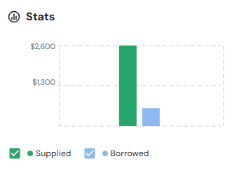
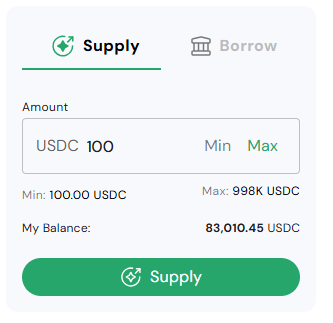

The Pool Details page provides comprehensive information about a specific lending/borrowing pool, including pool parameters, supply/borrow functionality, performance statistics, and transaction history. This page is accessed by clicking on any pool row from the main pools dashboard.

---

## Pool Header Information

### Pool Identity and Status

**Pool Branding**
- Pool name with logo/icon (e.g., "Sharingblock")
- Dropdown selector for pool navigation: Dropdown navigation allows quick switching between pools on different chains without returning to the main list
- Status indicators: Active, Sharing, SHARINGBLOCK

**Network and Social Links**
- Chain identifier with network icon
- Social media links (X/Twitter integration)
- External link indicators for verification

### Core Pool Parameters

#### Timeline Information
- **Chain**: Blockchain network specification
- **Start Date**: Pool launch date
- **End Date**: Pool closure/maturity date

#### Financial Metrics
- **LTV Ratio**: Loan-to-Value percentage
- **APR**: Annual Percentage Rate
- **Max Pool Capacity**: Maximum pool size in USDC

### Pool Description

**Functionality Overview**
- Detailed explanation of pool mechanics for both borrowers and lenders
- Risk and reward structure explanation

---

## Pool Statistics Dashboard

### Visual Performance Chart

**Supply vs Borrowed Visualization**
- Bar chart showing pool utilization
- Green bars for supplied amounts
- Blue bars for borrowed amounts
- Y-axis scaling with dollar amounts

### Key Performance Metrics

- **Total USDC Borrowed Historically**: Cumulative borrowing activity
- **Available to Borrow**: Current liquidity available
- **Active Supplied Value**: Current lending positions
- **Total Repaid**: Historical repayment amounts
- **Active Collateral Value**: Current collateral backing
- **Disbursement Percentage**: Pool utilization ratio

---

## Pool Interaction Interface

### Supply/Borrow Tabs

**Supply Tab**
- Interface for lending to the pool
- Amount input with Min/Max buttons
- Balance verification and limits display
- "Supply" button for transaction execution

**Borrow Tab**
- Interface for borrowing from the pool
- Amount input with Min/Max buttons
- Collateral requirements and calculations
- "Borrow" button for transaction execution

### Supply Configuration

**Amount Input**
- USDC denomination with numerical input
- Min/Max quick selection buttons
- Minimum and maximum limits display
- Current wallet balance verification

**Transaction Validation**
- Real-time balance checking
- Limit enforcement
- Fee calculation and display

### Borrow Configuration

**Amount Input**
- USDC denomination with numerical input
- Min/Max quick selection buttons
- Minimum and maximum limits display
- Available borrowing capacity verification

**Transaction Validation**
- Real-time collateral checking
- Limit enforcement
- Fee calculation and display

---
