The **Pool Details** page provides comprehensive information about a specific lending or borrowing pool, including pool parameters, supply/borrow functionality, performance statistics, and transaction history. This page is accessed by clicking on any pool row from the main Pools Dashboard.

---

## Dashboard Overview  

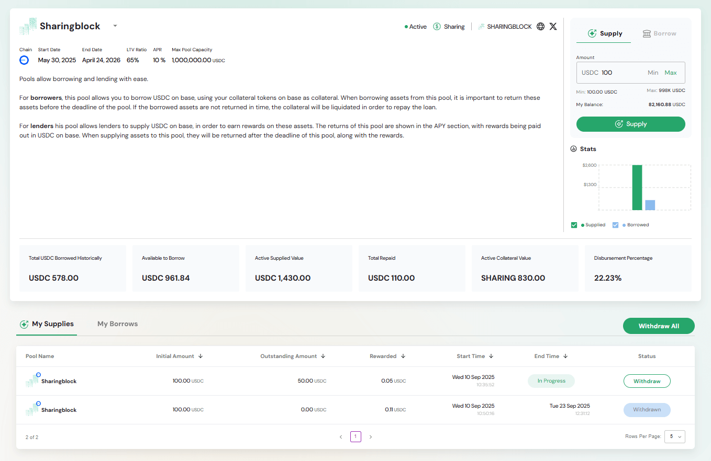

The pool details dashboard provides:  
- **Pool Information Header** – Displays chain, start date, end date, LTV ratio, APR, and max pool capacity  
- **Description Box** – A free-text section where pool creators or administrators can describe the pool. This may include information such as borrowing rules, supply opportunities, repayment conditions, or general notes about the pool. The content is flexible and can be tailored to highlight any important details for users.  
- **Supply/Borrow Panel** – Side panel for entering supply or borrow amounts, with Min/Max shortcuts and wallet balance display  
- **Stats** – Visual performance charts showing pool utilization (supplied vs borrowed)  
- **Key Metrics** – Summaries of borrowing, supply, liquidity, collateral, and repayment values  
- **My Supplies / My Borrows Table** – Tabs for switching between supplied and borrowed positions, with sortable tables and management actions  
- **Actions & Modals** – Contextual controls for managing supplies and borrows (Withdraw, Pay Back, Update Collateral, etc.)  

## Dashboard Components  

### Pool Information Header  

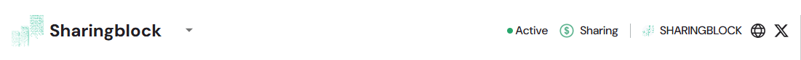  
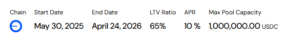  

Displays pool identity, branding, and configuration details:  
- **Branding** – Pool name with logo/icon and status indicators (Active, token, etc.)  
- **Navigation** – Dropdown to switch between pools across chains  
- **Timeline** – Start and end dates for pool lifecycle  
- **Financial Parameters** – LTV ratio, APR, max pool capacity  
- **Network & Links** – Chain identifier, plus social/external links  

### Description Box  

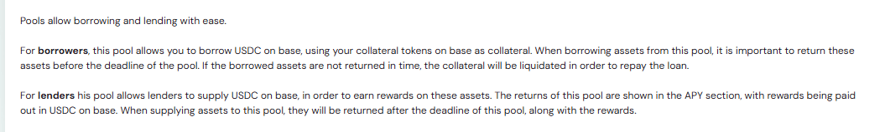  

The **Description Box** is a free-text area where pool creators or administrators can describe the pool.  
Its purpose is to provide important context or guidance to users.  

Possible uses include:  
- **Borrowers** – Explaining collateral requirements, repayment deadlines, and potential liquidation risks.  
- **Lenders** – Outlining how to supply assets, expected APR, reward distribution, and how/when funds are returned.  

Because this section is flexible, the exact content will vary depending on the pool’s goals and configuration.  

### Supply/Borrow Panel  

#### Supply Tab  

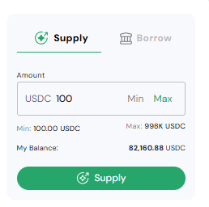  

- **Amount Input** – Enter supply amount with Min/Max shortcuts  
- **Wallet Balance** – Shows how much USDC is available to supply  
- **Validation** – Confirms limits and available balance before transaction  
- **Supply Button** – Executes supply transaction  

#### Borrow Tab  

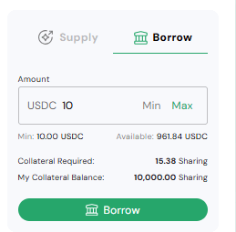  

- **Amount Input** – Enter borrow amount with Min/Max shortcuts  
- **Collateral Required** – Displays how much collateral is needed  
- **My Collateral Balance** – Shows collateral available in your wallet  
- **Borrow Button** – Executes borrowing transaction after validation  

### Stats  

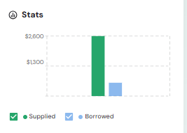  

Visual bar chart of pool utilization:  
- **Supplied** – Total assets supplied (green)  
- **Borrowed** – Total assets borrowed (blue)  
- Tooltips provide breakdowns for exact amounts at specific points.  

### Key Metrics  

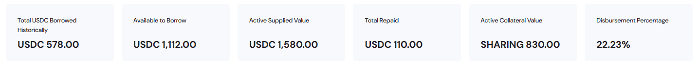  

- **Total USDC Borrowed Historically** – Cumulative borrowing activity  
- **Available to Borrow** – Remaining liquidity  
- **Active Supplied Value** – Total actively supplied USDC  
- **Total Repaid** – Aggregate repayments  
- **Active Collateral Value** – Collateral backing active loans  
- **Disbursement Percentage** – Ratio of borrowed to total pool capacity  

### My Supplies / My Borrows Table  

#### My Supplies  

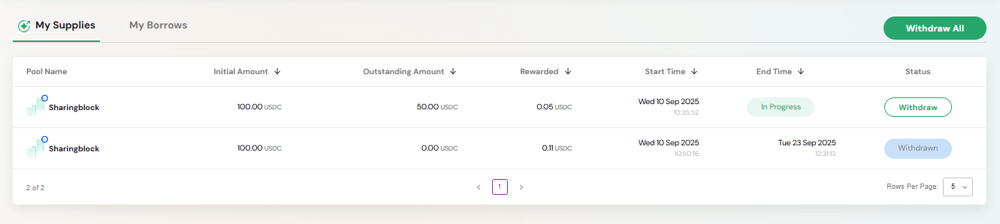  

Displays all supply positions:  
- **Columns** – Pool name, initial amount, outstanding, rewarded, start/end time, status, actions  
- **Actions** – Withdraw from active positions or view completed ones  

#### My Borrows  

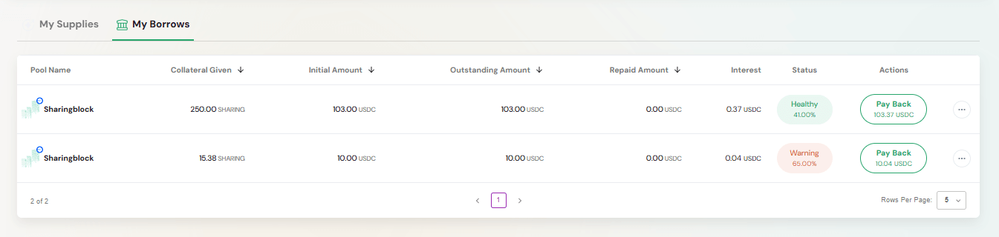  

Displays borrowing positions with collateral, outstanding debt, repayments, and health indicators:  
- **Healthy Position** – Sufficient collateral 
- **Warning Position** – At-risk collateral ratio 
- **Actions** – Includes **Pay Back** or **Update Collateral Amount**  

### Actions & Modals  

The **Actions & Modals** section contains all interactive dialogs and quick actions you can use to manage your supply and borrow positions. These modals ensure that you can perform portfolio management tasks directly within the Pool Details page without navigating elsewhere.  

**Withdraw Modal**  

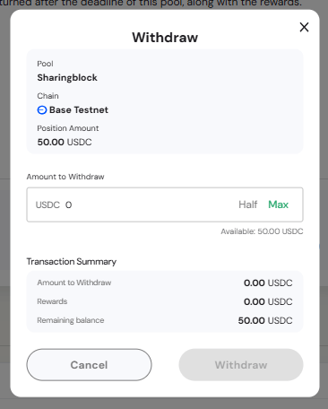  

Allows you to withdraw a specific amount from an active supply position.  
- **Amount to Withdraw** – Field to enter the desired amount (with Half/Max shortcuts).  
- **Rewards** – Displays earned rewards being claimed.  
- **Remaining Balance** – Shows how much will remain in the position after withdrawal.  

**Withdraw All**  

  
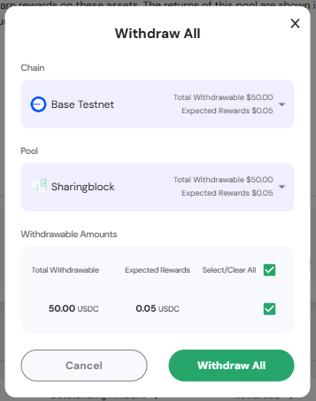  

Provides a **bulk withdrawal** option across all active supply positions.  
- **Chain & Pool Selectors** – Show which chain/pool the withdrawal is being made from.  
- **Withdrawable Amounts** – Displays both principal and expected rewards.  
- **Select All / Clear All** – Quick toggles to choose positions.  
- **Withdraw All Button** – Executes the transaction in one step.  

**Pay Position Modal**  

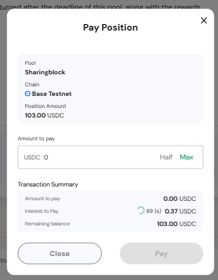  

Used to repay borrowed funds and reduce outstanding debt.  
- **Amount to Pay** – User can input a custom amount (with Half/Max shortcuts).  
- **Interest to Pay** – Shows the accrued interest being covered.  
- **Remaining Balance** – Displays the new outstanding loan balance after repayment.  

This helps manage debt levels and avoid liquidation.  

**Update Collateral Action**  

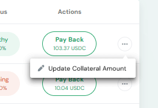  

Allows adding more collateral to an existing borrow position.  
- **New Collateral Amount** – Field to enter additional collateral.  
- **LTV Ratio** – Updated in real time as collateral is added.  
- **Save Changes** – Confirms the collateral update.  

This is a **risk management tool**, helping users strengthen their positions and prevent liquidation by improving their loan-to-value ratio.  

> Together, these actions and modals give users **full control** over supply and borrowing activities: from partial withdrawals and repayments to bulk exits and collateral management.  

