In this section you can learn how to install and implement the graphic components of the defactor library in your solutions.

---

## UI Storybook

Check out our collection of react components for defactor user interfaces here: [https://ui-kit.defactor.dev](https://ui-kit.defactor.dev/)

---

## Components API

In this section, you can see the API of each component

### Button Component

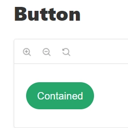

#### Props

Props of the Button component are also available

|      Name      |            Type             | Default value |                                       Description                                       |
| :------------: | :-------------------------: | :-----------: | :-------------------------------------------------------------------------------------: |
|    variant     |          `string`           |       -       | The variant of the button with 3 values: `contained`, `outlined` and `text`. (Required) |
|    bgColor     |          `string`           |       -       |                     The background color of the button. (Optional)                      |
|     label      |          `string`           |       -       |                           The label of the button. (Optional)                           |
|     color      |          `string`           |       -       |                        The color label of the button. (Optional)                        |
|    disabled    |          `boolean`          |     false     |                    If `true`, the component is disabled. (Optional)                     |
|   fontFamily   |          `string`           |       -       |                        The font family of the button. (Optional)                        |
|   fullWidth    |          `boolean`          |       -       |      If `true`, the input will take up the full width of its container. (Optional)      |
|  borderColor   |          `string`           |       -       |                       The color border of the button. (Optional)                        |
| externalStyles |          `string`           |       -       |                    The external custom styles of button. (Optional)                     |
|     loader     | `React Element` or `string` |       -       |                          The loader of the button. (Optional)                           |
|      icon      | `React Element` or `string` |       -       |                           The icon of the button. (Optional)                            |

You can interact with the component in the following link [Button](https://ui-kit.defactor.dev/?path=/docs/button--contained)

### Card Component

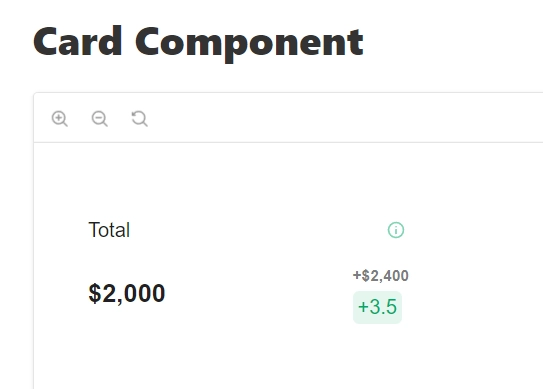

#### Props

Props of the Card component are also available

|       Name       |         Type         | Default value |                              Description                              |
| :--------------: | :------------------: | :-----------: | :-------------------------------------------------------------------: |
|      label       |       `string`       |       -       |                   The label of the card. (Required)                   |
|      value       | `string` or `number` |       -       |                   The value of the card. (Required)                   |
|   fluctuation    |       `string`       |       -       |                The fluctuation of the card. (Optional)                |
| fluctuationValue |       `string`       |       -       |             The fluctuationValue of the card. (Optional)              |
|  hoverBehavior   |      `boolean`       |     false     | If `true`, the tooltip will work on hover in all the card. (Optional) |
|      color       |       `string`       |       -       |            The color of the point in the card. (Optional)             |
|    fontFamily    |       `string`       |       -       |                The font family of the card. (Optional)                |
|  externalStyles  |       `string`       |       -       |            The external custom styles of card. (Optional)             |
|   infoTooltip    |      `ITooltip`      |       -       |        The information of the tooltip in the card. (Optional)         |

You can interact with the component in the following link [Card Component](https://ui-kit.defactor.dev/?path=/docs/card-component--card-component-item)

### Card Container

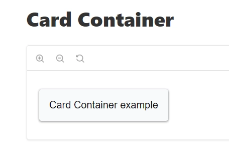

#### Props

Props of the Card Container are also available

|       Name       |              Type               | Default value |                              Description                              |
| :--------------: | :-----------------------------: | :-----------: | :-------------------------------------------------------------------: |
|     content      |          `React Node`           |       -       |                  The content of the card. (Required)                  |
| handleMouseEnter | `((newValue: boolean) => void)` |       -       |      The function to run on mouse enter of the card. (Optional)       |
| handleMouseLeave | `((newValue: boolean) => void)` |       -       |      The function to run on mouse leave of the card. (Optional)       |
|    isPointer     |            `boolean`            |       -       |      If `true`, the mouse is displayed as a pointer. (Optional)       |
|  hoverBehavior   |            `boolean`            |     false     | If `true`, the tooltip will work on hover in all the card. (Optional) |

You can interact with the component in the following link [Card Container](https://ui-kit.defactor.dev/?path=/docs/card-container--card-container-item)

### Collateral Section

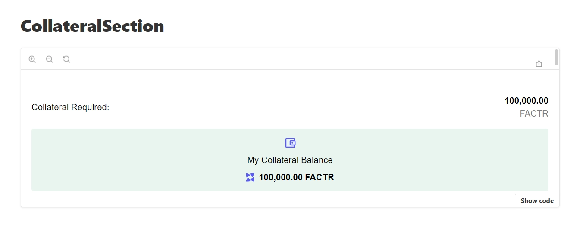

#### Props

Props of the Collateral Section are also available

|       Name       |            Type             | Default value |                                      Description                                      |
| :--------------: | :-------------------------: | :-----------: | :-----------------------------------------------------------------------------------: |
|  textCollateral  |          `string`           |       -       |               The text collateral of the collateral section. (Optional)               |
| numberCollateral |          `string`           |       -       |              The number collateral of the collateral section. (Optional)              |
|    textWallet    |          `string`           |       -       |               The text collateral of the collateral section. (Optional)               |
|   numberWallet   |          `string`           |       -       |              The number collateral of the collateral section. (Optional)              |
| requiredSection  |          `boolean`          |       -       | If `true`, is displayed the collateral required of the collateral section. (Required) |
|   tokenSymbol    |          `string`           |       -       |           The token symbol displayed in the collateral section. (Optional)            |
|    walletIcon    | `React Element` or `string` |       -       |                 The wallet icon in the collateral section. (Optional)                 |
|    fontFamily    |          `string`           |       -       |                 The font family of the collateral section. (Optional)                 |
| backgroundColor  |          `string`           |  `#26A66B1A`  |              The background color of the collateral section. (Optional)               |
|      loader      | `React Element` or `string` |       -       |                   The loader of the collateral section. (Optional)                    |
|    tokenIcon     | `React Element` or `string` |       -       |                 The token icon of the collateral section. (Optional)                  |

You can interact with the component in the following link [Collateral Section](https://ui-kit.defactor.dev/?path=/docs/collateralsection--container-item)

### Container

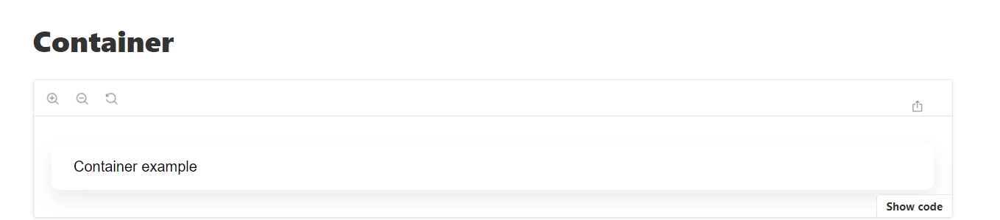

#### Props

Props of the Container are also available

|      Name      |     Type     | Default value |                     Description                     |
| :------------: | :----------: | :-----------: | :-------------------------------------------------: |
|    content     | `React Node` |       -       |      The content of the container. (Required)       |
| externalStyles |   `string`   |       -       | The external custom styles of container. (Optional) |

You can interact with the component in the following link [Container](https://ui-kit.defactor.dev/?path=/docs/container--container-item)

### Dashboard

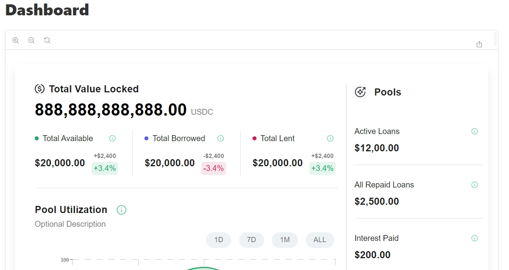

#### Props

Props of the Dashboard are also available

|         Name         |            Type             | Default value |                             Description                              |
| :------------------: | :-------------------------: | :-----------: | :------------------------------------------------------------------: |
|        colors        |         `string[]`          |       -       |             The colors to represent the data. (Optional)             |
|       currency       |          `string`           |       -       |         The currency to display in the dashboard. (Required)         |
|     currencyIcon     | `React Element` or `string` |       -       |      The currency icon to display in the dashboard. (Optional)       |
|   totalValueLocked   |    `number` or `string`     |       -       |    The total value locked to display in the dashboard. (Required)    |
|     titleGraphic     |          `string`           |       -       |          The title to display in the dashboard. (Required)           |
|     bottomLabel      |          `string`           |       -       |       The bottom label to display in the dashboard. (Required)       |
|      bottomIcon      | `React Element` or `string` |       -       |       The bottom icon to display in the dashboard. (Optional)        |
| bottomContainerItems |        `CardItem[]`         |      []       | The bottom information cards to display in the dashboard. (Optional) |
|      rightLabel      |          `string`           |       -       |       The right label to display in the dashboard. (Required)        |
|      rightIcon       | `React Element` or `string` |       -       |        The right icon to display in the dashboard. (Optional)        |
| rightContainerItems  |        `CardItem[]`         |      []       | The right information cards to display in the dashboard. (Optional)  |
|      fontFamily      |          `string`           |       -       |             The font family of the dashboard. (Optional)             |
|       content        |        `React Node`         |       -       |               The content of the dashboard. (Required)               |

You can interact with the component in the following link [Dashboard](https://ui-kit.defactor.dev/?path=/docs/dashboard--dashboard-item)

### Drop Down

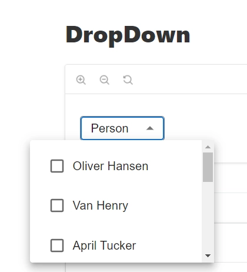

#### Props

Props of the DropDown are also available

|    Name     |      Type      | Default value |                        Description                        |
| :---------: | :------------: | :-----------: | :-------------------------------------------------------: |
| placeholder |    `string`    |       -       |        The placeholder in the dropdown. (Required)        |
|   options   |   `string[]`   |       -       |    The options to display in the dropdown. (Required)     |
| fontFamily  |    `string`    |       -       |        The font family of the dropdown. (Optional)        |
|  onChange   | `(() => void)` |       -       | The function to run by change of the dropdown. (Required) |

You can interact with the component in the following link [DropDown](https://ui-kit.defactor.dev/?path=/docs/dropdown--drop-down-item)

### Flat Container

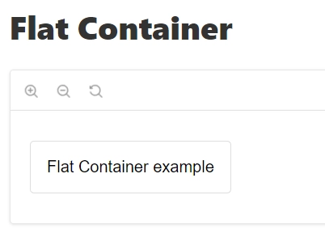

#### Props

Props of the Flat Container are also available

|      Name      |     Type     | Default value |                         Description                          |
| :------------: | :----------: | :-----------: | :----------------------------------------------------------: |
|    content     | `React Node` |       -       |        The content of the flat container. (Required)         |
| externalStyles |   `string`   |       -       | The external custom styles of the flat container. (Optional) |

You can interact with the component in the following link [Flat Container](https://ui-kit.defactor.dev/?path=/docs/flat-container--flat-container-item)

### Informative Container

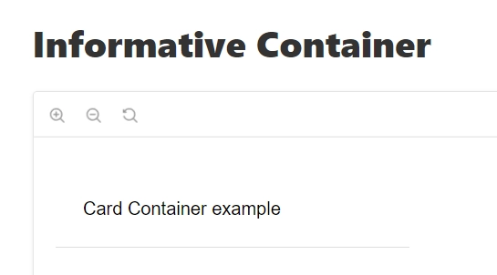

#### Props

Props of the Informative Container are also available

|       Name       |              Type               | Default value |                                      Description                                       |
| :--------------: | :-----------------------------: | :-----------: | :------------------------------------------------------------------------------------: |
|  externalStyles  |            `string`             |       -       |          The external custom styles of the informative container. (Optional)           |
|     content      |          `React Node`           |       -       |                  The content of the informative container. (Required)                  |
| handleMouseEnter | `((newValue: boolean) => void)` |       -       |      The function to run on mouse enter of the informative container. (Optional)       |
| handleMouseLeave | `((newValue: boolean) => void)` |       -       |      The function to run on mouse leave of the informative container. (Optional)       |
|    isPointer     |            `boolean`            |       -       |               If `true`, the mouse is displayed as a pointer. (Optional)               |
|  hoverBehavior   |            `boolean`            |     false     | If `true`, the tooltip will work on hover in all the informative container. (Optional) |

You can interact with the component in the following link [Informative Container](https://ui-kit.defactor.dev/?path=/docs/informative-container--informative-container-item)

### Input

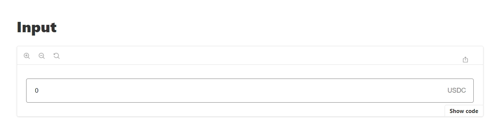

#### Props

Props of the Input are also available

|   Name    |                     Type                     | Default value |                      Description                       |
| :-------: | :------------------------------------------: | :-----------: | :----------------------------------------------------: |
|   value   |                 `InputValue`                 |       -       |           The value of the input. (Required)           |
| setFormat |                  `boolean`                   |       -       |     If `true`, set format of the input. (Optional)     |
|   type    |           `HTMLInputTypeAttribute`           |       -       |       The type of value of the input. (Optional)       |
| onChange  | `(e: ChangeEvent<HTMLInputElement>) => void` |       -       | The function to run on change of the input. (Required) |

You can interact with the component in the following link [Input](https://ui-kit.defactor.dev/?path=/docs/input--input-item)

### Language Selector

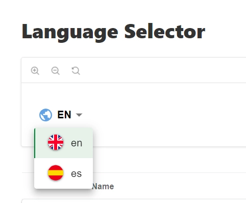

#### Props

Props of the Language Selector are also available

|    Name    |            Type             | Default value |                          Description                          |
| :--------: | :-------------------------: | :-----------: | :-----------------------------------------------------------: |
|   locale   |          `string`           |       -       |               The current language. (Required)                |
|  pathname  |            `any`            |       -       |       The pathname to update language page. (Required)        |
|   router   |            `any`            |       -       |        The router to update language page. (Required)         |
|     t      |            `any`            |       -       |       The function to get translation page. (Required)        |
|  options   |     `OptionLanguage[]`      |       -       |               The options language. (Required)                |
|    icon    | `React Element` or `string` |       -       |         The icon language selector button. (Optional)         |
| activeIcon | `React Element` or `string` |       -       | The active icon language selector on hover button. (Optional) |
|  bgColor   |          `string`           |   `#057d2f`   | The background color of language selector options. (Optional) |

You can interact with the component in the following link [Language Selector](https://ui-kit.defactor.dev/?path=/docs/language-selector--language-selector-item)

### LendBorrow

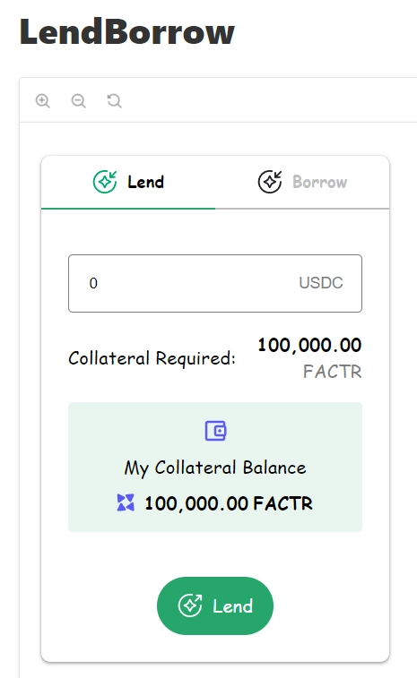

#### Props

Props of the LendBorrow are also available

|          Name          |            Type             | Default value |                                        Description                                         |
| :--------------------: | :-------------------------: | :-----------: | :----------------------------------------------------------------------------------------: |
|         color          |          `string`           |   `#26a66b`   |                      The color of button and tab selected. (Optional)                      |
|         onLend         |        `() => void`         |       -       |                   The function to run on lend of LendBorrow . (Required)                   |
|        onBorrow        |        `() => void`         |       -       |                  The function to run on borrow of LendBorrow . (Required)                  |
|        bgColor         |          `string`           |       -       |                   The background color of collateral section. (Optional)                   |
|       walletSvg        |          `string`           |       -       |                     The wallet icon of collateral section. (Required)                      |
|       labelLend        |          `string`           |       -       |                             The label of lend tab. (Required)                              |
|       currentTab       |          `string`           |       -       |                            The label of current tab. (Required)                            |
|        disabled        |          `boolean`          |       -       |                      If `true`, the component is disabled. (Optional)                      |
|       lendingSvg       |          `string`           |       -       |                        The lending icon of lend borrow. (Required)                         |
|      labelBorrow       |          `string`           |       -       |                            The label of borrow tab. (Required)                             |
|       textWallet       |          `string`           |       -       |                     The text wallet of collateral section. (Optional)                      |
|       fontFamily       |          `string`           |       -       |                       The font family of the lend borrow. (Optional)                       |
|      tokenSymbol       |          `string`           |       -       |              The token symbol displayed in the collateral section. (Optional)              |
|      borrowingSvg      |          `string`           |       -       |                      The borrowing icon of borrow borrow. (Required)                       |
|     textCollateral     |          `string`           |       -       |                   The text collateral of collateral section. (Optional)                    |
|         value          |  `bigInt` or `InputValue`   |       -       |                            The value of lend borrow. (Required)                            |
|   collateralBalance    |          `string`           |       -       |                     The collateral balance of lend borrow. (Optional)                      |
|         loader         | `React Element` or `string` |       -       |                           The loader of lend borrow. (Optional)                            |
|   collateralRequired   |          `string`           |       -       |            The amount collateral required of the collateral section. (Optional)            |
| showRequiredCollateral |          `boolean`          |    `false`    | If `true`, display of the amount collateral required of the collateral section. (Optional) |
|    loaderCollateral    | `React Element` or `string` |       -       |                        The loader of collateral section. (Optional)                        |
|       tokenIcon        | `React Element` or `string` |       -       |                    The token icon of the collateral section. (Optional)                    |
|        onChange        |        `() => void`         |       -       |                   The function to run on change of the input. (Required)                   |
|      onChangeTab       |        `() => void`         |       -       |                      The function to run on change of tab. (Required)                      |

You can interact with the component in the following link [LendBorrow](https://ui-kit.defactor.dev/?path=/docs/lendborrow--lend-borrow-item)

### Modal

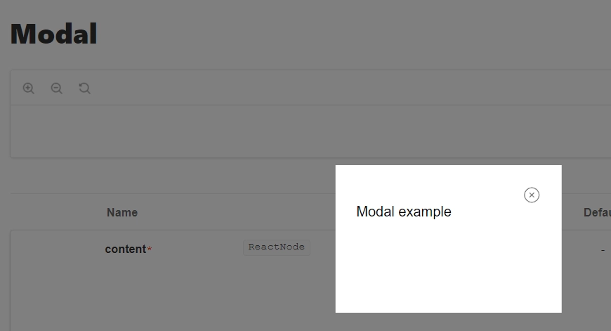

#### Props

Props of the Modal are also available

|      Name      |     Type     | Default value |                      Description                      |
| :------------: | :----------: | :-----------: | :---------------------------------------------------: |
|    content     | `React Node` |       -       |         The content of the modal. (Required)          |
|     close      | `() => void` |       -       | The function to run on close of the modal. (Required) |
|     isOpen     |  `boolean`   |       -       |         If `true`, open the modal. (Required)         |
| externalStyles |   `string`   |       -       |  The external custom styles of the modal. (Required)  |

You can interact with the component in the following link [Modal](https://ui-kit.defactor.dev/?path=/docs/modal--modal-item)

### Pill

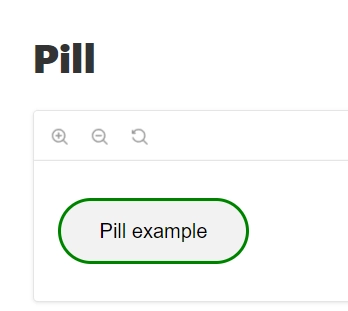

#### Props

Props of the Pill are also available

|      Name      |            Type             | Default value |                      Description                       |
| :------------: | :-------------------------: | :-----------: | :----------------------------------------------------: |
|     label      | `React Element` or `string` |       -       |           The label of the pill. (Required)            |
|  customBorder  |          `string`           |       -       | The custom style of the border of the pill. (Optional) |
|     color      |          `string`           |       -       |        The color label of the pill. (Required)         |
|    bgColor     |          `string`           |       -       |      The background color of the pill. (Required)      |
|   fontFamily   |          `string`           |       -       |        The font family of the pill. (Optional)         |
| externalStyles |          `string`           |       -       |   The external custom styles of the pill. (Optional)   |

You can interact with the component in the following link [Pill](https://ui-kit.defactor.dev/?path=/docs/pill--pill-item)

### Preview Profile

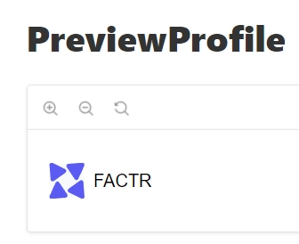

#### Props

Props of the Preview Profile are also available

|    Name    |            Type             | Default value |                       Description                       |
| :--------: | :-------------------------: | :-----------: | :-----------------------------------------------------: |
|   label    |          `string`           |       -       |      The label of the preview profile. (Optional)       |
|   image    |          `string`           |       -       |      The image of the preview profile. (Optional)       |
|  bgColor   |          `string`           |       -       | The background color of the preview profile. (Optional) |
|  fontSize  |          `string`           |       -       |    The font size of the preview profile. (Optional)     |
| imageSize  |          `string`           |       -       |    The image size of the preview profile. (Optional)    |
| fontWeight |          `string`           |       -       |   The font weight of the preview profile. (Optional)    |
| fontFamily |          `string`           |       -       |   The font family of the preview profile. (Optional)    |
|  imgChild  | `React Element` or `string` |       -       |   The image child of the preview profile. (Optional)    |

You can interact with the component in the following link [Preview Profile](https://ui-kit.defactor.dev/?path=/docs/previewprofile--preview-profile-item)

### SideBar

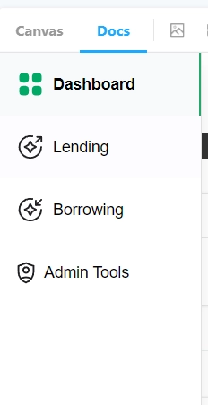

#### Props

Props of the SideBar are also available

|      Name      |     Type     | Default value |                      Description                      |
| :------------: | :----------: | :-----------: | :---------------------------------------------------: |
|  menuOptions   | `React Node` |       -       |    The content options of the sideBar. (Required)     |
| externalStyles |   `string`   |       -       | The external custom styles of the sideBar. (Optional) |

You can interact with the component in the following link [SideBar](https://ui-kit.defactor.dev/?path=/docs/sidebar--sidebar-item)

### Small Profile

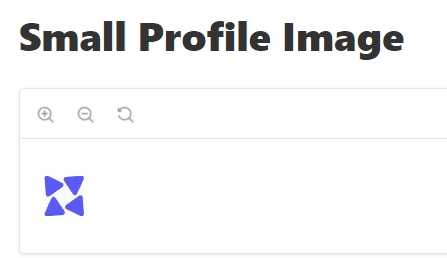

#### Props

Props of the Small Profile are also available

|   Name   |            Type             | Default value |                      Description                      |
| :------: | :-------------------------: | :-----------: | :---------------------------------------------------: |
|  image   |          `string`           |       -       |      The image of the small profile. (Optional)       |
|   icon   |          `string`           |       -       |       The icon of the small profile. (Optional)       |
|   size   |          `string`           |       -       |       The size of the small profile. (Optional)       |
| bgColor  |          `string`           |   `#F8F9FC`   | The background color of the small profile. (Optional) |
| imgChild | `React Element` or `string` |       -       |   The image child of the small profile. (Optional)    |

You can interact with the component in the following link [Small Profile](https://ui-kit.defactor.dev/?path=/docs/small-profile-image--small-profile-image-item)

### Table

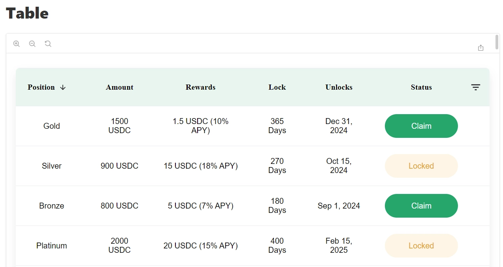

#### Props

Props of the Table are also available

|                                   Name                                   |               Type                |       Default value       |                              Description                               |
| :----------------------------------------------------------------------: | :-------------------------------: | :-----------------------: | :--------------------------------------------------------------------: |
|                                   rows                                   |          `IRowsObject[]`          |             -             |                   The rows of the table. (Required)                    |
|                                 loading                                  |             `boolean`             |             -             |     If `true`, display the loading state of the table. (Optional)      |
|                                fontFamily                                |             `string`              |             -             |                The font family of the table. (Optional)                |
|                                emptyTitle                                |             `string`              |             -             |    The title to display if don't have data of the table. (Optional)    |
|                             emptyDescription                             |             `string`              |             -             | The description to display if don't have data of the table. (Required) |
|                                emptyIcon                                 |           `React Node`            |             -             |      The icon to display if don't have data of table. (Optional)       |
|                               visiblePage                                |             `number`              |             -             |               The selected page of the table. (Optional)               |
|                               haveOptions                                |             `boolean`             |             -             |    If `true`, allow display options button of the table. (Optional)    |
|                              headerbgColor                               |             `string`              |             -             |      The background color on the header of the table. (Optional)       |
|                              rowsHoverColor                              |             `string`              | `rgba(38, 166, 107, 0.1)` |
| The background color on the rows on hover mouse of the table. (Optional) |
|                             totalRowsNumber                              |             `number`              |             -             |                The rows number of the table. (Required)                |
|                             rowsNumberLabel                              |             `string`              |             -             |       The label of rows number by page of the table. (Optional)        |
|                                 rowsPage                                 |            `number[]`             |             -             |      The options of rows number by page of the table. (Optional)       |
|                             rowsPageSelected                             |             `number`              |             -             |        The current rows number by page of the table. (Required)        |
|                                 headers                                  |         `IHeaderObject[]`         |             -             |              The headers columns of the table. (Required)              |
|                                 filters                                  |         `IFilterObject[]`         |             -             |             The filter by column of the table. (Optional)              |
|                                 nextPage                                 |    `(motion: string) => void`     |             -             |    The function on click next page button of the table. (Optional)     |
|                             loaderComponent                              |           `React Node`            |             -             |             The loader component of the table. (Optional)              |
|                            handleSelectedPage                            | `(selectedValue: number) => void` |             -             |      The function to run on select page of the table. (Optional)       |
|                                setFilters                                |            `()=> void`            |             -             |        The function to set the filters of the table. (Required)        |
|                          handleSelectedRowsPage                          | `(selectedValue: string) => void` |             -             |   The function to run on select number rows of the table. (Required)   |

You can interact with the component in the following link [Table](https://ui-kit.defactor.dev/?path=/docs/table--table-item)

### Tooltip

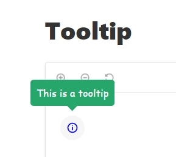

#### Props

Props of the Tooltip are also available

|     Name     |             Type              | Default value |                                       Description                                       |
| :----------: | :---------------------------: | :-----------: | :-------------------------------------------------------------------------------------: |
|     text     |           `string`            |       -       |                           The text of the tooltip. (Required)                           |
|  fontFamily  |           `string`            |       -       |                       The font family of the tooltip. (Optional)                        |
|     icon     |  `React Element` or `string`  |       -       |                           The icon of the tooltip. (Optional)                           |
|  activeIcon  |  `React Element` or `string`  |       -       |                   The active icon of the tooltip on hover. (Optional)                   |
|   sizeIcon   |           `number`            |       -       |                        The size icon of the tooltip . (Optional)                        |
|   bgColor    |           `string`            |   `#26a66b`   |                     The background color of the tooltip. (Optional)                     |
|    color     |           `string`            |       -       |                       The color label of the tooltip. (Optional)                        |
|     open     |           `boolean`           |    `false`    |                          The state of the tooltip. (Optional)                           |
|   position   |           `string`            |       -       | The position of the tooltip with 4 values: `top`, `left`, `right`, `bottom`. (Optional) |
| handleChange | `(newValue: boolean) => void` |       -       |                The function to run on change of the tooltip. (Required)                 |

You can interact with the component in the following link [Tooltip](https://ui-kit.defactor.dev/?path=/docs/tooltip--tooltip-item)

### Bar Chart

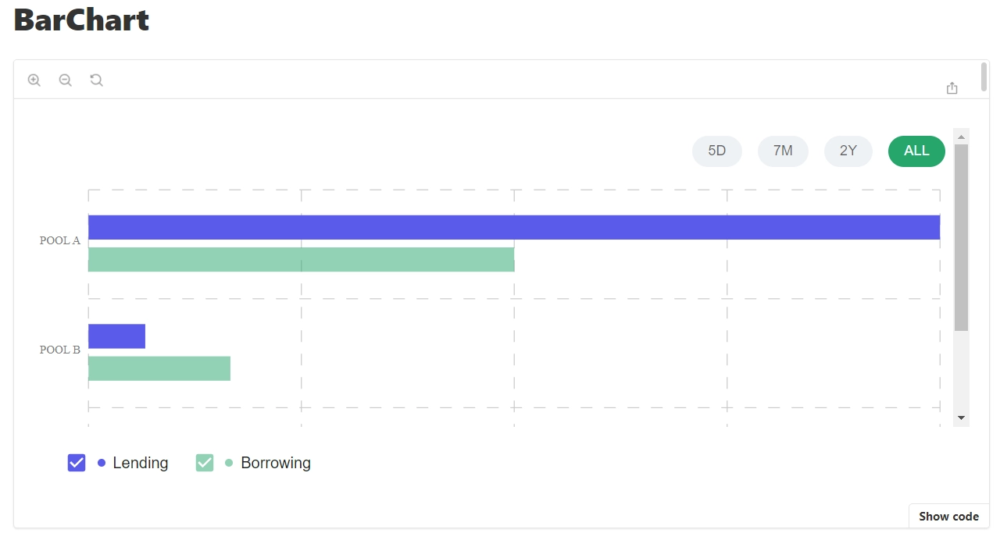

#### Props

Props of the Bar Chart are also available

|        Name         |            Type             | Default value |                                                  Description                                                  |
| :-----------------: | :-------------------------: | :-----------: | :-----------------------------------------------------------------------------------------------------------: |
|     formatValue     |      `FormatValueType`      |       -       |                     The function to format value of tooltip of the bar chart. (Optional)                      |
|       series        |     `ChartSeriesType[]`     |       -       |                                 The data series of the bar chart. (Required)                                  |
|       colors        |         `string[]`          |       -       |                         The colors to represent the data of the bar chart. (Required)                         |
|        data         |         `string[]`          |       -       |                                     The data of the bar chart. (Required)                                     |
|     dateFilter      |         `string[]`          |       -       |                         The date filter to validate data of the bar chart. (Optional)                         |
|       loading       |          `boolean`          |       -       |                       If `true`, display the loading state of the bar chart. (Optional)                       |
|     emptyTitle      |          `string`           |       -       |                     The title to display if don't have data of the bar chart. (Optional)                      |
|  emptyDescription   |          `string`           |       -       |                  The description to display if don't have data of the bar chart. (Optional)                   |
|      emptyIcon      | `React Element` or `string` |       -       |                      The icon to display if don't have data of the bar chart. (Optional)                      |
|        color        |          `string`           |    `white`    |                          The color label of date filter of the bar chart. (Optional)                          |
|      showXAxis      |          `boolean`          |    `true`     |                           If `true` display the X Axis of the bar chart. (Optional)                           |
|    filterBgColor    |          `string`           |   `#26a66b`   |                    The background color label of date filter of the bar chart. (Optional)                     |
|    currentFilter    |          `string`           |       -       |                             The value of date filter of the bar chart. (Optional)                             |
| formatValueVertical |      `FormatValueType`      |       -       |                     The function to format value of tooltip of the bar chart. (Optional)                      |
| handleChangeFilter  | `(filter: string) => void)` |       -       |                 The function to run on change of date filter of the the bar chart. (Optional)                 |
|  displayDirection   |          `string`           | `horizontal`  | The display direction of the bars values of the bar chart with 2 values: `horizontal`, `vertical`. (Optional) |
|  formatValueAxisY   |      `FormatValueType`      |       -       |                     The function to format values on Y Axis of the bar chart. (Optional)                      |
|  formatValueAxisX   |      `FormatValueType`      |       -       |                     The function to format values on X Axis of the bar chart. (Optional)                      |
|   loaderComponent   |        `React Node`         |       -       |                                    The loader of the bar chart. (Optional)                                    |
|     formatDate      |      `FormatValueType`      |       -       |                           The function to format date of the bar chart. (Optional)                            |
|     fontFamily      |          `string`           |       -       |                                 The font family of the bar chart. (Optional)                                  |

You can interact with the component in the following link [Bar Chart](https://ui-kit.defactor.dev/?path=/docs/charts-barchart--bar-chart-item)

### Line Chart

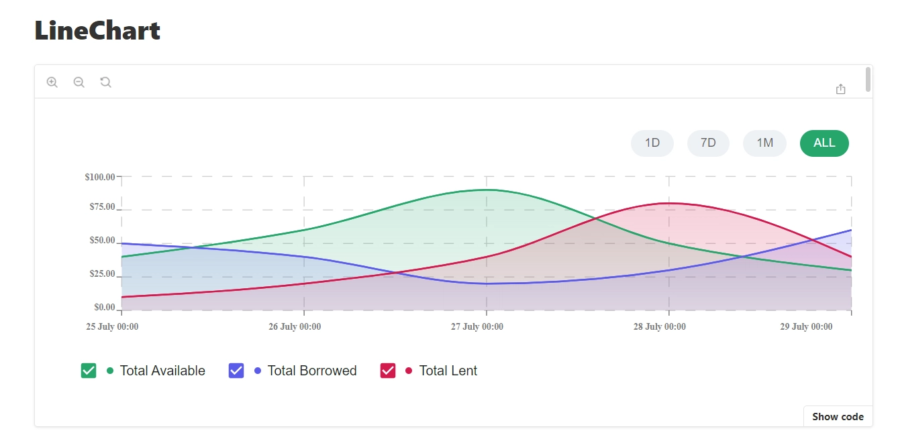

#### Props

Props of the Line Chart are also available

|        Name        |                  Type                  | Default value |                                  Description                                   |
| :----------------: | :------------------------------------: | :-----------: | :----------------------------------------------------------------------------: |
|    formatValue     |           `FormatValueType`            |       -       |     The function to format value of tooltip of the line chart. (Optional)      |
|       series       |           `SeriesDataType[]`           |       -       |                 The data series of the line chart. (Required)                  |
|       colors       |               `string[]`               |       -       |         The colors to represent the data of the line chart. (Required)         |
|     dateFilter     |               `string[]`               |       -       |         The date filter to validate data of the line chart. (Optional)         |
|      loading       |               `boolean`                |       -       |       If `true`, display the loading state of the line chart. (Optional)       |
|     emptyTitle     |                `string`                |       -       |     The title to display if don't have data of the line chart. (Optional)      |
|  emptyDescription  |                `string`                |       -       |  The description to display if don't have data of the line chart. (Optional)   |
|     emptyIcon      |      `React Element` or `string`       |       -       |      The icon to display if don't have data of the line chart. (Optional)      |
|     formatDate     |           `FormatValueType`            |       -       |           The function to format date of the line chart. (Optional)            |
|  formatValueAxisX  |           `FormatValueType`            |       -       |     The function to format values on X Axis of the line chart. (Optional)      |
|  formatValueAxisY  |           `FormatValueType`            |       -       |     The function to format values on Y Axis of the line chart. (Optional)      |
| handleChangeFilter |      `(filter: string) => void)`       |       -       | The function to run on change of date filter of the the line chart. (Optional) |
|        data        | `LineChartDataType[] ` or ` undefined` |       -       |                     The data of the line chart. (Required)                     |
|   filterBgColor    |                `string`                |   `#26a66b`   |    The background color label of date filter of the line chart. (Optional)     |
|   currentFilter    |                `string`                |       -       |             The value of date filter of the line chart. (Optional)             |
|       color        |                `string`                |    `white`    |          The color label of date filter of the line chart. (Optional)          |
|  loaderComponent   |              `React Node`              |       -       |                    The loader of the line chart. (Optional)                    |
|     fontFamily     |                `string`                |       -       |                 The font family of the line chart. (Optional)                  |

You can interact with the component in the following link [Line Chart](https://ui-kit.defactor.dev/?path=/docs/charts-linechart--line-chart-item)

### Pie Chart

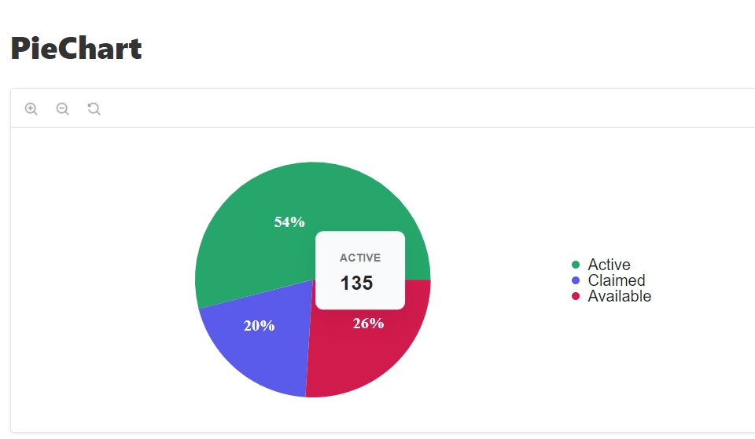

#### Props

Props of the Pie Chart are also available

|       Name       |            Type             |              Default value               |                                Description                                 |
| :--------------: | :-------------------------: | :--------------------------------------: | :------------------------------------------------------------------------: |
|       data       |        `PieDataType`        |                    -                     |                   The data of the pie chart. (Required)                    |
|     loading      |          `boolean`          |                    -                     |     If `true`, display the loading state of the pie chart. (Optional)      |
|    emptyTitle    |          `string`           |                    -                     |    The title to display if don't have data of the pie chart. (Optional)    |
| emptyDescription |          `string`           |                    -                     | The description to display if don't have data of the pie chart. (Optional) |
|    emptyIcon     | `React Element` or `string` |                    -                     |    The icon to display if don't have data of the pie chart. (Optional)     |
|    fontFamily    |          `string`           |                    -                     |                The font family of the pie chart. (Optional)                |
| loaderComponent  |        `React Node`         |                    -                     |                  The loader of the pie chart. (Optional)                   |
|   formatValue    |      `FormatValueType`      | `value => value.toLocaleString('en-US')` |    The function to format value of tooltip of the pie chart. (Optional)    |
|    formatDate    |      `FormatValueType`      |                    -                     |          The function to format date of the pie chart. (Optional)          |
| formatValueAxisX |      `FormatValueType`      |                    -                     |    The function to format values on X Axis of the pie chart. (Optional)    |
| formatValueAxisY |      `FormatValueType`      |                    -                     |    The function to format values on Y Axis of the pie chart. (Optional)    |

You can interact with the component in the following link [Pie Chart](https://ui-kit.defactor.dev/?path=/docs/charts-piechart--pie-chart-item)
